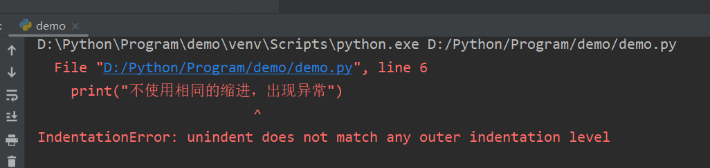
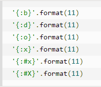
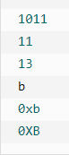
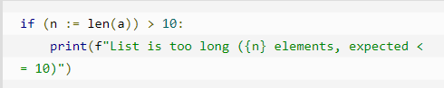

# Python基础知识

---

[TOC]


# 一、Python 基础语法

---

## 1.1  标识符

- 在 Python 里，标识符由字母、数字、下划线组成。

- 在 Python 中，所有标识符可以包括英文、数字以及下划线(_)，但不能以数字开头。

- Python 中的标识符是区分大小写的。

以下划线开头的标识符是有特殊意义的。以单下划线开头 **_foo** 的代表不能直接访问的类属性，需通过类提供的接口进行访问，不能用 **from xxx import \*** 而导入。

以双下划线开头的 **__foo** 代表类的私有成员，以双下划线开头和结尾的 **__foo__** 代表 Python 里特殊方法专用的标识，如 **__init__()** 代表类的构造函数。

Python 可以同一行显示多条语句，方法是用分号 **;** 分开。

---

## 1.2  保留字符(关键字)

下面的列表显示了在Python中的保留字。这些保留字不能用作常数或变数，或任何其他标识符名称。所有 Python 的关键字只包含小写字母。

Python 的标准库提供了一个 keyword 模块，可以输出当前版本的所有关键字：

```python
>>> import keyword
>>> keyword.kwlist
['False', 'None', 'True', 'and', 'as', 'assert', 'break', 'class', 'continue', 'def', 'del', 'elif', 'else', 'except', 'finally', 'for', 'from', 'global', 'if', 'import', 'in', 'is', 'lambda', 'nonlocal', 'not', 'or', 'pass', 'raise', 'return', 'try', 'while', 'with', 'yield']
```

---

---

## 1.3  行和缩进

Python 的代码块不使用大括号 **{}** 来控制类，函数以及其他逻辑判断。python 最具特色的就是用缩进来写模块。

==缩进的空白数量是可变的，但是所有代码块语句必须包含相同的缩进空白数量，这个必须严格执行。==

示例如下：

```python
x = 9
if x == 9:
    print("使用缩进划分代码块")
else:
    print("dadadadadad")
  print("不使用相同的缩进，出现异常")

```

运行结果如下：



---

---

## 1.4  多行语句

Python语句中一般以新行作为语句的结束符，而无需使用 **“ ; ”** 分号作为结束符。

但是我们可以使用斜杠（ \ ）将一行的语句分为多行显示，如下所示：

```python
total = item_one + \
        item_two + \
        item_three
print('AAAAAAAAAAAAAAAAAAAAAAAAAAAAAAAAAAAAAAAA\
vvvvvvvvvvvvvvvvvvvvvvv')
```

语句中包含 [], {} 或 () 括号就不需要使用多行连接符。如下实例：

```python
days = ['Monday', 'Tuesday', 'Wednesday',
        'Thursday', 'Friday']
```

---

---

## 1.5  引号

Python 可以使用引号( **'** )、双引号( **"** )、三引号( **'''** 或 **"""** ) 来表示字符串，引号的开始与结束必须的相同类型的。

==其中三引号可以由多行组成，编写多行文本的快捷语法，常用于文档字符串，在文件的特定地点，被当做注释。==

```python
word = 'word'
sentence = "这是一个句子。"
paragraph = """这是一个段落。
包含了多个语句"""
```

---

---

## 1.6  注释

Python 的单行注释以 **“#”** 开头

Python 的多行注释使用三个单引号 **(''')** 或三个双引号 **(""")**。

```python
#!/usr/bin/python
# -*- coding: UTF-8 -*-
# 文件名：test.py
# 单行注释也可出现在语句或表达式行末
name = '你的名字' #这是一个单行注释


'''
这是多行注释，使用单引号。
这是多行注释，使用单引号。
这是多行注释，使用单引号。
'''

"""
这是多行注释，使用双引号。
这是多行注释，使用双引号。
这是多行注释，使用双引号。
"""
```

---

---

## 1.7  转义字符—— \

Python 使用 “ \ ” 作为转义字符

```python
c = " 子曰：\"学而时习之，不亦说乎\" "
# 将双引号转换为普通的双引号，不在带有标识字符串的含义
"""
转义字符常用实例：
1. \' 表示 '
2. \" 表示 "
3. \t 表示 制表符
4. \n 表示 换行符
5. \\ 表示 反斜杠
6. \uXXXX 表示 Unicode 编码，实例如下：
"""
s = '\u16A4'
#打印 s 为：ᚤ
```

---

---

## 1.8  编码

默认情况下，Python 3 源码文件以 **UTF-8** 编码，所有字符串都是 unicode 字符串。 当然你也可以为源码文件指定不同的编码：

```python
# -*- coding: cp-1252 -*-
```

---

---

## 1.9  input 与 print 函数

### 1.9.1  input

input函数用于输入操作，执行下面的程序在按回车键后就会等待用户输入：

```python
input("\n\n按下 enter 键后退出。")
```

### 1.9.2  print

print函数用于输出操作。print 默认输出是换行的，如果要实现不换行需要在变量末尾加上 **end=""**：

```python
x="a"
y="b"
# 换行输出
print( x )
print( y )
 
print('---------')
# 不换行输出
print( x, end=" " )
print( y, end=" " )
print()
```

---

---

## 1.10  import 与 from…import

在 python 用 **import** 或者 **from...import** 来导入相应的模块。

将整个模块(somemodule)导入，格式为： **import somemodule**

从某个模块中导入某个函数,格式为： **from somemodule import somefunction**

从某个模块中导入多个函数,格式为： **from somemodule import firstfunc, secondfunc, thirdfunc**

将某个模块中的全部函数导入，格式为： **from somemodule import \***

---

---

# 二、Python 变量类型

---

## 2.1  变量赋值

Python 中的变量赋值不需要类型声明。每个变量在内存中创建，都包括变量的标识，名称和数据这些信息。==每个变量在使用前都必须赋值，变量赋值后，该变量才会被创建==。

Python 使用内置函数 id() 获取变量的内存地址。

Python 为弱类型变量，即变量的类型由其所具有的值的类型决定。示例如下：

```python
b = 1
print(b, type(b))
b = '我的世界'
print(b, type(b))
'''
b 首先为 int 型，后其类型改为 str 型
'''
```

### 2.1.1  多个变量赋值

1. Python 允许你同时为多个变量赋值。例如：

   ```python
   a = b = c = 1
   ```

​       以上实例，创建一个整型对象，值为1，三个变量被分配到相同的内存空间上

2. Python同时允许为多个对象指定多个变量。例如：

   ```python
   a, b, c, = 1, 2, 'john'
   ```

   以上实例，两个整型对象 1 和 2 分别给变量 a 和 b ，字符串对象 ‘john’ 分配给变量 c。

---

---

### 2.1.2  对象的删除

可通过 del 删除一些对象的引用。示例如下：

```python
a = b = c = 1
del a
del b, c
print(a)
'''
报出异常，a 未被定义
'''
```

---

---

## 2.2  标准数据类型

Python有六个标准的数据类型：

- Numbers（数字）
- String（字符串）
- List（列表）
- Tuple（元组）
- Set（集合）
- Dictionary（字典）

---

### 2.2.1  数字

数字数据类型用于存储数值。他们是不可改变的数据类型，这意味着改变数字数据类型会分配一个新的对象。当你指定一个值时，Number对象就会被创建，示例如下：

```python
b = 1
print(b, type(b))
b = 12.001
print(b, type(b))
c = str(b)
print(c, type(c))
```

Python支持三种不同的数字类型：

- int（有符号整型）
- float（浮点型）
- complex（复数）

---

#### 2.2.1.1  整数 int

1. 在Python 3 中，所有的整数都是 int 类型，Long 类型被移除。
2. Python 中的整数没有大小限制，可以是任意大的一个数。
3. 如果数字的长度过大，可以使用 “_”（下划线）作为分隔符

```python
c = 123_456_789
#效果等同于 C = 123456789 
```

#### 2.2.1.2  其他进制的整数

1. 二进制以 “0b” 开头
2. 八进制以 “0o” 开头
3. 十六进制以 “0x” 开头

```python
a = 0b10
b = 0o10
c = 0xA
# 控制台打印 a，b，c 时，是以 10 进制的形式输出。即 a = 2, b = 8, c = 10
```

---

#### 2.2.1.3  浮点数——float

在Python中直接对浮点数进行运算可能会得到不精确的结果，在实际使用中，应避免直接对浮点数进行运算

```python
c = 0.1 + 0.2
# 打印 c 为 0.30000000000000004
```

---

#### 2.2.1.4  数学函数

Python 中数学运算常用的函数基本都在 **math** 模块、**cmath** 模块中。

- math 模块提供了许多对浮点数的数学运算函数。

- cmath 模块包含了一些用于复数运算的函数。

cmath 模块的函数跟 math 模块函数基本一致，区别是 cmath 模块运算的是复数，math 模块运算的是数学运算。

| 函数                                                         | 返回值 ( 描述 )                                              |
| :----------------------------------------------------------- | :----------------------------------------------------------- |
| [abs(x)](https://www.runoob.com/python3/python3-func-number-abs.html) | 返回数字的绝对值，如abs(-10) 返回 10                         |
| [ceil(x)](https://www.runoob.com/python3/python3-func-number-ceil.html) | 返回数字的上入整数，如math.ceil(4.1) 返回 5                  |
| [exp(x)](https://www.runoob.com/python3/python3-func-number-exp.html) | 返回e的x次幂(ex),如math.exp(1) 返回2.718281828459045         |
| [fabs(x)](https://www.runoob.com/python3/python3-func-number-fabs.html) | 返回数字的绝对值，如math.fabs(-10) 返回10.0                  |
| [floor(x)](https://www.runoob.com/python3/python3-func-number-floor.html) | 返回数字的下舍整数，如math.floor(4.9)返回 4                  |
| [log(x)](https://www.runoob.com/python3/python3-func-number-log.html) | 如math.log(math.e)返回1.0,math.log(100,10)返回2.0            |
| [log10(x)](https://www.runoob.com/python3/python3-func-number-log10.html) | 返回以10为基数的x的对数，如math.log10(100)返回 2.0           |
| [max(x1, x2,...)](https://www.runoob.com/python3/python3-func-number-max.html) | 返回给定参数的最大值，参数可以为序列。                       |
| [min(x1, x2,...)](https://www.runoob.com/python3/python3-func-number-min.html) | 返回给定参数的最小值，参数可以为序列。                       |
| [modf(x)](https://www.runoob.com/python3/python3-func-number-modf.html) | 返回x的整数部分与小数部分，两部分的数值符号与x相同，整数部分以浮点型表示。 |
| [pow(x, y)](https://www.runoob.com/python3/python3-func-number-pow.html) | x**y 运算后的值。                                            |
| [round(x [,n\])](https://www.runoob.com/python3/python3-func-number-round.html) | 返回浮点数 x 的四舍五入值，如给出 n 值，则代表舍入到小数点后的位数。**其实准确的说是保留值将保留到离上一位更近的一端。** |
| [sqrt(x)](https://www.runoob.com/python3/python3-func-number-sqrt.html) | 返回数字x的平方根。                                          |

---

#### 2.2.1.5  随机数函数

使用随机函数需要导入 **random** 模块。

在 random 模块中，有 **randint(a, b)**，其实质是调用 **randrange(a, b+1)** 

| 函数                                                         | 描述                                                         |
| :----------------------------------------------------------- | :----------------------------------------------------------- |
| [choice(seq)](https://www.runoob.com/python/func-number-choice.html) | 从序列的元素中随机挑选一个元素，比如 random.choice(range(10))，从**0到9**中随机挑选一个整数。 |
| [randrange ([start,\] stop [,step])](https://www.runoob.com/python/func-number-randrange.html) | 从指定范围内，按指定基数递增的集合中获取一个随机数，基数默认值为 1，**randrange(1, 9, 1) 指在 1-8 中取值，基数为1，不能取 9** |
| [random()](https://www.runoob.com/python/func-number-random.html) | 随机生成下一个实数，它在 **[0,1)** 范围内。                  |
| [seed([x\])](https://www.runoob.com/python/func-number-seed.html) | 改变随机数生成器的种子seed。如果你不了解其原理，你不必特别去设定seed，Python会帮你选择seed。 |
| [shuffle(lst)](https://www.runoob.com/python/func-number-shuffle.html) | 将序列的所有元素随机排序                                     |
| [uniform(x, y)](https://www.runoob.com/python/func-number-uniform.html) | 随机生成下一个实数，它在 **[x,y]** 范围内。                  |

---

#### 2.2.1.6  三角函数

三角函数包含在 **math**， **cmath** 中

| 函数                                                         | 描述                                              |
| :----------------------------------------------------------- | :------------------------------------------------ |
| [acos(x)](https://www.runoob.com/python/func-number-acos.html) | 返回x的反余弦弧度值。                             |
| [asin(x)](https://www.runoob.com/python/func-number-asin.html) | 返回x的反正弦弧度值。                             |
| [atan(x)](https://www.runoob.com/python/func-number-atan.html) | 返回x的反正切弧度值。                             |
| [atan2(y, x)](https://www.runoob.com/python/func-number-atan2.html) | 返回给定的 X 及 Y 坐标值的反正切值。              |
| [cos(x)](https://www.runoob.com/python/func-number-cos.html) | 返回x的弧度的余弦值。                             |
| [hypot(x, y)](https://www.runoob.com/python/func-number-hypot.html) | 返回欧几里德范数 sqrt(x*x + y*y)。                |
| [sin(x)](https://www.runoob.com/python/func-number-sin.html) | 返回的x弧度的正弦值。                             |
| [tan(x)](https://www.runoob.com/python/func-number-tan.html) | 返回x弧度的正切值。                               |
| [degrees(x)](https://www.runoob.com/python/func-number-degrees.html) | 将弧度转换为角度,如degrees(math.pi/2) ， 返回90.0 |
| [radians(x)](https://www.runoob.com/python/func-number-radians.html) | 将角度转换为弧度                                  |

---

#### 2.2.1.7  数学常量

- math.pi：输出pi。
- math.e：输出e

| 常量 | 描述                                  |
| :--- | :------------------------------------ |
| pi   | 数学常量 pi（圆周率，一般以π来表示）  |
| e    | 数学常量 e，e即自然常数（自然常数）。 |

---

---

### 2.2.2  字符串

#### 2.2.2.1  定义字符串

1. Python 可以使用引号( **'** )、双引号( **"** )、三引号( **'''** 或 **"""** ) 来表示字符串，引号的开始与结束必须的相同类型的。
2. ==其中三引号可以由多行组成，编写多行文本的快捷语法，常用于文档字符串，在文件的特定地点，被当做注释。==
3. 相同的引号之间不能嵌套
4. ==**字符串 在python中是 不可变序列 **==

```python
c = " 子曰："学而时习之，不亦说乎" "
# 报错，相同的引号之间不能相互嵌套，修改为：
c = " 子曰：'学而时习之，不亦说乎' "
```

4. 长字符串的定义——三重引号

```python
s = '''锄禾日当午，
汗滴禾下苦，
谁知盘中餐，
粒粒皆辛苦。
'''
print(s)
# 使用三重引号表示长字符串（亦做多行注释使用）：''', """
# 三重引号能保留字符串的格式，上述 print 的结果为：
'''
锄禾日当午，
汗滴禾下苦，
谁知盘中餐，
粒粒皆辛苦。
'''
# 保留设定的换行
```

---

#### 2.2.2.2  字符串的索引

python的字串列表有2种取值顺序:

- 从左到右索引默认0开始的，最大范围是字符串长度少1
- 从右到左索引默认-1开始的，最大范围是字符串开头


如果你要实现从字符串中获取一段子字符串的话，可以使用 **[头下标:尾下标]** 来截取相应的字符串，其中下标是从 0 开始算起，可以是正数或负数，下标可以为空表示取到头或尾。

**[头下标:尾下标]** 获取的子字符串包含头下标的字符，但不包含尾下标的字符。

```python
s = 'abcdefg'
a = s[0]  # 下标为 0 的字符
b = s[1]  # 下标为 1 的字符
c = s[0: ]  # 从下标为 0 的位置开始截取，直到最后一个字符
d = s[1:4]  # 从下标为 1 的位置开始截取，直到下标为 4 的字符，但不包含第四个字符
e = s * 2  # *号，重复字符串 s 两次，赋值给 e
f = s + 'abc'  # 字符串的加法运算，s 的末尾 加上 'abc'
g = s[1:4:2]  # 在索引 1 到索引 4 的位置并设置为步长为 2（间隔一个位置）来截取字符串
```

Python 列表截取可以接收第三个参数，参数作用是截取的步长，以下实例在索引 1 到索引 4 的位置并设置为步长为 2（间隔一个位置）来截取字符串。

```python
s = "0123456789"
e = s[0: 4: 2]
print(e)
"""
输出结果：02
"""
```

---

#### 2.2.2.3  转义字符

| 转义字符    | 描述                                                         |
| :---------- | :----------------------------------------------------------- |
| \(在行尾时) | 续行符                                                       |
| \\          | 反斜杠符号                                                   |
| \'          | 单引号                                                       |
| \"          | 双引号                                                       |
| \a          | 响铃                                                         |
| \b          | 退格(Backspace)                                              |
| \000        | 空                                                           |
| \n          | 换行                                                         |
| \v          | 纵向制表符                                                   |
| \t          | 横向制表符                                                   |
| \r          | 回车                                                         |
| \f          | 换页                                                         |
| \oyy        | 八进制数，**yy** 代表的字符，例如：**\o12** 代表换行，其中 o 是字母，不是数字 0。 |
| \xyy        | 十六进制数，yy代表的字符，例如：\x0a代表换行                 |
| \other      | 其它的字符以普通格式输出                                     |

---

#### 2.2.2.4  字符串运算符

下表实例变量a值为字符串 "Hello"，b变量值为 "Python"：

| 操作符 | 描述                                                         | 实例                            |
| :----- | :----------------------------------------------------------- | :------------------------------ |
| +      | 字符串连接                                                   | a + b 输出结果： HelloPython    |
| *      | 重复输出字符串                                               | a*2 输出结果：HelloHello        |
| []     | 通过索引获取字符串中字符                                     | a[1] 输出结果 **e**             |
| [ : ]  | 截取字符串中的一部分，遵循**左闭右开**原则，str[0:2] 是不包含第 3 个字符的。 | a[1:4] 输出结果 **ell**         |
| in     | 成员运算符 - 如果字符串中包含给定的字符返回 True             | **'H' in a** 输出结果 True      |
| not in | 成员运算符 - 如果字符串中不包含给定的字符返回 True           | **'M' not in a** 输出结果 True  |
| r/R    | 原始字符串 - 原始字符串：所有的字符串都是直接按照字面的意思来使用，没有转义特殊或不能打印的字符。 原始字符串除在字符串的第一个引号前加上字母 **r**（可以大小写）以外，与普通字符串有着几乎完全相同的语法。 | `print( r'\n' ) print( R'\n' )` |
| %      | 格式字符串                                                   | 请看下一节内容。                |

---

#### 2.2.2.3  格式化字符串

Python 支持格式化字符串的输出 。尽管这样可能会用到非常复杂的表达式，但最基本的用法是将一个值插入到一个有字符串格式符 %s 的字符串中。

##### 1.  字符串格式化符号

| 符  号 | 描述                                 |
| :----- | :----------------------------------- |
| %c     | 格式化字符及其ASCII码                |
| %s     | 格式化字符串                         |
| %d     | 格式化整数                           |
| %u     | 格式化无符号整型                     |
| %o     | 格式化无符号八进制数                 |
| %x     | 格式化无符号十六进制数               |
| %X     | 格式化无符号十六进制数（大写）       |
| %f     | 格式化浮点数字，可指定小数点后的精度 |
| %e     | 用科学计数法格式化浮点数             |
| %E     | 作用同%e，用科学计数法格式化浮点数   |
| %g     | %f和%e的简写                         |
| %G     | %f 和 %E 的简写                      |
| %p     | 用十六进制数格式化变量的地址         |

```python
#使用 'abc' 填充占位符 %s
b = 'hello %s'%'abc' 

#多个占位符的填充如下，括号中的字符依次填充
b = 'hello %s, 你好，%s'%('abc', '孙悟空')

#对填充的字符串进行长度限定，长度在3-5之间，少于3的字符串自动使用 空格 进行填充，多余5的字符串自动截短至5个字符
b = 'hello %3.5s'%'abcdefg'

#对填充的浮点数进行小数点位数限制，如下示例为 小数点后面保留两位，自动对第三位小数进行四舍五入
b = 'hello %.2f'%123.456

#对填充的整数进行表示，如填充的数为浮点数，自动省去全部小数，不进行四舍五入
b = 'hello %.2d'%123.456 

#也可以用变量填充占位符
b = 123.4445
f = 'test: b = %s'%b
print(b)
```

##### 2.  格式化操作符辅助指令

| 符号  | 功能                                                         |
| :---- | :----------------------------------------------------------- |
| *     | 定义宽度或者小数点精度                                       |
| -     | 用做左对齐                                                   |
| +     | 在正数前面显示加号( + )                                      |
| <sp>  | 在正数前面显示空格                                           |
| #     | 在八进制数前面显示零('0')，在十六进制前面显示'0x'或者'0X'(取决于用的是'x'还是'X') |
| 0     | 显示的数字前面填充'0'而不是默认的空格                        |
| %     | '%%'输出一个单一的'%'                                        |
| (var) | 映射变量(字典参数)                                           |
| m.n.  | m 是显示的最小总宽度,n 是小数点后的位数(如果可用的话)        |

##### 3.  f-string

f-string 是 python3.6 之后版本添加的，称之为字面量格式化字符串，是新的格式化字符串的语法。

f-string 格式化字符串以 f 开头，后面跟着字符串，字符串中的表达式用大括号 {} 包起来，它会将变量或表达式计算后的值替换进去

在 Python 3.8 的版本中可以使用 **=** 符号来拼接运算表达式与结果：

```python
a = 123
b = "呵呵"
c = f'hello {a}, {b}'
print(c) # hello 123, 呵呵

x = 1
print(f'{x+1=}')   # Python 3.8，打印：'x+1=2'
```

##### 4.  str.format()

Python2.6 开始，新增了一种格式化字符串的函数 [str.format()](https://www.runoob.com/python/att-string-format.html)，它增强了字符串格式化的功能。

基本语法是通过 **{}** 和 **:** 来代替以前的 **%** 。

```python
# format 函数可以接受不限个参数，位置可以不按顺序。
"{} {}".format("hello", "world")    # 不设置指定位置，按默认顺序，输出：'hello world'
 
"{0} {1}".format("hello", "world")  # 设置指定位置，输出：'hello world'

# 也可以设置参数
print("网站名：{name}, 地址 {url}".format(name="菜鸟教程", url="www.runoob.com"))
 
# 通过字典设置参数
site = {"name": "菜鸟教程", "url": "www.runoob.com"}
print("网站名：{name}, 地址 {url}".format(**site))
 
# 通过列表索引设置参数
my_list = ['菜鸟教程', 'www.runoob.com']
print("网站名：{0[0]}, 地址 {0[1]}".format(my_list))  # "0" 是必须的

# 也可以向 str.format() 传入对象：
class AssignValue(object):
    def __init__(self, value):
        self.value = value
my_value = AssignValue(6)
print('value 为: {0.value}'.format(my_value))  # "0" 是可选的
```

---

##### 5.  format 的数字格式化

下表为数字格式化的format格式，去掉数字标识符 “ f ”，“ d ” 即可用于字符串的格式化

| 数字       | 格式                                                         | 输出                                                         | 描述                                                      |
| :--------- | :----------------------------------------------------------- | :----------------------------------------------------------- | :-------------------------------------------------------- |
| 3.1415926  | {:.2f}                                                       | 3.14                                                         | 保留小数点后两位                                          |
| 3.1415926  | {:+.2f}                                                      | +3.14                                                        | 带符号保留小数点后两位                                    |
| -1         | {:+.2f}                                                      | -1.00                                                        | 带符号保留小数点后两位                                    |
| 2.71828    | {:.0f}                                                       | 3                                                            | 不带小数                                                  |
| 5          | {:0>2d}                                                      | 05                                                           | 数字补零 (填充左边, 宽度为2)                              |
| 5          | {:x<4d}                                                      | 5xxx                                                         | 数字补x (填充右边, 宽度为4)                               |
| 10         | {:x<4d}                                                      | 10xx                                                         | 数字补x (填充右边, 宽度为4)                               |
| 1000000    | {:,}                                                         | 1,000,000                                                    | 以逗号分隔的数字格式                                      |
| 0.25       | {:.2%}                                                       | 25.00%                                                       | 百分比格式，保留2位小数                                   |
| 1000000000 | {:.2e}                                                       | 1.00e+09                                                     | 指数记法                                                  |
| 13         | {:>10d}                                                      | 13                                                           | 右对齐 (默认, 宽度为10)                                   |
| 13         | {:<10d}                                                      | 13                                                           | 左对齐 (宽度为10)                                         |
| 13         | {:^10d}                                                      | 13                                                           | 中间对齐 (宽度为10)                                       |
| 11         |  |  | 进制，b、d、o、x 分别是二进制、十进制、八进制、十六进制。 |

---

---

### 2.2.3  布尔值与空值

#### 2.2.3.1  布尔值

布尔值一共有两个：True 和 False。

在 Python 中布尔值实际上属于整型，True 相当于 1 ，False 相当于 0

#### 2.2.3.2  空值

==Python 中使用 **None** 表示 空值，与java 中的 null  不同==

---

---

### 2.2.4  列表list

#### 2.2.4.1  列表简介

List（列表） 是 Python 中使用最频繁的数据类型。

列表可以完成大多数集合类的数据结构实现。它支持字符，数字，字符串甚至可以包含列表（即嵌套）。

列表用 **[ ]** 标识，是 python 最通用的复合数据类型。

列表中值的切割也可以用到变量 **[头下标:尾下标]** ，就可以截取相应的列表，从左到右索引默认 0 开始，从右到左索引默认 -1 开始，下标可以为空表示取到头或尾。


```python
list = ['runoob', 786, 2.23, 'john', 70.2]
tinylist = [123, 'john']

print(list)  # 输出完整列表
print(list[0])  # 输出列表的第一个元素
print(list[1:3])  # 输出第二个至第三个元素
print(list[2:])  # 输出从第三个开始至列表末尾的所有元素
print(tinylist * 2)  # 输出列表两次
print(list + tinylist)  # 打印组合的列表
```

---

#### 2.2.4.2  切片

**切片：指从现有列表中获取一个子列表**

**语法：列表 [ 起始 : 结束 ]**

**注意：**

- **截取的子列表中，包含起始位置的元素，但是不包含结束位置的元素**
- **该操作将返回一个新的列表，但对原来的列表无影响**
- **截取可以接收第三个参数，参数作用是截取的步长，以下实例在索引 1 到索引 4 的位置并设置为步长为 2（间隔一个位置）来截取元素。步长不能为 0 **

```python
my_list = ['01', 12, 23, 34, 45, 56, 67, 78, 89, 910]
print(my_list[0:])  # 截取从 0 开始 至 列表的最后一个元素
print(my_list[:3])  # 截取从 列表起始元素 开始 至 列表中索引为 2 的元素
print(my_list[1:3])  # 截取从 索引位置为 1 的元素开始 至 索引为 2 的元素
print(my_list[1:4:2])  # 在索引 1 到索引 4 的位置并设置为步长为 2（间隔一个位置）来截取元素
```

---

#### 2.2.4.3  列表函数与方法

- **列表函数**

| 序号 | 函数                                                         |
| :--- | :----------------------------------------------------------- |
| 1    | [cmp(list1, list2)](https://www.runoob.com/python/att-list-cmp.html) 比较两个列表的元素 |
| 2    | [len(list)](https://www.runoob.com/python/att-list-len.html) 列表元素个数 |
| 3    | [max(list)](https://www.runoob.com/python/att-list-max.html) 返回列表元素最大值 |
| 4    | [min(list)](https://www.runoob.com/python/att-list-min.html) 返回列表元素最小值 |
| 5    | [list(seq)](https://www.runoob.com/python/att-list-list.html) 将元组转换为列表 |

- **列表方法**

| 序号 | 方法                                                         |
| :--- | :----------------------------------------------------------- |
| 1    | [list.append(obj)](https://www.runoob.com/python/att-list-append.html) 在列表末尾添加新的对象 |
| 2    | [list.count(obj)](https://www.runoob.com/python/att-list-count.html) 统计某个元素在列表中出现的次数 |
| 3    | [list.extend(seq)](https://www.runoob.com/python/att-list-extend.html) 在列表末尾一次性追加另一个序列中的多个值（用新列表扩展原来的列表） |
| 4    | [list.index(obj, x, y)](https://www.runoob.com/python/att-list-index.html) 从列表中找出某个值第一个匹配项的索引位置，x 表示起始索引值，y 表示结束索引值，查找时包括 x 不包括 y |
| 5    | [list.insert(index, obj)](https://www.runoob.com/python/att-list-insert.html) 将对象插入列表 |
| 6    | [list.pop([index=-1\])](https://www.runoob.com/python/att-list-pop.html) 移除列表中的一个元素（默认最后一个元素），并且返回该元素的值，可以指定index的值，即根据索引删除元素 |
| 7    | [list.remove(obj)](https://www.runoob.com/python/att-list-remove.html) 移除列表中某个值的第一个匹配项 |
| 8    | [list.reverse()](https://www.runoob.com/python/att-list-reverse.html) 反向列表中元素 |
| 9    | [list.sort(cmp=None, key=None, reverse=False)](https://www.runoob.com/python/att-list-sort.html) 对原列表进行排序 |

---

#### 2.2.4.4  修改列表

1. 通过索引修改列表中指定索引的值
2. 通过 del 来删除列表中的元素
3. 通过切片来修改列表，通过给列表的切片赋值，来修改列表，注意，只能使用序列来对切片进行赋值，赋值后的效果为：用 赋值给切片的序列 来替代 列表中切片的原内容
4. 当切片中设置了步长时，进行赋值的序列中元素的个数必须跟切片中元素的个数一致

```python
my_list = ['01', 12, 23, 34, 45, 56, 67, 78, 89, 910]
print("初始列表：", my_list)
# 修改列表操作
# 1.通过索引修改列表
my_list[0] = 'test01'

# 2.通过切片来修改列表
my_list[0:2] = '测试用例'  # 使用序列 ‘测试用例’ 替换 列表切片中原来的元素 ‘01, 12’
# 修改后列表： ['测', '试', '用', '例', 23, 34, 45, 56, 67, 78, 89, 910]


# 3.当切片设置步长，则 进行赋值的序列的元素数量 必须与 切片 中的元素数量一致
my_list[0:4:2] = ["test01", "test02"]
# 修改后列表： ['test01', '试', 'test02', '例', 23, 34, 45, 56, 67, 78, 89, 910]

# 4.特殊情况：my_list[0:0]，向索引为 0 的元素前插入一个元素
my_list[0:0] = ["我的世界"]
# 修改后列表： ['我的世界', 'test01', '试', 'test02', '例', 23, 34, 45, 56, 67, 78, 89, 910]


# 删除元素
# 1.使用 del 进行列表元素的删除
del my_list[1]  # 删除索引为 1 的元素
del my_list[0:2]  # 删除指定切片中的元素
print("修改后列表：", my_list)
# 修改后列表： ['test02', '例', 23, 34, 45, 56, 67, 78, 89, 910]
```

---

---

### 2.2.5  元组tuple

- 元组是另一个数据类型，类似于 List（列表）。
- **==元组用 () 标识。内部元素用逗号隔开。但是元组不能二次赋值，相当于只读列表。==**
- 元组的操作与列表一致，只是元组只能进行读取操作，修改、插入与删除元素均是不可以的。

#### 2.2.5.1  元组的创建

- 元组使用 () 进行创建，当元组不为空时，() 可以省略。【不建议省略小括号】

- 当元组不为空元组时，必须保证里面存在一个逗号：“,” 

  ```python
  my_tuple = 10, 20, 30
  print(my_tuple, type(my_tuple))
  
  '''
   如下形式，python 无法分辨该值为 元组 还是 int，输出 my_tuple01 的类型为 int
  '''
  my_tuple01 = (40)
  #正确书写如下：
  my_tuple02 = (40,)
  ```

---

#### 2.2.5.2  元组的解包

- 元组的解包：将元组当中的每一个元素都赋值给一个变量

  ```python
  my_tuple = (10, 20, 30, 40)
  a, b, c, d = my_tuple # 解包操作
  print("a = ", a) # a = 10
  print("b = ", b) # b = 20
  print("c = ", c) # c = 30
  print("d = ", d) # d = 40
  
  # 解包操作的用法：交换变量的值
  a1 = 100
  b1 = 200
  a1, b1 = b1, a1
  
  '''
  解包操作的注意事项：
      1.在对一个元组进行解包时，必须保证变量的数量与元组中元素的数量一致
      2.变量的数量小于元组中元素的数量时，可以一个变量前加上 “*”，将元组中剩余的元组全部赋值给该变量，该变量变成一个列表
  '''
  my_tuple = (1, 2, 3, 4, 5, 6, 7, 8, 9)
  a, b, *c = my_tuple # *c
  print("a = ", a) # a = 1
  print("b = ", b) # b = 2
  print("c = ", c, type(c)) # c 为列表，c = [3, 4, 5, 6, 7, 8, 9]
  
  my_tuple01 = (1, 2, 3, 4, 5, 6, 7, 8, 9)
  a, *b, c = my_tuple01 # *b
  print("a = ", a) # a = 1
  print("b = ", b) # b = [2, 3, 4, 5, 6, 7, 8]
  print("c = ", c, type(c)) # c = 9
  ```

---

---

### 2.2.6  字典dict

- 字典(dictionary)是除列表以外python之中最灵活的内置数据结构类型。列表是有序的对象集合，字典是无序的对象集合。

- 两者之间的区别在于：字典当中的元素是通过键来存取的，而不是通过偏移存取。

- 字典用"{ }"标识。字典由索引(key)和它对应的值value组成。key必须是不可变对象，同时key值要保持唯一，如果重复最后的一个键值对会替换前面的，值不需要唯一

```python
dict = {}
# 字典赋值
dict['one'] = "This is one"
dict[2] = "This is two"

tinydict = {'name': 'john', 'code': 6734, 'dept': 'sales'}

print(dict['one'])  # 输出键为'one' 的值，注意在此需要添加引号，不然报错
print(dict[2])  # 输出键为 2 的值，由于键值是数字，在此不需要加引号
one = "one"
print(dict[one]) # 当将键值赋值给变量时，变量亦不能加上引号
print(tinydict)  # 输出完整的字典
print(tinydict.keys())  # 输出所有键
print(tinydict.values())  # 输出所有值
```

#### 2.2.6.1  字典的创建

1. 使用 {} 定义一个字典

   ```python
   #一般格式：dict_01 = {key1: value1, key2: value2, key3: value3}
   dict_01 = {'name': 'john', 'code': 6734, 'dept': 'sales'}
   dict_02 = {}  # 空字典
   ```

2. 使用 dict() 函数创建

   ```python
   dict_01 = dict(k1="value1", k2="value2", k3="value3")
   
   #dict() 同样可以将双值子序列装换为字典
   #双值序列：即序列中只包含两个值：[a, b]，(1, 2)
   #子序列：如果序列中的元素也为序列，我们称这个元素为子序列
   dict_02 = dict([(1, 'a'), (2, 'b')]) # 在此，子序列亦可为列表，但是保持为元组更好
   print(dict_02)
   
   ```

---

#### 2.2.6.2  字典的取值

1. 使用键值来获取对应的value值

   ```python
   dict_01 = {'name': 'john', 'code': 6734, 'dept': 'sales'}
   print(dict_01['name'])
   # 这种方式在 键值不存在 时会抛出异常：KeyError
   ```

2. 使用 get() 方法来获取键值对应的value值

   ```python
   dict_01 = {'name': 'john', 'code': 6734, 'dept': 'sales'}
   print(dict_01.get("name")) # 打印 john
   # 这种方式在 键值不存在 时会返回一个 None 值，不会抛出异常
   # get()中可以传入第二个参数：default，作为当所选键值不存在时的返回的值
   print(dict_01.get("k1"), "默认值") # 打印 默认值
   ```

---

#### 2.2.6.3  字典的修改

1. 修改字典键值对应的value

   ```python
   dict_01 = dict(k1="value1", k2="value2", k3="value3", k4="value4")
   dict_01['k1'] = 'Value01' # 修改 k1 对应的键值
   dict_01['k5'] = 'Value05' # 当字典中没有该键值时，将自动添加这个键值对
   print(dict_01)
   ```

2. 删除字典中的键值对

   ```python
   dict = {'Name': 'Zara', 'Age': 7, 'Class': 'First'}
    
   del dict['Name']  # 删除键是'Name'的value，当该键值不存在时，抛出异常
   dict.clear()      # 清空字典所有条目
   del dict          # 删除字典
   ```

---

#### 2.2.6.4  字典的内置方法

| 序号 | 函数及描述                                                   |
| :--- | :----------------------------------------------------------- |
| 1    | [radiansdict.clear()](https://www.runoob.com/python3/python3-att-dictionary-clear.html) 删除字典内所有元素 |
| 2    | [radiansdict.copy()](https://www.runoob.com/python3/python3-att-dictionary-copy.html) 返回一个字典的浅复制 |
| 3    | [radiansdict.fromkeys()](https://www.runoob.com/python3/python3-att-dictionary-fromkeys.html) 创建一个新字典，以序列seq中元素做字典的键，val为字典所有键对应的初始值 |
| 4    | [radiansdict.get(key, default=None)](https://www.runoob.com/python3/python3-att-dictionary-get.html) 返回指定键的值，如果值不在字典中返回default值 |
| 5    | [key in dict](https://www.runoob.com/python3/python3-att-dictionary-in.html) 如果键在字典dict里返回true，否则返回false |
| 6    | [radiansdict.items()](https://www.runoob.com/python3/python3-att-dictionary-items.html) 以列表返回可遍历的(键, 值) 元组数组 |
| 7    | [radiansdict.keys()](https://www.runoob.com/python3/python3-att-dictionary-keys.html) 返回一个迭代器，可以使用 list() 来转换为列表 |
| 8    | [radiansdict.setdefault(key, default=None)](https://www.runoob.com/python3/python3-att-dictionary-setdefault.html) 和get()类似, 但如果键不存在于字典中，将会添加键并将值设为default |
| 9    | [radiansdict.update(dict2)](https://www.runoob.com/python3/python3-att-dictionary-update.html) 把字典dict2的键/值对更新到dict里 |
| 10   | [radiansdict.values()](https://www.runoob.com/python3/python3-att-dictionary-values.html) 返回一个迭代器，可以使用 list() 来转换为列表 |
| 11   | [pop(key[,default\])](https://www.runoob.com/python3/python3-att-dictionary-pop.html) 删除字典给定键 key 所对应的值，返回值为被删除的值。key值必须给出。 否则，返回default值。 |
| 12   | [popitem()](https://www.runoob.com/python3/python3-att-dictionary-popitem.html) 随机返回并删除字典中的最后一对键和值。 |

---

#### 2.2.6.5  内置方法 — copy()

- 该方法用于对字典进行浅复制

- 复制以后的对象和原对象是独立的，修改一个不会影响另一个

- 注意：浅复制只会简单的赋值对象内部的值，当这个值为一个可变对象时，这个可变对象不会被复制，对这个可变对象的修改会同时影响原字典以及浅复制出来的字典

  ```python
  dict_01 = dict(k1="value1", k2="value2", k3="value3", k4="value4")
  dict_02 = dict_01.copy()
  print(dict_01, id(dict_01))
  print(dict_02, id(dict_02)) # 二者之间的键值对是一致的，但是 id 不同
  
  dict_01['k1'] = 'Value01'
  print(dict_01, id(dict_01)) # 只会修改 dict_01 中 k1 对应的键值，不影响 dict_02
  print(dict_02, id(dict_02))
  
  '''
  注意：浅复制只会简单的赋值对象内部的值，当这个值为一个可变对象时，这个可变对象不会被复制，对这个可变对象的修改会同时影响原字典以及浅复制出来的字典
  '''
  d_1 = {'k1': [1, 2, 3, 4], 'k2': 'value2', 'k3': 'value3'}
  d_2 = d_1.copy()
  
  print(d_1, id(d_1))
  print(d_2, id(d_2))  # d_1 与 d_1 中的键值对一致
  
  d_2['k1'][1] = 20  # 修改 d_2 中，k1 键对应的序列中，索引为 2 的value，修改为 20
  
  print(d_1, id(d_1))
  print(d_2, id(d_2))  # d_1 与 d_2 中，k1 键对应的序列中，索引为 2 的value 同时被修改
  ```

---

#### 2.2.6.6  字典的遍历

1. keys()  以 ==列表== 返回字典中所有的键值

2. values()  以 ==列表== 返回字典中所有的 value 值

3. item()  以 ==列表== 返回字典中所有的键值对，==每一个键值对变为一个元组作为列表的一个元素==

   ```python
   d_1 = {'k1': [1, 2, 3, 4], 'k2': 'value2', 'k3': 'value3'}
   keys = d_1.keys()
   values = d_1.values()
   print(keys)  # 打印结果：dict_keys(['k1', 'k2', 'k3'])
   print(values)  # 打印结果：dict_values([[1, 2, 3, 4], 'value2', 'value3'])
   items = d_1.items()
   print(items)  # 打印结果：dict_items([('k1', [1, 2, 3, 4]), ('k2', 'value2'), ('k3', 'value3')])
   ```

---

---

### 2.2.7  集合set

集合与列表非常相似，其不同点在于：

- 集合中只能存储不可变对象
- 集合中存储的对象时无序的（即不是按照元素的插入顺序保存）
- 集合中不能出现重复的数据

#### 2.2.7.1  集合的创建

1. 使用 {} 来创建集合

2. 使用 set() 函数来创建集合

   ```python
   set_01 = {1, 2, 3, 4}
   set_03 = {}  # 此表示一个空字典，而不是空集合，空集合的创建只能使用 set() 函数
   set_02 = set([1, 2, 2, 6])  # set() 只能传入一个参数，参数可为：列表，元组，字符串【即序列】，改为集合之后，会剔除其中的重复元素，
   print(set_01, type(set_01))
   print(set_02, type(set_02))  # 集合中的元素为：1,2,6
   
   '''
   set() 函数将 字典 转化为 集合 时，只会将字典中的键插入集合
   '''
   set_04 = set({'k1': 'v1', 'k2': 'v2'})
   print(set_04)  # 打印结果为：{'k2', 'k1'}
   ```

---

#### 2.2.7.2  集合的操作

1. 使用 in 和 not in 检查元素是否在集合里面

   ```python
   set_03 = {1, 2, 3, 4, 5, 6}
   print(1 in set_03)  # 打印：True
   print('a' in set_03)  # 打印：False
   print(1 not in set_03)  # 打印：False
   print('a' not in set_03)  # 打印：True
   ```

2. 使用 len() 来获取集合中元素的数量

   ```python
   set_03 = {1, 2, 3, 4, 5, 6}
   print(len(set_03))  # 打印：6
   ```
   
3. 可以使用 for 循环来遍历集合中的元素

   ```python
   set_01 = {1, 2, 3, 4}
   for obj in set_01:
       print(obj)
   ```

---

#### 2.2.7.3  集合的方法

| 方法                                                         | 描述                                                         |
| :----------------------------------------------------------- | :----------------------------------------------------------- |
| [add()](https://www.runoob.com/python3/ref-set-add.html)     | 为集合添加元素                                               |
| [clear()](https://www.runoob.com/python3/ref-set-clear.html) | 移除集合中的所有元素                                         |
| [copy()](https://www.runoob.com/python3/ref-set-copy.html)   | 拷贝一个集合                                                 |
| [difference()](https://www.runoob.com/python3/ref-set-difference.html) | 返回多个集合的差集                                           |
| [difference_update()](https://www.runoob.com/python3/ref-set-difference_update.html) | 移除集合中的元素，该元素在指定的集合也存在。                 |
| [discard()](https://www.runoob.com/python3/ref-set-discard.html) | 删除集合中指定的元素，若元素不存在，不会报错                 |
| [intersection()](https://www.runoob.com/python3/ref-set-intersection.html) | 返回集合的交集                                               |
| [intersection_update()](https://www.runoob.com/python3/ref-set-intersection_update.html) | 返回集合的交集。                                             |
| [isdisjoint()](https://www.runoob.com/python3/ref-set-isdisjoint.html) | 判断两个集合是否包含相同的元素，如果没有返回 True，否则返回 False。 |
| [issubset()](https://www.runoob.com/python3/ref-set-issubset.html) | 判断指定集合是否为该方法参数集合的子集。                     |
| [issuperset()](https://www.runoob.com/python3/ref-set-issuperset.html) | 判断该方法的参数集合是否为指定集合的子集                     |
| [pop()](https://www.runoob.com/python3/ref-set-pop.html)     | 随机移除元素                                                 |
| [remove()](https://www.runoob.com/python3/ref-set-remove.html) | 移除指定元素，元素不存在时会报错                             |
| [symmetric_difference()](https://www.runoob.com/python3/ref-set-symmetric_difference.html) | 返回两个集合中不重复的元素集合。                             |
| [symmetric_difference_update()](https://www.runoob.com/python3/ref-set-symmetric_difference_update.html) | 移除当前集合中在另外一个指定集合相同的元素，并将另外一个指定集合中不同的元素插入到当前集合中。 |
| [union()](https://www.runoob.com/python3/ref-set-union.html) | 返回两个集合的并集                                           |
| [update()](https://www.runoob.com/python3/ref-set-update.html) | 给集合添加另一个集合的全部元素                               |

---

#### 2.2.7.4  集合的运算

对集合做运算时，不会影响原来的集合，而是返回一个运算的结果

- & —— 交集运算，两个集合相交的部分
- | —— 并集运算，两个集合的合集
- “-” 减号 —— 差集运算，s1 - s2 ：即s1中，s2没有的元素组成的集合
- ^ —— 异或集，两个集合不相交的部分组成的集合
- <= —— 检查一个集合是否是另一个集合的子集，返回一个布尔值
- < —— 检查一个集合是否是另一个集合的真子集
- “>=” —— 判断一个集合是否是另一个集合的超集
- “>” —— 判断一个集合是否是另一个集合的真超集

```python
set_01 = {1, 2, 3, 4}
set_02 = {3, 4, 5, 6, 7}
result = set_01 & set_02  # 并集运算，{3, 4}
result = set_01 | set_02  # 并集运算，{1, 2, 3, 4, 5, 6, 7}
result = set_01 - set_02  # 差集运算，{1, 2}
result = set_01 ^ set_02  # 异或集运算，{1, 2, 5, 6, 7}

set_03 = {1, 2}
set_04 = {2, 3}
set_05 = {1, 2, 3}
set_06 = {1, 2, 3}
result = set_03 <= set_05  # True
result = set_04 <= set_05  # False
result = set_06 <= set_05  # True

result = set_03 < set_05  # True
result = set_06 < set_05  # False
# 超集和真超集与子集和真子集类同，在此不做演示
print(result)
```

---

---

### 2.2.8  数据类型转换

| 函数                                                         | 描述                                                |
| :----------------------------------------------------------- | :-------------------------------------------------- |
| [int(x [,base\])](https://www.runoob.com/python3/python-func-int.html) | 将x转换为一个整数                                   |
| [float(x)](https://www.runoob.com/python3/python-func-float.html) | 将x转换到一个浮点数                                 |
| [complex(real [,imag\])](https://www.runoob.com/python3/python-func-complex.html) | 创建一个复数                                        |
| [str(x)](https://www.runoob.com/python3/python-func-str.html) | 将对象 x 转换为字符串                               |
| [repr(x)](https://www.runoob.com/python3/python-func-repr.html) | 将对象 x 转换为表达式字符串                         |
| [eval(str)](https://www.runoob.com/python3/python-func-eval.html) | 用来计算在字符串中的有效Python表达式,并返回一个对象 |
| [tuple(s)](https://www.runoob.com/python3/python3-func-tuple.html) | 将序列 s 转换为一个元组                             |
| [list(s)](https://www.runoob.com/python3/python3-att-list-list.html) | 将序列 s 转换为一个列表                             |
| [set(s)](https://www.runoob.com/python3/python-func-set.html) | 转换为可变集合                                      |
| [dict(d)](https://www.runoob.com/python3/python-func-dict.html) | 创建一个字典。d 必须是一个 (key, value)元组序列。   |
| [frozenset(s)](https://www.runoob.com/python3/python-func-frozenset.html) | 转换为不可变集合                                    |
| [chr(x)](https://www.runoob.com/python3/python-func-chr.html) | 将一个整数转换为一个字符                            |
| [ord(x)](https://www.runoob.com/python3/python-func-ord.html) | 将一个字符转换为它的整数值                          |
| [hex(x)](https://www.runoob.com/python3/python-func-hex.html) | 将一个整数转换为一个十六进制字符串                  |
| [oct(x)](https://www.runoob.com/python3/python-func-oct.html) | 将一个整数转换为一个八进制字符串                    |

---

---

## 2.3  数据类型检查 — type( )函数

type( ) 函数用于检查指定值（或变量）的数据类型，该函数会将检查的结果作为返回值返回。

```python
a = 13
b = '13'
print("a = ", a, type(a))
print("b = ", b, type(b))
'''
打印结果如下：
a =  13 <class 'int'>
b =  13 <class 'str'>
'''
```

---

---

# 三、变量与对象（object）

---

## 3.1  对象

- Python 是一门面向对象的语言
- 对象就是内存中专门用来存储指定数据的一块区域

---

## 3.2  对象的结构

每个对象要保存三种数据

### 3.2.1  id — 标识

- id 用来标识对象，每个对象都具有唯一的id
- id 由解析器生成的，在 Python 中，id 即为对象的内存地址
- 可通过 id( ) 函数来查看对象的 id
- 对象一旦创建，其 id 不可被改变

### 3.2.2  type — 类型

- 类型用来标识当前对象的数据类型
- 可通过 type ( ) 函数查看对象的类型
- 对象一旦被创建，其 type 不可被改变

### 3.2.3  value — 值

- value 就是对象中储存的具体数值
- 对象分为两大类：可变对象与不可变对象。可变对象的值可以改变；不可变对象的值不能被改变。

> **注意：“123” 是一个对象，在内存中，其 id 由解析器生成，类型为 int，其为不可变对象**

---

## 3.3  变量与对象的关系

示例：

```python
a = 123  # a 为变量，123 为 对象
print(id(a))
print(id(123))  # 打印结果一致
```

1. a 为 变量，123 为 对象
2. 变量相当于对象的别名
3. 变量中存储的是对象的 id（内存地址）

---

## 3.4  可变对象与不可变对象

在 python 中，strings, tuples, 和 numbers 是不可更改的对象，而 list,dict 等则是可以修改的对象。

- **不可变类型：**变量赋值 **a=5** 后再赋值 **a=10**，这里实际是新生成一个 int 值对象 10，再让 a 指向它，而 5 被丢弃，不是改变a的值，相当于新生成了a。
- **可变类型：**变量赋值 **la=[1,2,3,4]** 后再赋值 **la[2]=5** 则是将 list la 的第三个元素值更改，本身la没有动，只是其内部的一部分值被修改了。

----

## 3.5  可变变量

列表，字典即为可变变量

### 3.4.1  可变对象 — 列表

1. 修改对象操作

   ```python
   list_01 = [1, 2, 3]
   list_02 = list_01
   print("list_01的 id 为：", id(list_01))
   print("list_02的 id 为：", id(list_02)) # 两者 id 值一致
   list_01[0] = 10  # 修改对象操作
   print(list_01) 
   print(list_02) # 修改后，两者的输出结果一致，list_02[0] = 10 = list_01[0]
   ```

   - 该操作是在通过变量去修改对象的值
   - 该操作不会去改变变量所指向的对象
   - 当我们去修改对象时，如果有其他变量也指向了该对象，则修改也会在其他变量中体现。

> 注意：
>
> ```python
> a = [1, 2, 3]
> a[0] = 10 # 此为修改对象操作
> a = [4, 2] # 此为修改变量操作，注意区分。
> ```

---

---

# 四、运算符

---

## 4.1  算术运算符

| 运算符 | 描述                                            | 实例 **a=10，b=20**                                |
| :----- | :---------------------------------------------- | :------------------------------------------------- |
| +      | 加 - 两个对象相加                               | a + b 输出结果 30                                  |
| -      | 减 - 得到负数或是一个数减去另一个数             | a - b 输出结果 -10                                 |
| *      | 乘 - 两个数相乘或是返回一个被重复若干次的字符串 | a * b 输出结果 200                                 |
| /      | 除 - x除以y                                     | b / a 输出结果 2                                   |
| %      | 取模 - 返回除法的余数                           | b % a 输出结果 0                                   |
| **     | 幂 - 返回x的y次幂                               | a**b 为10的20次方， 输出结果 100000000000000000000 |
| //     | 取整除 - 返回商的整数部分（**向下取整**）       | 9 // 2 = 4                                         |

---

## 4.2  比较（关系）运算符

| 运算符 | 描述                                                         | 实例 a为10，变量b为20 |
| :----- | :----------------------------------------------------------- | :-------------------- |
| ==     | 等于 - 比较对象是否相等                                      | (a == b) 返回 False。 |
| !=     | 不等于 - 比较两个对象是否不相等                              | (a != b) 返回 true.   |
| >      | 大于 - 返回x是否大于y                                        | (a > b) 返回 False。  |
| <      | 小于 - 返回x是否小于y。所有比较运算符返回1表示真，返回0表示假。这分别与特殊的变量True和False等价。 | (a < b) 返回 true。   |
| >=     | 大于等于 - 返回x是否大于等于y。                              | (a >= b) 返回 False。 |
| <=     | 小于等于 - 返回x是否小于等于y。                              | (a <= b) 返回 true。  |

---

## 4.3  赋值运算符

| 运算符 | 描述                                                         | 实例 变量a为10，变量b为20                                    |
| :----- | :----------------------------------------------------------- | :----------------------------------------------------------- |
| =      | 简单的赋值运算符                                             | c = a + b 将 a + b 的运算结果赋值为 c                        |
| +=     | 加法赋值运算符                                               | c += a 等效于 c = c + a                                      |
| -=     | 减法赋值运算符                                               | c -= a 等效于 c = c - a                                      |
| *=     | 乘法赋值运算符                                               | c *= a 等效于 c = c * a                                      |
| /=     | 除法赋值运算符                                               | c /= a 等效于 c = c / a                                      |
| %=     | 取模赋值运算符                                               | c %= a 等效于 c = c % a                                      |
| **=    | 幂赋值运算符                                                 | c ** = a 等效于 c = c ** a                                   |
| //=    | 取整除赋值运算符                                             | c //= a 等效于 c = c // a                                    |
| :=     | 海象运算符，可在表达式内部为变量赋值。**Python3.8 版本新增运算符**。 | 在这个示例中，赋值表达式可以避免调用 len() 两次: |

----

## 4.4  位运算符

按位运算符是把数字看作二进制来进行计算的。Python中的按位运算法则如下：

下表中变量 a 为 60，b 为 13二进制格式如下：

```python
a = 60            # 60 = 0011 1100 
b = 13            # 13 = 0000 1101 
c = 0
 
c = a & b;        # 12 = 0000 1100
print ("1 - c 的值为：", c)
 
c = a | b;        # 61 = 0011 1101 
print ("2 - c 的值为：", c)
 
c = a ^ b;        # 49 = 0011 0001
print ("3 - c 的值为：", c)
 
c = ~a;           # -61 = 1100 0011
print ("4 - c 的值为：", c)
 
c = a << 2;       # 240 = 1111 0000
print ("5 - c 的值为：", c)
 
c = a >> 2;       # 15 = 0000 1111
print ("6 - c 的值为：", c)
```

| 运算符 | 描述                                                         | 实例                                                         |
| :----- | :----------------------------------------------------------- | :----------------------------------------------------------- |
| &      | 按位与运算符：参与运算的两个值,如果两个相应位都为1,则该位的结果为1,否则为0 | (a & b) 输出结果 12 ，二进制解释： 0000 1100                 |
| \|     | 按位或运算符：只要对应的二个二进位有一个为1时，结果位就为1。 | (a \| b) 输出结果 61 ，二进制解释： 0011 1101                |
| ^      | 按位异或运算符：当两对应的二进位相异时，结果为1              | (a ^ b) 输出结果 49 ，二进制解释： 0011 0001                 |
| ~      | 按位取反运算符：对数据的每个二进制位取反,即把1变为0,把0变为1。**~x** 类似于 **-x-1** | (~a ) 输出结果 -61 ，二进制解释： 1100 0011， 在一个有符号二进制数的补码形式。 |
| <<     | 左移动运算符：运算数的各二进位全部左移若干位，由"<<"右边的数指定移动的位数，高位丢弃，低位补0。 | a << 2 输出结果 240 ，二进制解释： 1111 0000                 |
| >>     | 右移动运算符：把">>"左边的运算数的各二进位全部右移若干位，">>"右边的数指定移动的位数 | a >> 2 输出结果 15 ，二进制解释： 0000 1111                  |

---

## 4.5  逻辑运算符

| 运算符 | 逻辑表达式 | 描述                                                         | 实例 以下假设变量 a 为 10, b为 20: |
| :----- | :--------- | :----------------------------------------------------------- | :--------------------------------- |
| and    | x and y    | 布尔"与" - 如果 x 为 False，x and y 返回 False，否则它返回 y 的计算值。 | (a and b) 返回 20。                |
| or     | x or y     | 布尔"或" - 如果 x 是非 0，它返回 x 的值，否则它返回 y 的计算值。 | (a or b) 返回 10。                 |
| not    | not x      | 布尔"非" - 如果 x 为 True，返回 False 。如果 x 为 False，它返回 True。 | not(a and b) 返回 False            |

---

## 4.6  成员运算符

| 运算符 | 描述                                                    | 实例                                              |
| :----- | :------------------------------------------------------ | :------------------------------------------------ |
| in     | 如果在指定的序列中找到值返回 True，否则返回 False。     | x 在 y 序列中 , 如果 x 在 y 序列中返回 True。     |
| not in | 如果在指定的序列中没有找到值返回 True，否则返回 False。 | x 不在 y 序列中 , 如果 x 不在 y 序列中返回 True。 |

---

## 4.7  身份运算符

| 运算符 | 描述                                        | 实例                                                         |
| :----- | :------------------------------------------ | :----------------------------------------------------------- |
| is     | is 是判断两个标识符是不是引用自一个对象     | **x is y**, 类似 **id(x) == id(y)** , 如果引用的是同一个对象则返True，否则返回 False |
| is not | is not 是判断两个标识符是不是引用自不同对象 | **x is not y** ， 类似 **id(a) != id(b)**。如果引用的不是同一个对象则返回结果 True，否则返回 False。 |

---

## 4.8  条件运算符（三元/三目运算符）

语法：**语句1  if  条件表达式   else   语句2**

执行流程：

1. 先对条件表达式进行判断
2. 判断结果为 True 则执行 语句1
3. 判断结果为 False 则执行 语句2

```python
x = 9
y = 12
print("x 的值比较大") if(x > y) else print("y 的值比较大")
```

---

## 4.9  运算符优先级

以下列出运算符优先级 **==从高到低==** 的顺序

| 运算符                   | 描述                                                   |
| :----------------------- | :----------------------------------------------------- |
| **                       | 指数 (最高优先级)                                      |
| ~ + -                    | 按位翻转, 一元加号和减号 (最后两个的方法名为 +@ 和 -@) |
| * / % //                 | 乘，除，取模和取整除                                   |
| + -                      | 加法减法                                               |
| >> <<                    | 右移，左移运算符                                       |
| &                        | 位 'AND'                                               |
| ^ \|                     | 位运算符                                               |
| <= < > >=                | 比较运算符                                             |
| <> == !=                 | 等于运算符                                             |
| = %= /= //= -= += *= **= | 赋值运算符                                             |
| is is not                | 身份运算符                                             |
| in not in                | 成员运算符                                             |
| not and or               | 逻辑运算符                                             |

---

---

# 五、流程控制语句

---

## 5.1  条件语句 — if

示例如下：

```python
# 例2：elif用法，即java中的 else if
num = 5     
if num == 3:            # 判断num的值
    print 'boss'        
elif num == 2:
    print 'user'
elif num == 1:
    print 'worker'
elif num < 0:           # 值小于零时输出
    print 'error'
else:
    print 'roadman'     # 条件均不成立时输出
###########################################################
num = 9
if num >= 0 and num <= 10:    # 判断值是否在0~10之间，可写为：0 <= num <= 10
    print 'hello'
# 输出结果: hello

num = 8
if 0 < num < 10:
    print("num 大于0，小于10")
    
num = 10
if num < 0 or num > 10:    # 判断值是否在小于0或大于10
    print 'hello'
else:
    print 'undefine'
# 输出结果: undefine
 
num = 8
# 判断值是否在0~5或者10~15之间
if (num >= 0 and num <= 5) or (num >= 10 and num <= 15):    
    print 'hello'
else:
    print 'undefine'
# 输出结果: undefine

################################################
# if 语句的巧用
a = 1
b = 2
print(a) if a < b else print(b)
print(a if a < b else b)
```

**==由于 python 并不支持 switch 语句==，所以多个条件判断，只能用 elif 来实现，如果判断需要多个条件需同时判断时，可以使用 or （或），表示两个条件有一个成立时判断条件成功；使用 and （与）时，表示只有两个条件同时成立的情况下，判断条件才成功**

---

---

## 5.2  循环语句 — for，while

Python 提供了 for 循环和 while 循环**（在 Python 中没有 do..while 循环）**

### 5.2.1  for 与 while 循环

| 循环类型   | 描述                                                   |
| :--------- | :----------------------------------------------------- |
| while 循环 | 在给定的判断条件为 true 时执行循环体，否则退出循环体。 |
| for 循环   | 重复执行语句                                           |
| 嵌套循环   | 你可以在while循环体中嵌套for循环                       |

---

### 5.2.2  循环控制语句

| 控制语句      | 描述                                                         |
| :------------ | :----------------------------------------------------------- |
| break 语句    | 在语句块执行过程中终止循环，并且跳出整个循环                 |
| continue 语句 | 在语句块执行过程中终止当前循环，跳出该次循环，执行下一次循环。 |
| pass 语句     | pass是空语句，是为了保持程序结构的完整性。                   |

---

### 5.2.3  while语句


---

### 5.2.4  while…else 语句

```python
count = 0
while count < 5:
    print(count, " is  less than 5")
    count = count + 1
else:
    print(count, " is not less than 5")
```

---

### 5.2.5  for 语句 — 用于遍历

Python for循环可以**遍历**任何序列的项目，如一个列表或者一个字符串。

```python
for letter in 'Python':  # 第一个实例
    print('当前字母 :', letter)

fruits = ['banana', 'apple', 'mango']
for fruit in fruits:  # 第二个实例
    print('当前水果 :', fruit)

print("Good bye!")
```

> **==注意：for 循环用于遍历，与 java 中的 foreach 类似而不是 for i，示例如下==**

```python
TestStr = "测试用字符串，便于显示结果"
index = 0
for index in range(len(TestStr)):  #
    print(TestStr[index])
    index = index + 2 # 在此处手动修改 index 的值，在下一次循环开始时，会自动将 index 修改为原来的值并 +1 ，即无法手动干扰 for 循环的遍历效果
    print(index)
```

---

### 5.2.6  for…else  语句

在 python 中，for … else 表示这样的意思，for 中的语句和普通的没有区别，else 中的语句会在循环正常执行完（即 for 不是通过 break 跳出而中断的）的情况下执行，while … else 也是一样。

```python
for num in range(10, 20):  # 迭代 10 到 20 之间的数字
    for i in range(2, num):  # 根据因子迭代
        if num % i == 0:  # 确定第一个因子
            j = num / i  # 计算第二个因子
            print('%d 等于 %d * %d' % (num, i, j))
            break  # 跳出当前循环
    else:  # 循环的 else 部分
        print(num, '是一个质数')
```

---

### 5.2.7  pass 语句

Python pass 是空语句，是为了保持程序结构的完整性。**pass** 不做任何事情，一般用做占位语句。

```python
for letter in 'Python':
    if letter == 'h':
        pass  # pass，空语句，不做任何事情
        print('这是 pass 块')
    print('当前字母 :', letter)
print("Good bye!")
```

```python
#该处的 pass 便是占据一个位置，因为如果定义一个空函数程序会报错，当你没有想好函数的内容是可以用 pass 填充，使程序可以正常运行。
def sample(n_samples):
    pass
```

---

---

# 六、迭代器与生成器

---

## 6.1  迭代器

迭代是 Python 最强大的功能之一，是访问序列元素的一种方式。

1. 迭代器是一个可以记住遍历的位置的对象
2. 迭代器对象从序列的第一个元素开始访问，直到所有的元素被访问完结束。迭代器只能往前，不会后退
3. 迭代器有两个基本的方法：iter() 和 next()
4. 所有的序列对象，包括字符串，列表，元组，集合都可用于创建迭代器

---

### 6.1.1  迭代器的使用

```python
set_01 = {1, 2, 3, 4}
it = iter(set_01)  # 创建迭代器对象
print(next(it))  # 输出迭代器中的下一个元素，
for obj in it:
    print(obj, end=" ")  # 采用 for 循环遍历迭代器，注意，此时的迭代器中不再包含元素 1
```

---

### 6.1.2  创建一个迭代器 —— 将一个类作为一个迭代器使用

把一个类作为一个迭代器使用需要在类中实现两个方法 __iter__() 与 __next__() 。

- __iter__() 方法返回一个特殊的迭代器对象， 这个迭代器对象实现了 __next__() 方法并通过 StopIteration 异常标识迭代的完成。

- __next__() 方法会返回下一个迭代器对象。

```python
class MyNumbers:

    def __iter__(self):
        self.a = 1
        return self

    def __next__(self):
        x = self.a
        self.a += 1
        return x


my_class = MyNumbers()
my_iter = iter(my_class)

print(next(my_iter))  # 1
print(next(my_iter))  # 2
print(next(my_iter))  # 3
print(next(my_iter))  # 4
print(next(my_iter))  # 5
```

---

### 6.1.3  StopIteration

StopIteration 异常用于标识迭代的完成，防止出现无限循环的情况，在 __next__() 方法中我们可以设置在完成指定循环次数后触发 StopIteration 异常来结束迭代。

```python
class MyNumbers:
  def __iter__(self):
    self.a = 1
    return self
 
  def __next__(self):
    if self.a <= 20:  # 迭代20次后停止
      x = self.a
      self.a += 1
      return x
    else:
      raise StopIteration
 
myclass = MyNumbers()
myiter = iter(myclass)
 
for x in myiter:
  print(x)
```

---

---

## 6.2  生成器

在 Python 中，使用了 yield 的函数被称为生成器（generator）。

跟普通函数不同的是，生成器是一个返回迭代器的函数，只能用于迭代操作，更简单点理解生成器就是一个迭代器。

在调用生成器运行的过程中，每次遇到 yield 时函数会暂停并保存当前所有的运行信息，返回 yield 的值, 并在下一次执行 next() 方法时从当前位置继续运行。

调用一个生成器函数，返回的是一个迭代器对象。

```python
import sys


def fibonacci(n):  # 生成器函数 - 斐波那契
    a, b, counter = 0, 1, 0
    while True:
        if counter > n:
            return
        yield a  # 返回 a 值。【5】程序再次运行到这里时，中断，再次返回 a 的值，a值更新
        a, b = b, a + b # 【4】运行该行代码，进入 while循环
        counter += 1


f = fibonacci(10)  # f 是一个迭代器，由生成器返回生成，
                   # 代码流程如下：【1】运行 fibonacci(n)方法，运行到 yield a 时中断，此时程序返回 a 
# 【2】执行下列代码
index = 0
obj = 11111
while True:
    index += 1
    try:
        print('obj = ', obj, 'index = ', index)
        obj = next(f)  # 【3】调用 next() 函数时，将 a 的值赋给 obj，程序从 yield a 的下一行继续运行，
        obj1 = obj  # 【6】程序在 yield a 再次中断后，进行该行代码，继续往后循环，注意，此时新的a的值并没有赋值给 obj
        print(obj1) # 【7】打印 obj1，进入 while循环，此时程序的一次while循环执行完毕，将从【3】开始新的循环
    except StopIteration:
        sys.exit()
```

----

---

# 七、函数

---

函数是组织好的，可重复使用的，用来实现单一，或相关联功能的代码段。

函数能提高应用的模块性，和代码的重复利用率。你已经知道Python提供了许多内建函数，比如print()。但你也可以自己创建函数，这被叫做用户自定义函数。

## 7.1  函数的定义与调用

- 函数代码块以 **def** 关键词开头，后接函数标识符名称和圆括号 **()**。
- 函数命令规则为驼峰命名法或下划线，代码规范中使用下划线。
- 任何传入参数和自变量必须放在圆括号中间，圆括号之间可以用于定义参数。
- 函数的第一行语句可以选择性地使用文档字符串—用于存放函数说明。
- 函数内容以冒号起始，并且缩进。
- **return [表达式]** 结束函数，选择性地返回一个值给调用方。不带表达式的return相当于返回 None。

### 7.1.1  语法

```python
def 函数名([形参1, 形参2, 形参3, ... 形参n]):
    代码块

    
def say_hello(name):
    print('hello!', name)
```

---

### 7.1.2  函数的调用

同一个py文件中，调用函数即使用 函数名() 进行调用，在不同的py文件中调用函数，需要先用 import 引入该函数，再进行调用。

```python
# 文件名为 demo.py
def say_hello(name):
    print('hello!', name)


say_hello("Iron")
```

```python
# 调用另外文件中的函数
import demo
if __name__ == '__main__':
    demo.say_hello('Iron')
```

---

---

## 7.2  参数的传递

### 7.2.1  参数

以下是调用函数时可使用的正式参数类型：

- 必需参数
- 关键字参数
- 默认参数
- 不定长参数

#### 7.2.1.1  必需参数

必需参数必需以正确的顺序传入参数，调用时的数量必须和声明时的一样。

```python
def print_person(name, age):
    print("name = ", name)
    print("age = ", age)


name = 'tom'
age = 18
print_person(age, name)  # 当参数的顺序不正确时，打印：name = 18, age = tom
print_person()  # 当不传参数时，将会报错
```

---

#### 7.2.1.2  关键字参数

关键字参数和函数调用关系紧密，函数调用使用关键字参数来确定传入的参数值。使用关键字参数时允许函数调用时的参数顺序与声明时不一致，因为 Python 解释器能够用参数名匹配参数值

```python
def print_person(name, age):
    print("name = ", name)
    print("age = ", age)


print_person(age=18, name="tom")  #打印结果：name = tom, age = 18
```

---

#### 7.2.1.3  默认参数

调用函数时，如果没有传递参数，则会使用默认参数。

```python
def print_person(name, age=18):
    print("name = ", name)
    print("age = ", age)


print_person(name="tom")  # 打印：name = tom, age = 18
#注意，当传入 age 的值，则不再使用默认值
print_person(name='iron', age=20)  # 打印：name = iron, age = 20
```

---

#### 7.2.1.4  不定长参数

当需要一个函数能处理比当初声明时更多的参数，这些参数叫不定长参数，和上述三种参数不同，声明时不会命名。

- *var_args_tuple：单星号( “ * ” )，参数会以元组的形式导入，存放所有未命名的变量参数
- **var_args_dict：双星号(“ \*\* ”)，参数会以字典的形式导入，存放所有未命名的变量参数

```python
#基本语法
def function_name([formal_args,]  *var_args_tuple):
    function_suite
    return [expression]
```

```python
def printinfo( arg1, *vartuple ):
   "打印任何传入的参数"
   print ("输出: ")
   print (arg1)
   print (vartuple)
 
# 调用printinfo 函数
printinfo( 70, 60, 50 )  # 打印：70,(60,50)
printinfo(10)  # 此时 不定长参数为一个空元组，这是可以允许的，不会报错

#声明函数时，参数中星号 * 可以单独出现，如果单独出现星号 * 后的参数必须用关键字传入。
def f(a,b,*,c):
    return a+b+c
result = f(1, 2, c=3)  # 注意，当不定长参数形式为字典上，不能单独出现 **，同时当不定长参数书为字典时，其后不可再加其他参数。
```

```python
def printinfo( arg1, **vardict ):
   "打印任何传入的参数"
   print ("输出: ")
   print (arg1)
   print (vardict)
 
# 调用printinfo 函数
printinfo(1, a=2,b=3)  #打印：1, {'a': 2, 'b': 3}
```

---

---

### 7.2.2  传不可变对象与可变对象的区别

python 函数的参数传递：

- **不可变类型：**类似 c++ 的值传递，如 整数、字符串、元组。如fun（a），传递的只是a的值，没有影响a对象本身。比如在 fun（a）内部修改 a 的值，只是修改另一个复制的对象，不会影响 a 本身。
- **可变类型：**类似 c++ 的引用传递，如 列表，字典。如 fun（la），则是将 la 真正的传过去，修改后fun外部的la也会受影响

python 中一切都是对象，严格意义我们不能说值传递还是引用传递，我们应该说传不可变对象和传可变对象。

```python
def ChangeInt( a ):
    a = 10
 
b = 2
ChangeInt(b)
print( b ) # 结果是 2


def changeme( mylist ):
   "修改传入的列表"
   mylist.append([1,2,3,4])
   print ("函数内取值: ", mylist)
   return
 
# 调用changeme函数
mylist = [10,20,30]
changeme( mylist )
print ("函数外取值: ", mylist)
#输出结果如下：
#函数内取值:  [10, 20, 30, [1, 2, 3, 4]]
#函数外取值:  [10, 20, 30, [1, 2, 3, 4]]
```

---

---

### 7.2.3  强制位置参数

Python3.8 新增了一个函数形参语法 / 用来指明函数形参必须使用指定位置参数，不能使用关键字参数的形式。

在以下的例子中，形参 a 和 b 必须使用指定位置参数，c 或 d 可以是位置形参或关键字形参，而 e 或 f 要求为关键字形参:

```python
def f(a, b, /, c, d, *, e, f):
    print(a, b, c, d, e, f)
```

以下使用方法是正确的:

```python
f(10, 20, 30, d=40, e=50, f=60)
```

以下使用方法会发生错误:

```python
f(10, b=20, c=30, d=40, e=50, f=60)   # b 不能使用关键字参数的形式
f(10, 20, 30, 40, 50, f=60)           # e 必须使用关键字参数的形式
```

---

---

## 7.3  匿名函数

python 使用 lambda 来创建匿名函数。

所谓匿名，意即不再使用 def 语句这样标准的形式定义一个函数。

- lambda 只是一个表达式，函数体比 def 简单很多。
- lambda的主体是一个表达式，而不是一个代码块。仅仅能在lambda表达式中封装有限的逻辑进去。
- lambda 函数拥有自己的命名空间，且不能访问自己参数列表之外或全局命名空间里的参数。
- 虽然lambda函数看起来只能写一行，却不等同于C或C++的内联函数，后者的目的是调用小函数时不占用栈内存从而增加运行效率。

### 7.3.1  匿名函数示例

#### 7.3.1.1  语法

lambda 函数的语法只包含一个语句，如下：

```python
lambda [arg1 [,arg2,.....argn]]:expression
```

#### 7.3.1.2  示例

```python
# 可写函数说明
sum = lambda arg1, arg2: arg1 + arg2

# 调用sum函数
print("相加后的值为 : ", sum(10, 20))
print("相加后的值为 : ", sum(20, 20))
```

---

---

## 7.4  return 语句

**return [表达式]** 语句用于退出函数，选择性地向调用方返回一个表达式。不带参数值的return语句返回None。

```python
def sum( arg1, arg2 ):
   # 返回2个参数的和."
   total = arg1 + arg2
   print ("函数内 : ", total)
   return total
 
# 调用sum函数
total = sum( 10, 20 )
print ("函数外 : ", total)
```

---


