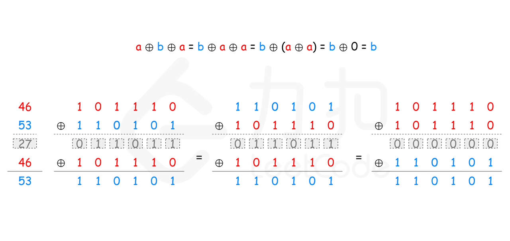
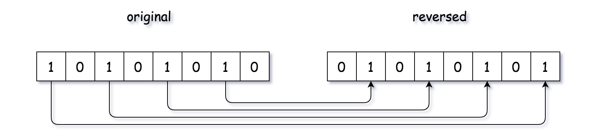
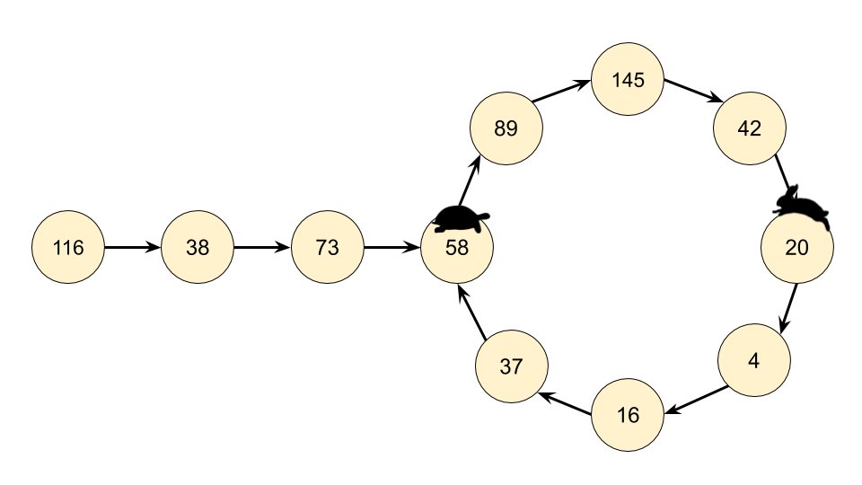
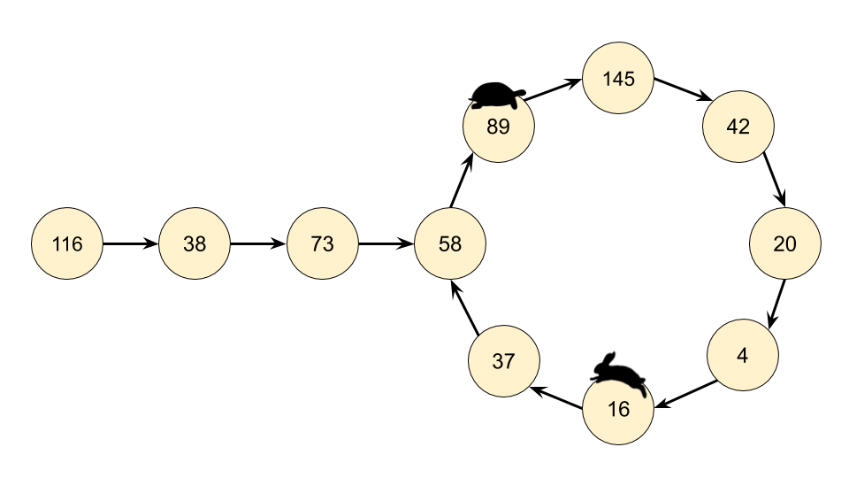
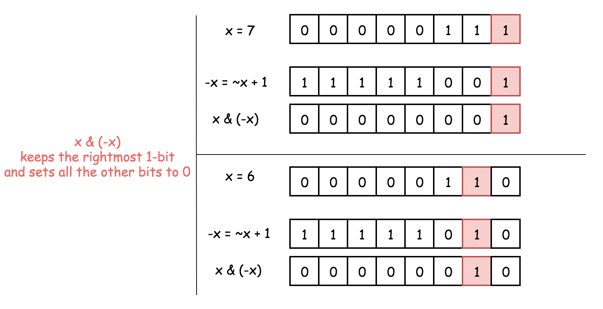

[TOC]


# 简单算法分析

---

## 1 两数之和

给定一个整数数组 nums 和一个整数目标值 target，请你在该数组中找出 和为目标值 的那 两个 整数，并返回它们的数组下标。

你可以假设每种输入只会对应一个答案。但是，数组中同一个元素不能使用两遍。

你可以按任意顺序返回答案。

1. 示例 1：

   输入：nums = [2,7,11,15], target = 9

   输出：[0,1]

   解释：因为 nums[0] + nums[1] == 9 ，返回 [0, 1] 。

2. 示例 2：

   输入：nums = [3,2,4], target = 6

   输出：[1,2]

3. 示例 3：

   输入：nums = [3,3], target = 6

   输出：[0,1]
   
   

### 1.1 解法一：暴力破解

最容易想到的方法是枚举数组中的每一个数 x，寻找数组中是否存在 target - x。

当我们使用遍历整个数组的方式寻找 target - x 时，需要注意到每一个位于 x 之前的元素都已经和 x 匹配过，因此不需要再进行匹配。而每一个元素不能被使用两次，所以我们只需要在 x 后面的元素中寻找 target - x。

```python
def twoSum_1(self, nums: list[int], target: int) -> list[int]:
    """
    :type nums: List[int]
    :type target: int
    :rtype: List[int]
    :description：两数之和，暴力破解
    """
    for index1 in range(len(nums)):
        for index2 in range(index1+1, len(nums)):
            if nums[index1] + nums[index2] == target:
                return [index1, index2]
```


### 1.2 解法二：哈希表

注意到方法一的时间复杂度较高的原因是寻找 target - x 的时间复杂度过高。因此，我们需要一种更优秀的方法，能够快速寻找数组中是否存在目标元素。如果存在，我们需要找出它的索引。

使用哈希表，可以将寻找 target - x 的时间复杂度降低到从 O(N)O(N) 降低到 O(1)O(1)。

这样我们创建一个哈希表，对于每一个 x，我们首先查询哈希表中是否存在 target - x，然后将 x 插入到哈希表中，即可保证不会让 x 和自己匹配。

```python
def twoSum_2(self, nums: list[int], target: int) -> list[int]:
    """
    :type nums: List[int]
    :type target: int
    :rtype: List[int]
    :description：两数之和，哈希表
    """
    hashtable = dict()
    for i, num in enumerate(nums):  # enumerate() 函数用于将一个可遍历的数据对象(如列表、元组或字符串)组合为一个索引序列，同时列出数据和数据下标
        if target - num in hashtable:  # key in dict：判断指定的键是否在字典中
            return [hashtable[target - num], i]
        hashtable[nums[i]] = i  # nums 中的数据进字典。nums[i] 为键，i为值
    return []
```


### 1.3 双指针

初始时两个指针分别指向第一个元素位置和最后一个元素的位置。每次计算两个指针指向的两个元素之和，并和目标值比较。如果两个元素之和等于目标值，则发现了唯一解。如果两个元素之和小于目标值，则将左侧指针右移一位。如果两个元素之和大于目标值，则将右侧指针左移一位。移动指针之后，重复上述操作，直到找到答案。

使用双指针的实质是缩小查找范围。那么会不会把可能的解过滤掉？答案是不会。假设 $\text{numbers}[i]+\text{numbers}[j]=\text{target}$ 是唯一解，其中 $0 \leq i<j \leq \text{numbers.length}-1$。初始时两个指针分别指向下标 0 和下标 $\text{numbers.length}-1$，左指针指向的下标小于或等于 i，右指针指向的下标大于或等于 j。除非初始时左指针和右指针已经位于下标 i 和 j，否则一定是左指针先到达下标 i 的位置或者右指针先到达下标 j 的位置。

如果左指针先到达下标 i 的位置，此时右指针还在下标 j 的右侧，$\text{sum}>\text{target}$，因此一定是右指针左移，左指针不可能移到 i 的右侧。

如果右指针先到达下标 j 的位置，此时左指针还在下标 i 的左侧，$\text{sum}<\text{target}$，因此一定是左指针右移，右指针不可能移到 j 的左侧。

由此可见，在整个移动过程中，左指针不可能移到 ii 的右侧，右指针不可能移到 jj 的左侧，因此不会把可能的解过滤掉。由于题目确保有唯一的答案，因此使用双指针一定可以找到答案。

```python
def twoSum(self, numbers: List[int], target: int) -> List[int]:
    low, high = 0, len(numbers) - 1
    while low < high:
        total = numbers[low] + numbers[high]
        if total == target:
            return [low, high]
        elif total < target:
            low += 1
        else:
            high -= 1

    return [-1, -1]
```

---


## 2 整数反转

给你一个 32 位的有符号整数 x ，返回 x 中每位上的数字反转后的结果。

如果反转后整数超过 32 位的有符号整数的范围 [−2^31,  2^31 − 1] ，就返回 0。

假设环境不允许存储 64 位整数（有符号或无符号）。

1. 示例 1：

   输入：x = 123

   输出：321

2. 示例 2：

   输入：x = -123

   输出：-321

3. 示例 3：

   输入：x = 120

   输出：21

4. 示例 4：

   输入：x = 0

   输出：0


### 2.1 解法一：弹出和推入数字 & 溢出前进行检查

我们可以一次构建反转整数的一位数字。在这样做的时候，我们可以预先检查向原整数附加另一位数字是否会导致溢出。

反转整数的方法可以与反转字符串进行类比。

我们想重复 “弹出”  xx 的最后一位数字，并将它 “推入” 到 rev 的后面。最后，rev 将与 xx 相反。

要在没有辅助堆栈 / 数组的帮助下 “弹出” 和 “推入” 数字，我们可以使用数学方法。

```python
# pop operation:
pop = x % 10;
x /= 10;

# push operation:
temp = rev * 10 + pop;
rev = temp;
```

但是，这种方法很危险，因为当 temp = rev⋅10+pop 时会导致溢出。幸运的是，事先检查这个语句是否会导致溢出很容易。在Python中可以设定 rev 的边界值，确定 rev 在边界之中即可

```python
def reverse(self, x: int) -> int:
    """
    :type x: int
    :rtype: int
    :description：整数反转
    """
    y, result = abs(x), 0 # 将 x 取绝对值，方便处理 负数，具体原因见 算法练习--2.3
    while y != 0:
        pop = y % 10
        y = y // 10 # 求余数，向下取整，单纯的 / 号，会使得 int 变成 float 类型
        result = result * 10 + pop
        #  边界的表示方法： boundry = (1<<31) -1 if x>0 else 1<<31。 result > boundry 即表示超过边界
        if -pow(2, 31) <= result <= pow(2, 31) - 1:
            continue
        else:
            return 0
    return result if x > 0 else -result
```


### 2.2 Python中负数取余的问题

C语言、java 这些是向0取值，-10 对 3 取余 得 -3 余 -1 ，

python 是向负无穷取值，-10 对 3 取余 得 -4 余 2.

在本题中，-123 % 10 = 7，因为 -123 对 10 取余 得 -13 余 7

---


## 3 回文数

给你一个整数 x ，如果 x 是一个回文整数，返回 ture ；否则，返回 false 。

回文数是指正序（从左向右）和倒序（从右向左）读都是一样的整数。例如，121 是回文，而 123 不是。

1. 示例 1：

   输入：x = 121

   输出：true

2. 示例 2：

   输入：x = -121

   输出：false

   解释：从左向右读, 为 -121 。 从右向左读, 为 121- 。因此它不是一个回文数。

3. 示例 3：

   输入：x = 10

   输出：false

   解释：从右向左读, 为 01 。因此它不是一个回文数。

4. 示例 4：

   输入：x = -101

   输出：false

提示：-2^31 <= x <= 2^31 - 1。


### 3.1 解法一：借助字符串

暴力破解，时间长，内存消耗大

```python
def is_palindrome(self, x) -> bool:
    """
    :type x: int
    :rtype: bool
    :description: 回文数判断，借助字符串
    """
    return str(x) == str(x)[::-1]
```

**注意：字符串截取**

```python
s = 'abcdefg'
a = s[0]  # 下标为 0 的字符
b = s[1]  # 下标为 1 的字符
c = s[0: ]  # 从下标为 0 的位置开始截取，直到最后一个字符
d = s[1:4]  # 从下标为 1 的位置开始截取，直到下标为 4 的字符，但不包含第四个字符
e = s * 2  # *号，重复字符串 s 两次，赋值给 e
f = s + 'abc'  # 字符串的加法运算，s 的末尾 加上 'abc'
g = s[1:4:2]  # 在索引 1 到索引 4 的位置并设置为步长为 2（间隔一个位置）来截取字符串

# 利用负数下标截取字符串
x = s[-4:-1] # 从下标为 -4 开始时截取 至 下标为 -1 前的字符：def
x = s[-1:-4] # 截取失败，截取字符串默认从前往后截取，s[4:1] 同样截取失败

# 注意特殊情况
x = s[4:1:-1] # 截取成功，x = edc。即逆置截取字符串，从索引为 4 开始，截取至 索引为 1，不包括索引1. 
x = s[::-1] # 逆置截取全部字符
x = s[::] # 截取全部字符串
```


### 3.2 解法二：反转一半的数字

**思路：**

第二个想法是将数字本身反转，然后将反转后的数字与原始数字进行比较，如果它们是相同的，那么这个数字就是回文。但是，如果反转后的数字大于 int.MAX，我们将遇到整数溢出问题。

按照第二个想法，为了避免数字反转可能导致的溢出问题，为什么不考虑只反转 int 数字的一半？毕竟，如果该数字是回文，其后半部分反转后应该与原始数字的前半部分相同。

例如，输入 1221，我们可以将数字 “1221” 的后半部分从 “21” 反转为 “12”，并将其与前半部分 “12” 进行比较，因为二者相同，我们得知数字 1221 是回文。

**算法：**

首先，我们应该处理一些临界情况。所有负数都不可能是回文，例如：-123 不是回文，因为 - 不等于 3。所以我们可以对所有负数返回 false。

除了 0 以外，所有个位是 0 的数字不可能是回文，因为最高位不等于 0。所以我们可以对所有大于 0 且个位是 0 的数字返回 false。

现在，让我们来考虑如何反转后半部分的数字：

对于数字 1221，如果执行 1221 % 10，我们将得到最后一位数字 1，要得到倒数第二位数字，我们可以先通过除以 10 把最后一位数字从 1221 中移除，1221 / 10 = 122，再求出上一步结果除以 10 的余数，122 % 10 = 2，就可以得到倒数第二位数字。如果我们把最后一位数字乘以 10，再加上倒数第二位数字，1 * 10 + 2 = 12，就得到了我们想要的反转后的数字。如果继续这个过程，我们将得到更多位数的反转数字。

现在的问题是，我们如何知道反转数字的位数已经达到原始数字位数的一半？

由于整个过程我们不断将原始数字除以 10，然后给反转后的数字乘上 10，所以，当原始数字小于或等于反转后的数字时，就意味着我们已经处理了一半位数的数字了。


```python
def is_palindrome_2(self, x) -> bool:
    """
    :type x: int
    :rtype: bool
    :description: 回文数判断，反转一半的数字
    """
    if x < 0 or (x % 10 == 0 and x != 0):
        return False
    reverted_number = 0
    while x > reverted_number:
        reverted_number = reverted_number * 10 + x % 10
        x //= 10
    return x == reverted_number or x == reverted_number // 10
```

---


## 4 罗马数

罗马数字包含以下七种字符: I， V， X， L，C，D 和 M。

| 字符 | 数值 |
| :--: | :--: |
|  I   |  1   |
|  V   |  5   |
|  X   |  10  |
|  L   |  50  |
|  C   | 100  |
|  D   | 500  |
|  M   | 1000 |

例如， 罗马数字 2 写做 II ，即为两个并列的 1。12 写做 XII ，即为 X + II 。 27 写做  XXVII, 即为 XX + V + II。

通常情况下，罗马数字中小的数字在大的数字的右边。但也存在特例，例如 4 不写做 IIII，而是 IV。数字 1 在数字 5 的左边，所表示的数等于大数 5 减小数 1 得到的数值 4 。同样地，数字 9 表示为 IX。这个特殊的规则只适用于以下六种情况：

1. I 可以放在 V (5) 和 X (10) 的左边，来表示 4 和 9。
2. X 可以放在 L (50) 和 C (100) 的左边，来表示 40 和 90。 
3. C 可以放在 D (500) 和 M (1000) 的左边，来表示 400 和 900。

给定一个罗马数字，将其转换成整数。输入确保在 1 到 3999 的范围内。

1. 示例 1:

   输入: "III"

   输出: 3

2. 示例 2:

   输入: "IV"

   输出: 4

3. 示例 3:

   输入: "IX"

   输出: 9

4. 示例 4:

   输入: "LVIII"

   输出: 58

   解释: L = 50, V= 5, III = 3.

5. 示例 5:

   输入: "MCMXCIV"

   输出: 1994

   解释: M = 1000, CM = 900, XC = 90, IV = 4.

**提示：**

1. 1 <= s.length <= 15
2. s 仅含字符 ('I', 'V', 'X', 'L', 'C', 'D', 'M')
3. 题目数据保证 s 是一个有效的罗马数字，且表示整数在范围 [1, 3999] 内
4. 题目所给测试用例皆符合罗马数字书写规则，不会出现跨位等情况。
5. IC 和 IM 这样的例子并不符合题目要求，49 应该写作 XLIX，999 应该写作 CMXCIX 。
6. 关于罗马数字的详尽书写规则，可以参考 罗马数字 - Mathematics 。


### 4.1 解法一：暴力破解，字符串匹配

字符串依次匹配

```python
def romanToInt(self, s: str) -> int:
    """
    :type s: str
    :rtype: int
    :description: 罗马数
    """
    i, num = 0, 0
    while i < len(s):
        if s[i] == 'M':
            num = num + 1000
            i = i + 1
        elif s[i] == 'D':
            num = num + 500
            i = i + 1
        elif s[i] == 'C':
            if i == len(s) - 1:
                num = num + 100
                i = i + 1
            elif s[i + 1] == 'D':
                num = num + 400
                i = i + 2
            elif s[i + 1] == 'M':
                num = num + 900
                i = i + 2
            else:
                num = num + 100
                i = i + 1
        elif s[i] == 'L':
            num = num + 50
            i = i + 1
        elif s[i] == 'X':
            if i == len(s) - 1:
                num = num + 10
                i = i + 1
            elif s[i+1] == 'L':
                num = num + 40
                i = i + 2
            elif s[i+1] == 'C':
                num = num + 90
                i = i + 2
            else:
                num = num + 10
                i = i + 1
        elif s[i] == 'V':
            num = num + 5
            i = i + 1
        elif s[i] == 'I':
            if i == len(s)-1:
                num = num + 1
                i = i + 1
            elif s[i+1] == 'V':
                num = num + 4
                i = i + 2
            elif s[i+1] == 'X':
                num = num + 9
                i = i + 2
            else:
                num = num + 1
                i = i + 1
    return num
```


### 4.2 解法二：罗马数规律

按照题目的描述，可以总结如下规则：

1. 罗马数字由 I, V, X, L, C, D, M 构成；
2. 当小值在大值的左边，则减小值，如 IV=5-1=4；
3. 当小值在大值的右边，则加小值，如 VI=5+1=6；
4. 由上可知，右值永远为正，因此最后一位必然为正。

在代码实现上，可以往后看多一位，对比当前位与后一位的大小关系，从而确定当前位是加还是减法。当没有下一位时，做加法即可。

也可保留当前位的值，当遍历到下一位的时，对比保留值与遍历位的大小关系，再确定保留值为加还是减。最后一位做加法即可。

```python
# 自定义 get_value 函数
def romanToInt_2(self, s: str) -> int:
    """
    :type s: str
    :rtype: int
    :description: 罗马数，罗马数规律
    """
    prenum, num, sum = Solution.get_num(s[0]), 0, 0
    for i in range(1, len(s)):
        num = Solution.get_num(s[i])
        if prenum < num:
            sum = sum - prenum
        else:
            sum = sum + prenum
        prenum = num
    return sum + prenum

@classmethod  # 加入 @classmethod 注释，方便直接调用该方法
def get_num(cls, s: str) -> int:
    num = 0
    if s == 'M':
        num = 1000
    elif s == 'D':
        num = 500
    elif s == 'C':
        num = 100
    elif s == 'L':
        num = 50
    elif s == 'X':
        num = 10
    elif s == 'V':
        num = 5
    elif s == 'I':
        num = 1
    return num
 
# 利用哈希表取值
def romanToInt_3(self, s: str) -> int:
    """
    :type s: str
    :rtype: int
    :description: 罗马数，罗马数规律，利用哈希表取值
    """
    roman_int = {'I': 1, 'V': 5, 'X': 10, 'L': 50, 'C': 100, 'D': 500, 'M': 1000}
    int = 0
    for index in range(len(s)-1):
        if roman_int[s[index]] < roman_int[s[index+1]]:
            int -= roman_int[s[index]]
        else:
            int += roman_int[s[index]]
    return int + roman_int[s[-1]]
```


### 4.3 解法三：利用字典进行字符串匹配

构建一个字典记录所有罗马数字子串，注意长度为2的子串记录的值是（实际值 - 子串内左边罗马数字代表的数值）

这样一来，遍历整个 ss 的时候判断当前位置和前一个位置的两个字符组成的字符串是否在字典内，如果在就记录值，不在就说明当前位置不存在小数字在前面的情况，直接记录当前位置字符对应值

```python
def romanToInt_4(self, s: str) -> int:
    """
    :type s: str
    :rtype: int
    :description: 罗马数，利用字典进行字符串匹配
    """
    # 注意在字典中 IX = 8，因为对于 XIX，第一次str1 = XI，匹配到 I，则 result+1，第二次匹配到 IX，则result + 8，两次合起来实现 IX = 9
    d = {'I': 1, 'IV': 3, 'V': 5, 'IX': 8, 'X': 10, 'XL': 30, 'L': 50, 'XC': 80, 'C': 100, 'CD': 300, 'D': 500, 'CM': 800, 'M': 1000}
    result = 0
    for i, n in enumerate(s):
        str1 = s[max(i - 1, 0):i + 1]  # 作者解析中的2就是用这行代码实现的
        if str1 in d:
            result += d.get(str1)
        else:
            result += d[n]
    return result
```

---


## 5 最长公共前缀

编写一个函数来查找字符串数组中的最长公共前缀。

如果不存在公共前缀，返回空字符串 ""。

1. 示例 1：

   输入：strs = ["flower","flow","flight"]

   输出："fl"

2. 示例 2：

   输入：strs = ["dog","racecar","car"]

   输出：""

   解释：输入不存在公共前缀。

提示：

- 0 <= strs.length <= 200
- 0 <= strs[i].length <= 200
- strs[i] 仅由小写英文字母组成


### 5.1 解法一：字符串截取，适用于Python

```python
def longestCommonPrefix_1(self, strs: List[str]) -> str:
    """
    :description: 最长公共前缀，字符串截取
    """
    if not strs:
        return ""
    else:
        str_1 = strs[0]
        for i in range(len(str_1)):
            for j in range(len(strs)):
                # 正常情况
                if strs[j][:i+1] != str_1[:i+1]:
                    return str_1[:i]
                else:
                    continue
        # 解决异常情况，当strs里的值都是相同的时候
        return str_1
 
def longestCommonPrefix_2(self, strs: List[str]) -> str:
    """
    :description: 最长公共前缀，字符串匹配，算法优化
    """
    if not strs:
        return ""
    # 利用 min 和 max 取 strs 中最长和最短的字符串
    str0 = min(strs)
    str1 = max(strs)
    for i in range(len(str0)):
        if str0[i] != str1[i]:
            return str0[:i]
    return str0
```


### 5.2 解法二：通用解法，纵向扫描

纵向扫描时，从前往后遍历所有字符串的每一列，比较相同列上的字符是否相同，如果相同则继续对下一列进行比较，如果不相同则当前列不再属于公共前缀，当前列之前的部分为最长公共前缀。


```python
def longestCommonPrefix_2(self, strs: List[str]) -> str:
    """
    :description: 最长公共前缀，字符串匹配，算法优化
    """
    if not strs:
        return ""
    length, count = len(strs[0]), len(strs)
    for i in range(length):
        c = strs[0][i]
        if any(i == len(strs[j]) or strs[j][i] != c for j in range(1, count)):
            return strs[0][:i]

    return strs[0]
```

---


## 6 有效的括号

给定一个只包括 '('，')'，'{'，'}'，'['，']' 的字符串 s ，判断字符串是否有效。

有效字符串需满足：

1. 左括号必须用相同类型的右括号闭合。
2. 左括号必须以正确的顺序闭合。

1. 示例 1：

   输入：s = "()"

   输出：true

2. 示例 2：

   输入：s = "()[]{}"

   输出：true

3. 示例 3：

   输入：s = "(]"

   输出：false

4. 示例 4：

   输入：s = "([)]"

   输出：false

5. 示例 5：

   输入：s = "{[]}"

   输出：true

提示：

- 1 <= s.length <= 10^4
- s 仅由括号 '()[]{}' 组成


### 6.1 解法一：标准解法，利用栈

**注意：**

Python中涉及字符串的匹配时可以利用字典简化代码

```python
def isValid_2(self, s: str) -> bool:
    """
    :description: 有效的括号，利用字典匹配
    :param s: 只含括号的字符串
    :return: bool
    """
    if len(s) % 2 == 1:
        return False
    else:
        pairs = {")": "(", "]": "[", "}": "{"}
        list_1 = []
        for ch in s:
            if ch in pairs:
                if not list_1 or list_1[-1] != pairs[ch]:
                    return False
                list_1.pop()
            else:
                list_1.append(ch)
        return not list_1
```

---


## 7 删除排序数组中的重复项

给定一个排序数组，你需要在 原地 删除重复出现的元素，使得每个元素只出现一次，返回移除后数组的新长度。

不要使用额外的数组空间，你必须在 原地 修改输入数组 并在使用 O(1) 额外空间的条件下完成。

1. 示例 1:

   给定数组 nums = [1, 1, 2], 

   函数应该返回新的长度 2, 并且原数组 nums 的前两个元素被修改为 1, 2。 

   你不需要考虑数组中超出新长度后面的元素。

2. 示例 2:

   给定 nums = [0, 0, 1, 1, 1, 2, 2, 3, 3, 4],

   函数应该返回新的长度 5, 并且原数组 nums 的前五个元素被修改为 0, 1, 2, 3, 4。

   你不需要考虑数组中超出新长度后面的元素。


### 7.1 解法：双指针

**算法：**

数组完成排序后，我们可以放置两个指针 i 和 j，其中 i 是慢指针，而 j 是快指针。只要 nums[i] = nums[j]，我们就增加 j 以跳过重复项。

当我们遇到 nums[j] != nums[i] 时，跳过重复项的运行已经结束，因此我们必须把 nums[j] 的值复制到nums[i+1]。然后递增 i，接着我们将再次重复相同的过程，直到 j 到达数组的末尾为止。

```python
def removeDuplicates(self, nums: List[int]) -> int:
    """
    :description: 删除有序数组中的重复项，双指针
    """
    if not nums:
        return 0
    i = 0
    for j in range(1, len(nums)):
        if nums[j] != nums[i]:
            i = i + 1
            nums[i] = nums[j]
    return i+1
```

---


## 8 移除元素

给你一个数组 nums 和一个值 val，你需要 原地 移除所有数值等于 val 的元素，并返回移除后数组的新长度。

不要使用额外的数组空间，你必须仅使用 O(1) 额外空间并 原地 修改输入数组。

元素的顺序可以改变。你不需要考虑数组中超出新长度后面的元素。

1. 示例 1：

   输入：nums = [3,2,2,3], val = 3

   输出：2, nums = [2,2]
   解释：函数应该返回新的长度 2, 并且 nums 中的前两个元素均为 2。你不需要考虑数组中超出新长度后面的元素。例如，函数返回的新长度为 2 ，而 nums = [2,2,3,3] 或 nums = [2,2,0,0]，也会被视作正确答案。

2. 示例 2：

   输入：nums = [0,1,2,2,3,0,4,2], val = 2
   输出：5, nums = [0,1,4,0,3]
   解释：函数应该返回新的长度 5, 并且 nums 中的前五个元素为 0, 1, 3, 0, 4。注意这五个元素可为任意顺序。你不需要考虑数组中超出新长度后面的元素。


### 8.1 解法一：双指针，val后移

当我们遇到 nums[i]=val 时，我们可以将当前元素与最后一个元素进行交换，并释放最后一个元素。这实际上使数组的大小减少了 1。

请注意，被交换的最后一个元素可能是您想要移除的值。但是不要担心，在下一次迭代中，我们仍然会检查这个元素。

```python
def removeElement_1(self, nums: List[int], val: int) -> int:
    """
    :description: 移除数组中的指定元素，双指针，val后移
    :param nums:
    :param val:
    :return:
    """
    i, count = 0, len(nums)
    while i < count:
        if nums[i] == val:
            nums[i] = nums[count-1]
            count -= 1
        else:
            i += 1

    return count
```


### 8.2 解法二：双指针，元素前移

双指针其实就是两个数，分别代表两个index，表示数组中第几个数的意思。比如这里，我们让a代表一个index，b代表一个index

然后我们让a一直往后移动，相当于nums[a]从数组第一个数遍历到最后一个数。当且仅当我们发现nums[a] != val 的时候，我们把这个数拷贝到 b 指向的位置，默认b是从0开始的，然后 b += 1指向下一个位置。

这样我们就保证了前b个数，就是我们要的结果。不重复的数。

```python
def removeElement_2(self, nums: List[int], val: int) -> int:
    """
    :description: 移除数组中的指定元素，双指针，元素前移
    :param nums:
    :param val:
    :return:
    """
    a, b = 0, 0

    while a < len(nums):
        if nums[a] != val:
            nums[b] = nums[a]
            b += 1
        a += 1

    return b
```

---


## 9 实现strStr() 

给定一个 haystack 字符串和一个 needle 字符串，在 haystack 字符串中找出 needle 字符串出现的第一个位置 (从0开始)。如果不存在，则返回  -1。

1. 示例 1：

   输入: haystack = "hello", needle = "ll"

   输出: 2

2. 示例 2:

   输入: haystack = "aaaaa", needle = "bba"

   输出: -1

说明:

1. 当 needle 是空字符串时，我们应当返回什么值呢？这是一个在面试中很好的问题。对于本题而言，当 needle 是空字符串时我们应当返回 0 。这与C语言的 strstr() 以及 Java的 indexOf() 定义相符。


### 9.1 解法一：字符串匹配

最直接的方法 - 沿着字符串逐步移动滑动窗口，将窗口内的子串与 needle 字符串比较。

```python
def strStr(self, haystack: str, needle: str) -> int:
    """
    :description: 实现strStr() 函数
    :param haystack:
    :param needle:
    :return:
    """
    if needle == "":
        return 0
    elif needle != "" and haystack == "":
        return -1
    else:
        len_1, len_2 = len(haystack), len(needle)
        for i in range(len_1):
            if haystack[i] == needle[0]:
                if i + len_2 <= len_1:
                    if haystack[i:i+len_2] == needle:
                        return i
        return -1
```

---


## 10 搜索插入位置

给定一个排序数组和一个目标值，在数组中找到目标值，并返回其索引。如果目标值不存在于数组中，返回它将会被按顺序插入的位置。

你可以假设数组中无重复元素。

1. 示例 1:

   输入: [1,3,5,6], 5

   输出: 2

2. 示例 2:

   输入: [1,3,5,6], 2

   输出: 1

3. 示例 3:

   输入: [1,3,5,6], 7

   输出: 4

4. 示例 4:

   输入: [1,3,5,6], 0

   输出: 0


### 10.1 解法一：暴力破解

依次查找，获取 nums 中第一个 大于等于 target 的下标

```python
def searchInsert(self, nums: List[int], target: int) -> int:
    """
    :description: 搜索插入位置
    :param nums:
    :param target:
    :return:
    """
    if not nums:
        return 0
    for i in range(0, len(nums)):
        if nums[i] >= target:
            return i
    return len(nums)
```


### 10.2 解法二：二分查找

假设题意是叫你在排序数组中寻找是否存在一个目标值，那么训练有素的读者肯定立马就能想到利用二分法在 O(logn) 的时间内找到是否存在目标值。但这题还多了个额外的条件，即如果不存在数组中的时候需要返回按顺序插入的位置，那我们还能用二分法么？答案是可以的，我们只需要稍作修改即可。

考虑这个插入的位置 pos，它成立的条件为：nums[pos−1] < target ≤ nums[pos]

其中 nums 代表排序数组。由于如果存在这个目标值，我们返回的索引也是 pos，因此我们可以将两个条件合并得出最后的目标：「在一个有序数组中找第一个大于等于 target 的下标」。

问题转化到这里，直接套用二分法即可，即不断用二分法逼近查找第一个大于等于 target 的下标 。下文给出的代码是笔者习惯的二分写法，ans 初值设置为数组长度可以省略边界条件的判断，因为存在一种情况是 target 大于数组中的所有数，此时需要插入到数组长度的位置。

```python
def searchInsert(self, nums: List[int], target: int) -> int:
    """
    :description: 搜索插入位置，二分查找
    :param nums:
    :param target:
    :return:
    """
    left, right = 0, len(nums)
    while left < right:
        mid = (left + right) // 2
        if nums[mid] < target:
            left = mid + 1
        else:
            right = mid
    return left
```

---


## 11 外观数列

给定一个正整数 n ，输出外观数列的第 n 项。

「外观数列」是一个整数序列，从数字 1 开始，序列中的每一项都是对前一项的描述。

你可以将其视作是由递归公式定义的数字字符串序列：

- countAndSay(1) = "1"
- countAndSay(n) 是对 countAndSay(n-1) 的描述，然后转换成另一个数字字符串。

前五项如下：

1.     1
2.     11
3.     21
4.     1211
5.     111221
第一项是数字 1 
描述前一项，这个数是 1 即 “ 一 个 1 ”，记作 "11"
描述前一项，这个数是 11 即 “ 二 个 1 ” ，记作 "21"
描述前一项，这个数是 21 即 “ 一 个 2 + 一 个 1 ” ，记作 "1211"
描述前一项，这个数是 1211 即 “ 一 个 1 + 一 个 2 + 二 个 1 ” ，记作 "111221"

要描述 一个数字字符串，首先要将字符串分割为 最小 数量的组，每个组都由连续的最多 相同字符 组成。然后对于每个组，先描述字符的数量，然后描述字符，形成一个描述组。要将描述转换为数字字符串，先将每组中的字符数量用数字替换，再将所有描述组连接起来。

例如，数字字符串 "3322251" 的描述如下图：


1. 示例 1：

   输入：n = 1

   输出："1"，这是一个基本样例。

2. 示例 2：

   输入：n = 4

   输出："1211"

   解释：

   - countAndSay(1) = "1"
   - countAndSay(2) = 读 "1" = 一 个 1 = "11"
   - countAndSay(3) = 读 "11" = 二 个 1 = "21"
   - countAndSay(4) = 读 "21" = 一 个 2 + 一 个 1 = "12" + "11" = "1211"


### 11.1 解法：递归

利用递归，根据 前项 获取 后项

```python
def countAndSay(self, n: int) -> str:
    """
    :description: 输出外观数列的第 n 项
    :param n:
    :return:
    """
    if n == 1:
        return "1"
    else:
        str_num = "1"
        for i in range(n-1):
            str_num = Solution.description(str_num)
        return str_num

@classmethod
def description(cls, str_num: str) -> str:
    """
    方法用于：被 countAndSay 调用，描述num
    """
    val = str_num[0]
    return_str = ""
    j = 0
    for i in range(len(str_num)):
        if str_num[i] == val:
            j += 1
        else:
            return_str = return_str + str(j) + val
            val = str_num[i]
            j = 1

    # 解决 “11” 这种情况，避免循环结束后有数字的未被描述
    return_str = return_str + str(j) + val
    return return_str
```

---


## 12 最大子序和

给定一个整数数组 nums ，找到一个具有最大和的连续子数组（子数组最少包含一个元素），返回其最大和。

1. 示例 1：

   输入：nums = [-2,1,-3,4,-1,2,1,-5,4]

   输出：6

   解释：连续子数组 [4,-1,2,1] 的和最大，为 6 。

2. 示例 2：

   输入：nums = [1]

   输出：1

3. 示例 3：

   输入：nums = [0]

   输出：0

4. 示例 4：

   输入：nums = [-1]

   输出：-1

5. 示例 5：

   输入：nums = [-100000]

   输出：-100000


### 12.1 解法一：动态规划

假设 nums 数组的长度是 n，下标从 0 到 n−1。

我们用 f(i) 代表以第 i 个数结尾的「连续子数组的最大和」，那么很显然我们要求的答案就是：
$$
max{f(i)}
$$
因此我们只需要求出每个位置的 f(i)，然后返回 f 数组中的最大值即可。那么我们如何求 f(i) 呢？我们可以考虑 nums[i] 单独成为一段还是加入 f(i−1) 对应的那一段，这取决于 nums[i] 和 f(i-1) + nums[i] 的大小，我们希望获得一个比较大的，于是可以写出这样的动态规划转移方程：
$$
f(i)=max[f(i−1)+nums[i],nums[i]]
$$
不难给出一个时间复杂度 O(n)、空间复杂度 O(n) 的实现，即用一个 f 数组来保存 f(i) 的值，用一个循环求出所有 f(i)。考虑到 f(i) 只和 f(i−1) 相关，于是我们可以只用一个变量 pre 来维护对于当前 f(i) 的 f(i−1) 的值是多少，从而让空间复杂度降低到 O(1)，这有点类似「滚动数组」的思想。

```python
def maxSubArray_1(self, nums: List[int]) -> int:
    """
    :description: 最大子序和，动态规划
    :param nums: list[int]
    :return: int
    """
    pre, max_ans = 0, nums[0]
    for i in nums:
        pre = max(pre+i, i)
        max_ans = max(max_ans, pre)

    return max_ans
```


### 12.2 解法二：分治

我们定义一个操作 **get(a, l, r)** 表示查询 **a** 序列 **[l，r]** 区间内的最大子段和，那么最终我们要求的答案就是 **get(nums, 0, nums.size() - 1)**。如何分治实现这个操作呢？

对于一个区间 **[l，r]**，我们取 
$$
m = ⌊ (l+r) / 2 ⌋
$$
对区间 **[l，m]** 和 **[m+1，r]** 分治求解。当递归逐层深入直到区间长度缩小为 **1** 的时候，递归「开始回升」。这个时候我们考虑如何通过 **[l，m]** 区间的信息和 **[m+1，r]** 区间的信息合并成区间 **[l，r]** 的信息。最关键的两个问题是：

- 我们要维护区间的哪些信息呢？
- 我们如何合并这些信息呢？

对于一个区间 **[l，r]**，我们可以维护四个量：

- **lSum** 表示 **[l，r]** 内以 **l** 为左端点的最大子段和
- **rSum** 表示 **[l，r]** 内以 **r** 为右端点的最大子段和 
- **mSum** 表示 **[l，r]** 内的最大子段和 
- **iSum** 表示 **[l，r]** 的区间和

以下简称 **[l，m]** 为 **[l，r]** 的「左子区间」，**[m+1，r]** 为 **[l，r]** 的「右子区间」。我们考虑如何维护这些量呢（如何通过左右子区间的信息合并得到 **[l，r]** 的信息）？对于长度为 **1** 的区间 **[i，i]**，四个量的值都和 **nums[ i ]** 相等。对于长度大于 **1** 的区间：

1. 首先最好维护的是 **iSum**，区间 **[l，r]** 的 **iSum** 就等于「左子区间」的 **iSum** 加上「右子区间」的 **iSum**。 
2. 对于 **[l，r]** 的 **lSum**，存在两种可能，它要么等于「左子区间」的 **lSum**，要么等于「左子区间」的 **iSum** 加上「右子区间」的 **lSum**，二者取大。 
3. 对于 **[l，r]** 的 **rSum**，同理，它要么等于「右子区间」的 **rSum**，要么等于「右子区间」的 **iSum** 加上「左子区间」的 **rSum**，二者取大。 
4. 当计算好上面的三个量之后，就很好计算 **[l，r]** 的 **mSum** 了。我们可以考虑 **[l，r]** 的 **mSum** 对应的区间是否跨越 **m** —— 它可能不跨越 **m**，也就是说 **[l，r]** 的 **mSum** 可能是「左子区间」的 **mSum** 和 「右子区间」的 **mSum** 中的一个；它也可能跨越 m，可能是「左子区间」的 **rSum** 和 「右子区间」的 **lSum** 求和。三者取大。

```python
def maxSubArray_2(self, nums: List[int]) -> int:
    """
    :description: 最大子序和，分治
    :param nums: list[int]
    :return: int
    """
    n = len(nums)
    # 递归终止条件
    if n == 1:
        return nums[0]
    else:
        # 递归计算左半边最大子序和
        max_left = self.maxSubArray(nums[0:len(nums) // 2])
        # 递归计算右半边最大子序和
        max_right = self.maxSubArray(nums[len(nums) // 2:len(nums)])

    # 计算中间的最大子序和，从右到左计算左边的最大子序和，从左到右计算右边的最大子序和，再相加
    max_l = nums[len(nums) // 2 - 1]
    tmp = 0
    for i in range(len(nums) // 2 - 1, -1, -1):
        tmp += nums[i]
        max_l = max(tmp, max_l)
    max_r = nums[len(nums) // 2]
    tmp = 0
    for i in range(len(nums) // 2, len(nums)):
        tmp += nums[i]
        max_r = max(tmp, max_r)
    # 返回三个中的最大值
    return max(max_right, max_left, max_l + max_r)
```

---


## 13 最后一个单词

给你一个字符串 s，由若干单词组成，单词之间用空格隔开。返回字符串中最后一个单词的长度。如果不存在最后一个单词，请返回 0 。

单词 是指仅由字母组成、不包含任何空格字符的最大子字符串。

1. 示例 1：

   输入：s = "Hello World"

   输出：5

2. 示例 2：

   输入：s = " "

   输出：0

提示：

- 1 <= s.length <= 10^4
- s 仅有英文字母和空格 ' ' 组成


### 13.1 解法一

1. 从后往前过滤
2. 利用 length 记录长度，j 记录索引位置
3. 注意末尾的空格处理

```python
def lengthOfLastWord(self, s: str) -> int:
    """
    :description: 最后一个单词的长度
    :param s: str
    :return: int
    """
    length, j = 0, -1
    for i in range(len(s)):
        if s[j] == " ":
            if length == 0:
                j -= 1
            else:
                return length
        else:
            length += 1
            j -= 1
    return length
```

---


## 14 加一

给定一个由 整数 组成的 非空 数组所表示的非负整数，在该数的基础上加一。

最高位数字存放在数组的首位， 数组中每个元素只存储单个数字。

你可以假设除了整数 0 之外，这个整数不会以零开头。

1. 示例 1：

   输入：digits = [1,2,3]

   输出：[1,2,4]

   解释：输入数组表示数字 123。

2. 示例 2：

   输入：digits = [4,3,2,1]

   输出：[4,3,2,2]

   解释：输入数组表示数字 4321。

3. 示例 3：

   输入：digits = [0]

   输出：[1]

4. 示例4：

   输入：digits = [9]

   输出：[1, 0]


### 14.1 解法一

从后往前遍历

1. 当数字加一之后变为  9，则该位变为 0，其前一位 +1
2. 当第一位数字为 9，则该位变为 0，数组在索引为 0 的地方插入一位 1

```python
def plusOne(self, digits: List[int]) -> List[int]:
    """
    :description: 加一
    :param digits: list
    :return: list
    """
    for i in range(len(digits)-1, -1, -1):
        digits[i] += 1
        if digits[i] != 10:
            break
        else:
            digits[i] = 0
            if i == 0:
                digits.insert(0, 1)
    return digits
```

---


## 15 二进制求和

给你两个二进制字符串，返回它们的和（用二进制表示）。

输入为 非空 字符串且只包含数字 1 和 0。

1. 示例 1:

   输入: a = "11", b = "1"
   输出: "100"

2. 示例 2:

   输入: a = "1010", b = "1011"

   输出: "10101"


### 15.1 解法一

1. 补齐两个字符串，使得两个字符串的长度一致
2. 用 carry 记录 是否进位，res 记录 返回的字符串
3. 在计算过程中，将 字符 转换为 整数，计算结束后，再将 数字 转换为 字符

```python
def addBinary(self, a: str, b: str) -> str:
    """
    :description: 计算两个二进制数的和
    :param a:
    :param b:
    :return:
    """
    # 1. 补齐两个字符串，使得两个字符串一样长
    if len(a) < len(b):
        a = '0'*(len(b)-len(a))+a
    else:
        b = '0'*(len(a)-len(b))+b
    # carry 记录 是否进位，res 记录 返回的字符串
    carry = 0
    res = ''
    for i in range(len(a)-1, -1, -1):
        if int(a[i])+int(b[i])+carry >= 2:
            res = str(int(a[i])+int(b[i])+carry-2)+res
            carry = 1
        else:
            res = str(int(a[i])+int(b[i])+carry)+res
            carry = 0
    if carry == 1:
        res = '1'+res
    return res
```

---


## 16 x 的平方根

实现 int sqrt(int x) 函数。

计算并返回 x 的平方根，其中 x 是非负整数。

由于返回类型是整数，结果只保留整数的部分，小数部分将被舍去。

1. 示例 1:

   输入: 4

   输出: 2

2. 示例 2:

   输入: 8

   输出: 2

   说明: 8 的平方根是 2.82842..., 由于返回类型是整数，小数部分将被舍去。


### 16.1 解法一：数学公式

利用 指数函数exp 和 对数函数 ln 代替平方根函数。

将 $\sqrt{x}$  写成 幂的形式：x^1/2^ ，在使用对数函数 e 进行换底，即可得到：
$$
\sqrt{x} = x^{1/2} = (e^{ln x})^{1/2} = e^{\frac{1}{2} lnx}
$$
注意：由于计算机无法存储浮点数的精确值，而指数函数和对数函数的参数和返回值均是浮点数，所以在运算过程中会存在误差。例如，当 x = 2147395600 时，$e^{\frac{1}{2}lnx}$ 的计算结果与正确值 46340 会相差 $10^{-11}$ ，这样对结果取整数部分时，会得到 46339 这个错误的结果

因此在获取结果的整数部分 ans 之后，要找出 ans 和 ans +1 哪个才是正确的答案

```python
def mySqrt(self, x: int) -> int:
    """
    :description: 求 x 的平方根
    :param x:
    :return:
    """
    if x == 0:
        return 0
    ans = int(math.exp(0.5 * math.log(x)))
    return ans + 1 if (ans + 1) ** 2 <= x else ans
```


### 16.2 解法二：二分查找

由于 $x$ 平方根的整数部分 ans 是满足 $k^2 \leq x$ 最大 k 值，因此我们可以对 k 进行二分查找，从而得到答案。

二分查找的下界为 0，上界可以粗略地设定为 x。在二分查找的每一步中，我们只需要比较中间元素 mid的平方与 x 的大小关系，并通过比较的结果调整上下界的范围。由于我们所有的运算都是整数运算，不会存在误差，因此在得到最终的答案 ans 后，也就不需要再去尝试 ans+1 了。

```python
def mySqrt_2(self, x: int) -> int:
    """
    :description: 求 x 的平方根，二分查找
    :param x:
    :return:
    """
    l, r, ans = 0, x, -1
    while l <= r:
        mid = (l+r) // 2
        if mid * mid <= x:
            ans = mid
            l = mid + 1
        else:
            r = mid-1
    return ans
```


### 16.3 解法三：牛顿迭代

牛顿迭代法是一种可以用来快速求解函数零点的方法。

为了叙述方便，我们用 C 表示待求出平方根的那个整数。显然，C 的平方根就是函数

$$
y = f(x) = x^2 - C
$$
的零点。

牛顿迭代法的本质是借助泰勒级数，从初始值开始快速向零点逼近。我们任取一个 $x_0$ 作为初始值，在每一步的迭代中，我们找到函数图像上的点 $(x_i, f(x_i))$，过该点作一条斜率为该点导数 $f'(x_i)$ 的直线，与横轴的交点记为 $x_{i+1}$ 。$x_{i+1}$ 相较于 $x_i$ 而言距离零点更近。在经过多次迭代后，我们就可以得到一个距离零点非常接近的交点。下图给出了从 $x_0$ 开始迭代两次，得到 $x_1$ 和 $x_2$ 的过程。


我们选择 $x_0 = C$ 作为初始值。

在每一步迭代中，我们通过当前的交点 $x_i$，找到函数图像上的点 $(x_i, x_i^2 - C)$，作一条斜率为 $f'(x_i) = 2x_i$ 的直线，直线的方程为：
$$
y_l = 2x_i(x - x_i) + x_i^2 - C \\= 2x_ix - (x_i^2 + C)
$$
与横轴的交点为方程 $2x_ix - (x_i^2 + C) = 0$ 的解，即为新的迭代结果 $x_{i+1}$ :
$$
x_{i+1} = \frac{1}{2}\left(x_i + \frac{C}{x_i}\right)
$$
在进行 k 次迭代后，$x_k$ 的值与真实的零点 $\sqrt{C}$  足够接近，即可作为答案。

细节：

1. 为什么选择 $x_0 = C$ 作为初始值？

   - 因为 $y = x^2 - C$ 有两个零点 $-\sqrt{C}$ 和 $\sqrt{C}$ 。 如果我们取的初始值较小，可能会迭代到 $-\sqrt{C}$ 这个零点，而我们希望找到的是 $\sqrt{C}$  这个零点。因此选择 $x_0 = C$ 作为初始值，每次迭代均有 $x_{i+1} < x_i$ ，零点 $\sqrt{C}$  在其左侧，所以我们一定会迭代到这个零点。

2. 迭代到何时才算结束？
   
- 每一次迭代后，我们都会距离零点更进一步，所以当相邻两次迭代得到的交点非常接近时，我们就可以断定，此时的结果已经足够我们得到答案了。一般来说，可以判断相邻两次迭代的结果的差值是否小于一个极小的非负数 $\epsilon$，其中 $ϵ$ 一般可以取 $10^{-6}$ 或 $10^{-7}$ 。
  
3. 如何通过迭代得到的近似零点得出最终的答案？

   - 由于 $y = f(x)$ 在 $[ C ,+∞]$ 上是凸函数（convex function）且恒大于等于零，那么只要我们选取的初始值 $x_0$  大于等于 $\sqrt{C}$  ，每次迭代得到的结果 $x_i$ 都会恒大于等于 $\sqrt{C}$  。因此只要 $\epsilon$ 选择地足够小，最终的结果 $x_k$ 只会稍稍大于真正的零点 $\sqrt{C}$ 。在题目给出的 32 位整数范围内，不会出现下面的情况：

     > 真正的零点为 $(n-1) / 2\epsilon$ ，其中 n 是一个正整数，而我们迭代得到的结果为 $(n-1) / 2\epsilon$ 在对结果保留整数部分后得到 n，但正确的结果为 n-1


```python
def mySqrt_3(self, x: int) -> int:
    """
    :description: 求 x 的平方根，牛顿迭代
    :param x:
    :return:
    """
    if x == 0:
        return 0
    c, x_0 = float(x), float(x)
    while True:
        x_i = 0.5 * (x_0 + c / x_0)
        if abs(x_0 - x_i) < 1e-7:
            break
        x_0 = x_i

    return int(x_0)
```

---


## 17 杨辉三角

给定一个非负整数 *numRows，*生成杨辉三角的前 *numRows* 行。


在杨辉三角中，每个数是它左上方和右上方的数的和。

1. 示例:

   输入: 5

   输出: [[1], [1, 1], [1, 2, 1], [1, 3, 3, 1], [1, 4, 6, 4, 1]]


### 17.1 解法

利用 杨辉三角 的规律

```python
def generate(self, numRows: int) -> List[List[int]]:
    """
    :description: 杨辉三角
    :param numRows:
    :return:
    """
    res_list = []
    pre_list = []
    for i in range(1, numRows+1):
        pre_list = Solution.generate_list(pre_list, i)
        res_list.append(pre_list)
    return res_list

@classmethod
def generate_list(cls, pre_list: List[int], length: int) -> List[int]:
    res_list = []
    if length == 1:
        res_list = [1]
    elif length == 2:
        res_list = [1, 1]
    else:
        res_list = [1, 1]
        for i in range(1, length-1):
            num = pre_list[i-1] + pre_list[i]
            res_list.insert(i, num)
    return res_list
```

---


## 18 杨辉三角 ||

给定一个非负索引 *k*，其中 *k* ≤ 33，返回杨辉三角的第 *k* 行。

优化你的算法到 *O*(*k*) 空间复杂度

1. 示例1

   输入：3

   输出：[1, 3, 3, 1]


### 18.1 解法一：动态数组

1. 新建两个数组
2. 一个存储前一行的值，一个生成该行的值

```python
def getRow(self, rowIndex: int) -> List[int]:
    """
    :description: 杨辉三角，获取指定行
    :param rowIndex: int
    :return: list[int]
    """
    pre_list = []
    for i in range(rowIndex+1):
        res_list = list()
        for j in range(0, i+1):
            if j == 0 or j == i:
                res_list.append(1)
            else:
                res_list.append(pre_list[j-1] + pre_list[j])
        pre_list = res_list
    return pre_list
```


### 18.2 解法二：反向求解

1. 只用一个数组
2. 当前行 第 i 项的计算只与 上一行第 i−1 项 及 第 i 项 有关。因此我们可以倒着计算当前行，这样计算到第 i 项时，第 i−1 项仍然是上一行的值。

```python
def getRow_2(self, rowIndex: int) -> List[int]:
    """
    :description: 杨辉三角，获取指定行
    :param rowIndex: int
    :return: list[int]
    """
    res_list = [1] * (rowIndex+1)
    for i in range(2, rowIndex+1):
        for j in range(i-1, 0, -1):
            res_list[j] = res_list[j] + res_list[j-1]
    return res_list
```

---


## 19 买卖股票的最佳时机

给定一个数组 prices ，它的第 i 个元素 prices[i] 表示一支给定股票第 i 天的价格。

你只能选择 某一天 买入这只股票，并选择在 未来的某一个不同的日子 卖出该股票。设计一个算法来计算你所能获取的最大利润。

返回你可以从这笔交易中获取的最大利润。如果你不能获取任何利润，返回 0 。

1. 示例 1：

   输入：[7,1,5,3,6,4]

   输出：5

   解释：在第 2 天（股票价格 = 1）的时候买入，在第 5 天（股票价格 = 6）的时候卖出，最大利润 = 6-1 = 5 。注意利润不能是 7-1 = 6, 因为卖出价格需要大于买入价格；同时，你不能在买入前卖出股票。

2. 示例 2：

   输入：prices = [7,6,4,3,1]

   输出：0

   解释：在这种情况下, 没有交易完成, 所以最大利润为 0。


### 19.1 解法一：一次遍历

1. 一次遍历数组
2. 利用一个常量记录 当前的最小值，利用一个常量记录 当前的最大利益 
3. 随着遍历的进行，更新 最小值 和 最大利益

```python
def maxProfit(self, prices: List[int]) -> int:
    """
    :description: 买卖股票的最佳时机
    :param prices:
    :return:
    """
    i, profit = 0, 0
    for j in range(1, len(prices)):
        if prices[j] > prices[i]:
            if profit < prices[j] - prices[i]:
                profit = prices[j] - prices[i]
        else:
            i = j
    return profit
```

---


## 20 买卖股票的最佳时机 ||

给定一个数组，它的第 i 个元素是一支给定股票第 i 天的价格。

设计一个算法来计算你所能获取的最大利润。你可以尽可能地完成更多的交易（多次买卖一支股票）。

注意：你不能同时参与多笔交易（你必须在再次购买前出售掉之前的股票）。

1. 示例 1:

   输入: [7,1,5,3,6,4]

   输出: 7

   解释: 在第 2 天（股票价格 = 1）的时候买入，在第 3 天（股票价格 = 5）的时候卖出, 这笔交易所能获得利润 = 5-1 = 4 。随后，在第 4 天（股票价格 = 3）的时候买入，在第 5 天（股票价格 = 6）的时候卖出, 这笔交易所能获得利润 = 6-3 = 3 。

2. 示例 2:

   输入: [1,2,3,4,5]

   输出: 4

   解释: 在第 1 天（股票价格 = 1）的时候买入，在第 5 天 （股票价格 = 5）的时候卖出, 这笔交易所能获得利润 = 5-1 = 4 。注意你不能在第 1 天和第 2 天接连购买股票，之后再将它们卖出。因为这样属于同时参与了多笔交易，你必须在再次购买前出售掉之前的股票。

3. 示例 3:

   输入: [7,6,4,3,1]

   输出: 0

   解释: 在这种情况下, 没有交易完成, 所以最大利润为 0。


### 20.1 解法一：暴力破解

1. 以 低价格 买入
2. 当前的价格 大于 买入价格 且 大于 后一天的价格，卖出，获得利润最大

```python
def maxProfit(self, prices: List[int]) -> int:
    """
    :description: 买卖股票的最佳时机，进阶
    :param prices:
    :return:
    """
    if len(prices) == 0:
        return 0
    else:
        i, profit = 0, 0
        prices.append(0)
        for j in range(len(prices)):
            if prices[j] > prices[i] and prices[j] > prices[j+1]:
                profit = profit + prices[j] - prices[i]
                i = j+1
            if prices[j] < prices[i]:
                i = j
        return profit
```


### 20.2 解法二：贪心算法

1. 买卖策略：
   - 单独交易日： 设今天价格 $p_1$ 、明天价格 $p_2$ ，则今天买入、明天卖出可赚取金额: $p_2 - p_1$ ,负值代表亏损。
   - 连续上涨交易日： 设此上涨交易日股票价格分别为 $p_1, p_2, ... , p_n$ ，则第一天买最后一天卖收益最大，即 $p_n - p_1$ ，等价于每天都买卖，即 $p_n - p_1=(p_2 - p_1)+(p_3 - p_2)+...+(p_n - p_{n-1})$  。
   - 连续下降交易日： 则不买卖收益最大，即不会亏钱。

2. 算法流程：

   - 遍历整个股票交易日价格列表 price，策略是所有上涨交易日都买卖（赚到所有利润），所有下降交易日都不买卖（永不亏钱）。

   1. 设 tmp 为第 i-1 日买入与第 i 日卖出赚取的利润，即 tmp = prices[i] - prices[i - 1] ；
   2. 当该天利润为正 tmp > 0，则将利润加入总利润 profit；当利润为 0 或为负，则直接跳过
   3. 遍历完成后，返回总利润 profit。

```python
def maxProfit_2(self, prices: List[int]) -> int:
    """
    :description: 买卖股票的最佳时机，进阶，贪心算法
    :param prices:
    :return:
    """
    profit = 0
    for i in range(1, len(prices)):
        tmp = prices[i] - prices[i - 1]
        if tmp > 0:
            profit += tmp
    return profit
```

---


## 21 验证回文串

给定一个字符串，验证它是否是回文串，只考虑字母和数字字符，可以忽略字母的大小写。

说明：本题中，我们将空字符串定义为有效的回文串。

1. 示例 1:

   输入: "A man, a plan, a canal: Panama"

   输出: true

2. 示例 2:

   输入: "race a car"

   输出: false

3. 示例3：

   输入：“   ”

   输出：true


### 21.1 解法一：双指针

1. 申明 i, j 两个指针，$i = 0，j = len(s) -1$
2. 两个指针单独向中间移动，其中跳过 非字母和数字 的字符，比较 i，j 指向的字符的 小写 是否相同
3. 当 i < j 时，跳出循环

```python
def isPalindrome(self, s: str) -> bool:
    """
    :description: 判断是否为 回文串
    :param s:
    :return:
    """
    i, j = 0, len(s)-1
    while i < j:
        # isalnum：库函数。判断传入的字符是否为字母或数字
        # 加入 i<j 的判定条件，防止出现 i或者j 溢出的情况
        # 例如：s = "    "
        while i < j and not s[i].isalnum():
            i += 1
        while i < j and not s[j].isalnum():
            j -= 1
        if i < j:
            if s[i].lower() != s[j].lower():
                return False
            i += 1
            j -= 1
    return True
```

---


## 22 只出现一次的数字

给定一个非空整数数组，除了某个元素只出现一次以外，其余每个元素均出现两次。找出那个只出现了一次的元素。

说明：

你的算法应该具有线性时间复杂度。 你可以不使用额外空间来实现吗？

1. 示例 1:

   输入: [2,2,1]

   输出: 1

2. 示例 2:

   输入: [4,1,2,1,2]

   输出: 4


### 22.1 解法一：位运算，异或

注意题目条件：**除了某个元素只出现一次以外，其余每个元素均出现两次**

如果不考虑时间复杂度和空间复杂度的限制，这道题有很多种解法，可能的解法有如下几种。

1. 使用集合存储数字。遍历数组中的每个数字，如果集合中没有该数字，则将该数字加入集合，如果集合中已经有该数字，则将该数字从集合中删除，最后剩下的数字就是只出现一次的数字。

2. 使用哈希表存储每个数字和该数字出现的次数。遍历数组即可得到每个数字出现的次数，并更新哈希表，最后遍历哈希表，得到只出现一次的数字。

3. 使用集合存储数组中出现的所有数字，并计算数组中的元素之和。由于集合保证元素无重复，因此计算集合中的所有元素之和的两倍，即为每个元素出现两次的情况下的元素之和。由于数组中只有一个元素出现一次，其余元素都出现两次，因此用集合中的元素之和的两倍减去数组中的元素之和，剩下的数就是数组中只出现一次的数字。

上述三种解法都需要额外使用 O(n) 的空间，其中 n 是数组长度。

如何才能做到线性时间复杂度和常数空间复杂度呢？

答案是使用位运算。对于这道题，可使用异或运算 $\oplus$。异或运算有以下三个性质：

1. 任何数和 0 做异或运算，结果仍然是原来的数，即 $a \oplus 0=a$ 
2. 任何数和其自身做异或运算，结果是 0，即 $a \oplus a=0$
3. 异或运算满足交换律和结合律，即 $a \oplus b \oplus a=b \oplus a \oplus a=b \oplus (a \oplus a)=b \oplus0=b$




假设数组中有 $2m+1$ 个数，其中有 $m$ 个数各出现两次，一个数出现一次。令 $a_{1}、a_{2}、…、a_{m}$ 为出现两次的 m 个数，$a_{m+1}$ 为出现一次的数。根据性质 3，数组中的全部元素的异或运算结果总是可以写成如下形式：
$$
(a_{1} \oplus a_{1}) \oplus (a_{2} \oplus a_{2}) \oplus \cdots \oplus (a_{m} \oplus a_{m}) \oplus a_{m+1}
$$
根据性质 2 和性质 1，上式可化简和计算得到如下结果：
$$
0 \oplus 0 \oplus \cdots \oplus 0 \oplus a_{m+1}=a_{m+1}
$$

因此，数组中的全部元素的异或运算结果即为数组中只出现一次的数字。

```python
def singleNumber(self, nums: List[int]) -> int:
    """
    :description: 只出现一次的数字，位运算
    :param nums:
    :return:
    """
    # lambda：创建匿名函数
    # X ^ y : 实现 异或运算
    return reduce(lambda x, y: x ^ y, nums)
```

---


## 23 Excel表 列名称

给定一个正整数，返回它在 Excel 表中相对应的列名称。

例如，

```text
1 -> A
2 -> B
3 -> C
...
26 -> Z
27 -> AA
28 -> AB 
...
```
1. 示例 1:

   输入: 1

   输出: "A"

2. 示例 2:

   输入: 28

   输出: "AB"

3. 示例 3:

   输入: 701

   输出: "ZY"


### 23.1 26进制改编

该题的实质是10进制转26进制，但是这个26进制有点特殊，一般26进制是指 0-25，但是在这里，26进制指的是 1-26。

由于没有 0 的存在，一种解决办法是：在进行26进制的转化的时候，原值 -1，这样便使得 A-Z 的范围变成 0-25

```python
def convertToTitle(self, n: int) -> str:
    """
    :description: Excel表，列名称
    :param n:
    :return:
    """
    s = ""
    while n > 0:
        n -= 1
        a, b = n // 26, n % 26
        s = s + chr(b+65)
        n = a
    return s[::-1]
```

---


## 24 阶乘后的零

给定一个整数 n，返回 n! 结果尾数中零的数量。

1. 示例 1:

   输入: 3

   输出: 0

   解释: 3! = 6, 尾数中没有零。

2. 示例 2:

   输入: 5

   输出: 1

   解释: 5! = 120, 尾数中有 1 个零.

说明: 你算法的时间复杂度应为 O(log n) 。


### 24.1 解法

1. 乘法中，积出现 0 即因子中有 $[2, 5]$ 成对出现

2. 在阶乘中，将每一个乘数进行分解，统计其中 $[2,5]$ 的对数即可得到阶乘中 0 的个数，又由于分解之后，因子中 2 的个数明显多于 5 的个数，因此，只统计 5 的个数即可

3. 出现因子 5，即该数一定是 5 的倍数，即$5,10,15,20...$ ，因此在遍历中，可设置 步长 为 $5$

   
   ​        
   ```python
   def trailingZeroes(self, n: int) -> int:
       zero_count = 0
       for i in range(5, n + 1, 5):
           current = i
           # 解决 current 中包含多个 5
           while current % 5 == 0:
               zero_count += 1
               current //= 5
   
       return zero_count
   ```


**优化：高效计算因子 5：**

解决 乘数包含 多个因子 5 的问题

所有包含两个及以上的因子 5 的数字都是 25 的倍数。所以我们可以简单的除以 25 来计算 25 的倍数是多少。另外，我们在 $\frac{n}{5}$ 已经计算了 25 一次，所以我们只需要再计算额外因子一次 $\frac{n}{25}$ （而不是 $2\cdot\frac{n}{25}$）

所以结合起来我们得到：

```python
fives = n / 5 + n / 25
tens = fives
```

但是如果有三个因子 55 呢！为了得到最终的结果，我们需要将所有的 $\dfrac{n}{5}、\dfrac{n}{25}、\dfrac{n}{125}、\dfrac{n}{625}$等相加。得到：
$$
fives=\dfrac{n}{5}+\dfrac{n}{25}+\dfrac{n}{125}+\dfrac{n}{625}+\dfrac{n}{3125}+\cdots
$$
这样看起来会一直计算下去，但是并非如此！我们使用整数除法，最终，分母将大于 n，因此当项等于 0 时，就可以停止我们的计算。

在代码中，我们可以通过循环 5 的幂来计算。

```python
def trailingZeroes(self, n: int) -> int:
    zero_count = 0
    current_multiple = 5
    while n >= current_multiple:
        zero_count += n // current_multiple
        current_multiple *= 5
    return zero_count
```

编写此算法的另一种方法是，我们不必每次尝试 5 的幂，而是每次将 n 本身除以 5。这也是一样的，因为我们最终得到的序列是：

$$
fives=\dfrac{n}{5}+\dfrac{（\dfrac{n}{5}）}{5}+\dfrac{（\dfrac{（\frac{n}{5}）}{5}）}{5}+\cdots
$$
注意，在第二步中，我们有 $\dfrac{（\frac{n}{5}）}{5}$ 这是因为前一步将 n 本身除以 5。等等。

这意味着序列等于：

$$
\dfrac{n}{5}+\dfrac{n}{25}+\dfrac{n}{125}+\cdots
$$

```python
def trailingZeroes(self, n: int) -> int:
    zero_count = 0
    while n > 0:
        n //= 5
        zero_count += n
    return zero_count
```

---


## 25 颠倒二进制位

颠倒给定的 32 位无符号整数的二进制位。

1. 示例 1：

   输入: 00000010100101000001111010011100

   输出: 00111001011110000010100101000000

   解释: 输入的二进制串 00000010100101000001111010011100 表示无符号整数 43261596，因此返回 964176192，其二进制表示形式为 00111001011110000010100101000000。

2. 示例 2：

   输入：11111111111111111111111111111101

   输出：10111111111111111111111111111111

   解释：输入的二进制串 11111111111111111111111111111101 表示无符号整数 4294967293，因此返回 3221225471 其二进制表示形式为 10111111111111111111111111111111 。

**说明：位运算**

| 运算符 | 描述                                                         | 实例：a = 60 = 0011 1100                                                     ，       b = 13 = 0000 1101 |
| :----- | :----------------------------------------------------------- | :----------------------------------------------------------- |
| &      | 按位与运算符：参与运算的两个值,如果两个相应位都为1,则该位的结果为1,否则为0 | (a & b) 输出结果 12 ，二进制解释： 0000 1100                 |
| \|     | 按位或运算符：只要对应的二个二进位有一个为1时，结果位就为1。 | (a \| b) 输出结果 61 ，二进制解释： 0011 1101                |
| ^      | 按位异或运算符：当两对应的二进位相异时，结果为1              | (a ^ b) 输出结果 49 ，二进制解释： 0011 0001                 |
| ~      | 按位取反运算符：对数据的每个二进制位取反,即把1变为0,把0变为1。**~x** 类似于 **-x-1** | (~a ) 输出结果 -61 ，二进制解释： 1100 0011， 在一个有符号二进制数的补码形式。 |
| <<     | 左移动运算符：运算数的各二进位全部左移若干位，由"<<"右边的数指定移动的位数，高位丢弃，低位补0。 | a << 2 输出结果 240 ，二进制解释： 1111 0000                 |
| >>     | 右移动运算符：把">>"左边的运算数的各二进位全部右移若干位，">>"右边的数指定移动的位数 | a >> 2 输出结果 15 ，二进制解释： 0000 1111                  |

> 参与 位运算 的两个数，其长度一致，长度不一致的，高位补 0。在运算时，两个数均为 二进制形式


### 25.1 解法一：逐位颠倒



逐位颠倒作为最直接的解决方案。尽管听起来很简单，但上述逻辑的不同实现产生不同的解决方案。例如，要检索整数 n 中最右边的位，可以应用模运算（即 n%2）或 与运算（即 n &1）。另一个例子是，为了组合反转位（例如 2^a^，2^b^）的结果，可以使用加法运算（即 2^a^ + 2^b^）或再次使用 位或运算（即 2^a^ | 2^b^）。

在这里，我们将展示基于上述逻辑的实现示例。


关键思想是，对于位于索引 i 处的位，在反转之后，其位置应为 31-i（注：索引从零开始）。

1. 我们从右到左遍历输入整数的位字符串（即 n=n>>1）。要检索整数的最右边的位，我们应用与运算（n&1）。
2. 对于每个位，我们将其反转到正确的位置（即（n&1）<<power）。然后添加到最终结果。
3. 当 n==0 时，我们终止迭代。

```python
def reverseBits(self, n: int) -> int:
    """
    :description：颠倒二进制位
    :param n:
    :return:
    """
    ret, power = 0, 31
    while n:
        ret += (n & 1) << power
        n = n >> 1
        power -= 1
    return ret
```

---


## 26 位1 的个数

编写一个函数，输入是一个无符号整数（以二进制串的形式），返回其二进制表达式中数字位数为 '1' 的个数（也被称为汉明重量）。

 提示：

- 请注意，在某些语言（如 Java）中，没有无符号整数类型。在这种情况下，输入和输出都将被指定为有符号整数类型，并且不应影响您的实现，因为无论整数是有符号的还是无符号的，其内部的二进制表示形式都是相同的。
- 在 Java 中，编译器使用二进制补码记法来表示有符号整数。因此，在上面的 示例 3 中，输入表示有符号整数 -3。

1. 示例 1：

   输入：00000000000000000000000000001011

   输出：3

   解释：输入的二进制串 00000000000000000000000000001011 中，共有三位为 '1'。

2. 示例 2：

   输入：00000000000000000000000010000000

   输出：1

   解释：输入的二进制串 00000000000000000000000010000000 中，共有一位为 '1'。

3. 示例 3：

   输入：11111111111111111111111111111101

   输出：31

   解释：输入的二进制串 11111111111111111111111111111101 中，共有 31 位为 '1'。


### 26.1 位运算

1. 变量count记录位 1 的数量，从右至左遍历数字的二进制串
2. 末位与 1 进行 逻辑与 运算，若结果为 1，则末位为 1，count++
3. 数字右移一位，当 n == 0 时，结束遍历

```python
def hammingWeight(self, n: int) -> int:
    """
    :description: 位1 的个数
    :param n:
    :return:
    """
    count = 0
    while n:
        if (n & 1) == 1:
            count += 1
        n = n >> 1
    return count
```


### 26.2 位运算的小技巧

算法：

我们可以把前面的算法进行优化。我们不再检查数字的每一个位，而是不断把数字最后一个 1 反转，并把答案加一。当数字变成 0 的时候，我们就知道它没有 1 的位了，此时返回答案。

这里关键的想法是对于任意数字 n ，将 n 和 n - 1 做 与运算，会把最后一个 1 的位变成 0 。为什么？考虑 n 和 n - 1 的二进制表示。


在二进制表示中，数字 n 中最低位的 1 总是对应 n - 1 中的 0 。因此，将 n 和 n−1 与运算总是能把 n 中最低位的 1 变成 0 ，并保持其他位不变。使用这个小技巧，代码变得非常简单。

```python
def hammingWeight(self, n: int) -> int:
    """
    :description: 位1 的个数
    :param n:
    :return:
    """
    count = 0
    while n:
        count += 1
        n &= (n-1)
    return count
```

---


## 27 快乐数

编写一个算法来判断一个数 n 是不是快乐数。

「快乐数」定义为：

- 对于一个正整数，每一次将该数替换为它每个位置上的数字的平方和。然后重复这个过程直到这个数变为 1，也可能是 无限循环 但始终变不到 1。
- 如果 可以变为  1，那么这个数就是快乐数。

如果 n 是快乐数就返回 true ；不是，则返回 false 。

1. 示例 1：

   输入：19
   输出：true
   解释：
         $1^2 + 9^2 = 82$
         $8^2 + 2^2 = 68$
         $6^2 + 8^2 = 100$

   ​      $1^2 + 0^2 + 0^2 = 1$

2. 示例 2：

   输入：n = 2

   输出：false


### 27.1 解法一：哈希集合检测循环

我们可以先举几个例子。

我们从 7 开始。则下一个数字是 49（因为 $7^2=49$），然后下一个数字是97（因为 $4^2+9^2=97$）。我们可以不断重复该的过程，直到我们得到 1。因为我们得到了 1，我们知道 7 是一个快乐数，函数应该返回 true。

让我们从 116 开始。通过反复通过平方和计算下一个数字，我们最终得到 58，再继续计算之后，我们又回到 58。由于我们回到了一个已经计算过的数字，可以知道有一个循环，因此不可能达到 1。所以对于 116，函数应该返回 false。


根据我们的探索，我们猜测会有以下三种可能：

1. 最终会得到 11。
2. 最终会进入循环。
3. 值会越来越大，最后接近无穷大。

第三个情况比较难以检测和处理。我们怎么知道它会继续变大，而不是最终得到 1 呢？我们可以仔细想一想，每一位数的最大数字的下一位数是多少。

| Digits |    Largest    | Next |
| ------ | :-----------: | ---: |
| 1      |       9       |   81 |
| 2      |      99       |  162 |
| 3      |      999      |  243 |
| 4      |     9999      |  324 |
| 13     | 9999999999999 | 1053 |

对于 3 位数的数字，它不可能大于 243。这意味着它要么被困在 243 以下的循环内，要么跌到 1。4 位或 4 位以上的数字在每一步都会丢失一位，直到降到 3 位为止。所以我们知道，最坏的情况下，算法可能会在 243 以下的所有数字上循环，然后回到它已经到过的一个循环或者回到 1。但它不会无限期地进行下去，所以我们排除第三种选择。

即使在代码中你不需要处理第三种情况，你仍然需要理解为什么它永远不会发生，这样你就可以证明为什么你不处理它。

算法分为两部分，我们需要设计和编写代码。

1. 给一个数字 n，它的下一个数字是什么？
2. 按照一系列的数字来判断我们是否进入了一个循环。

第 1 部分我们按照题目的要求做数位分离，求平方和。

第 2 部分可以使用哈希集合完成。每次生成链中的下一个数字时，我们都会检查它是否已经在哈希集合中。如果它不在哈希集合中，我们应该添加它。如果它在哈希集合中，这意味着我们处于一个循环中，因此应该返回 false。

我们使用哈希集合而不是向量、列表或数组的原因是因为我们反复检查其中是否存在某数字。检查数字是否在哈希集合中需要 O(1) 的时间，而对于其他数据结构，则需要 O(n) 的时间。选择正确的数据结构是解决这些问题的关键部分。

```python
def isHappy(self, n: int) -> bool:
    """
    :description: 快乐数
    :param n:
    :return:
    """
    res = 0
    seen = set()
    while 1 <= n < (2 ** 32)-1:
        res = 0
        while n != 0:
          # divmod() 函数，求商求余函数。
            n, digit = divmod(n, 10) # 利用 divmod() 同时求商求余，n = n//10, digit = n%10
            res += digit**2
            # res += (n % 10)**2
            # n = (n // 10)
        n = res
        if n == 1:
            return True
        elif n != 1 and n not in seen:
            seen.add(n)
        else:
            return False
```


```python
def isHappy_2(self, n: int) -> bool:
    """
    :description: 快乐数，哈希集合检测循环，内置def
    :param n:
    :return:
    """
    def get_next(num):
        total_sum = 0
        while num > 0:
            num, digit = divmod(num, 10)
            total_sum += digit ** 2
        return total_sum

    seen = set()
    while n != 1 and n not in seen:
        seen.add(n)
        n = get_next(n)

    return n == 1
```

---


### 27.2 解法二：快慢指针

通过反复调用 getNext(n) 得到的链是一个隐式的链表。隐式意味着我们没有实际的链表节点和指针，但数据仍然形成链表结构。起始数字是链表的头 “节点”，链中的所有其他数字都是节点。next 指针是通过调用 getNext(n) 函数获得。

意识到我们实际有个链表，那么这个问题就可以转换为检测一个链表是否有环。因此我们在这里可以使用弗洛伊德循环查找算法。这个算法是两个奔跑选手，一个跑的快，一个跑得慢。在龟兔赛跑的寓言中，跑的快的称为 “乌龟”，跑得快的称为 “兔子”。

不管乌龟和兔子在循环中从哪里开始，它们最终都会相遇。这是因为兔子每走一步就向乌龟靠近一个节点（在它们的移动方向上）。







我们不是只跟踪链表中的一个值，而是跟踪两个值，称为快跑者和慢跑者。在算法的每一步中，慢速在链表中前进 1 个节点，快跑者前进 2 个节点（对 getNext(n) 函数的嵌套调用）。

如果 n 是一个快乐数，即没有循环，那么快跑者最终会比慢跑者先到达数字 1。

如果 n 不是一个快乐的数字，那么最终快跑者和慢跑者将在同一个数字上相遇。

```python
def isHappy_3(self, n: int) -> bool:
    """
    :description: 快乐数，快慢指针
    :param n:
    :return:
    """
    def get_next(number):
        total_sum = 0
        while number > 0:
            number, digit = divmod(number, 10)
            total_sum += digit ** 2
        return total_sum

    slow_runner = n
    fast_runner = get_next(n)
    while fast_runner != 1 and slow_runner != fast_runner:
        slow_runner = get_next(slow_runner)
        fast_runner = get_next(get_next(fast_runner))
    return fast_runner == 1
```

---


## 28 计数质数

统计所有小于非负整数 n 的质数的数量。

1. 示例 1：
   输入：n = 10
   输出：4
   解释：小于 10 的质数一共有 4 个, 它们是 2, 3, 5, 7 。
2. 示例 2：
   输入：n = 0
   输出：0
3. 示例 3：
   输入：n = 1
   输出：0


### 28.1 解法一：暴力破解，易超时

很直观的思路是我们枚举每个数判断其是不是质数。

考虑质数的定义：在大于 1 的自然数中，除了 1 和它本身以外不再有其他因数的自然数。因此对于每个数 x，我们可以从小到大枚举 $[2,x-1]$ 中的每个数 y，判断 y 是否为 x 的因数。但这样判断一个数是否为质数的时间复杂度最差情况下会到 O(n)，无法通过所有测试数据。

考虑到如果 y 是 x 的因数，那么 $\frac{x}{y}$ 也必然是 x 的因数，因此我们只要校验 y 或者 $\frac{x}{y}$ 即可。而如果我们每次选择校验两者中的较小数，则不难发现较小数一定落在 $[2,\sqrt{x}]$ 的区间中，因此我们只需要枚举$[2,\sqrt{x}]$ 中的 所有数即可，这样单次检查的时间复杂度从 O(n) 降低至了 $O(\sqrt{n})$。

```python
def countPrimes(self, n: int) -> int:
    """
    :description: 计数质数
    :param n:
    :return:
    """
    def is_prime(num: int) -> bool:
        i = 2
        while i**2 <= num:
            if num % i == 0:
                return False
            i += 1
        return True

    ans, i = 0, 2
    while i < n:
        ans += is_prime(i)
        i += 1
    return ans
```


### 28.2 解法二：埃氏筛

枚举没有考虑到数与数的关联性，因此难以再继续优化时间复杂度。接下来我们介绍一个常见的算法，该算法由希腊数学家厄拉多塞（$\rm EratosthenesEratosthenes$）提出，称为厄拉多塞筛法，简称埃氏筛。

我们考虑这样一个事实：如果 x 是质数，那么大于 x 的 x 的倍数 $2x,3x,\ldots$ 一定不是质数，因此我们可以从这里入手。

我们设 $\textit{isPrime}[i]$ 表示数 i 是不是质数，如果是质数则为 1，否则为 0。从小到大遍历每个数，如果这个数为质数，则将其所有的倍数都标记为合数（除了该质数本身），即 0，这样在运行结束的时候我们即能知道质数的个数。

这种方法的正确性是比较显然的：这种方法显然不会将质数标记成合数；另一方面，当从小到大遍历到数 x 时，倘若它是合数，则它一定是某个小于 x 的质数 y 的整数倍，故根据此方法的步骤，我们在遍历到 y 时，就一定会在此时将 x 标记为 $\textit{isPrime}[x]=0$ 。因此，这种方法也不会将合数标记为质数。

当然这里还可以继续优化，对于一个质数 x，如果按上文说的我们从 2x 开始标记其实是冗余的，应该直接从 $x\cdot x$ 开始标记，因为 $2x,3x,\ldots$  这些数一定在 x 之前就被其他数的倍数标记过了，例如 2 的所有倍数，3 的所有倍数等。

```python
def countPrimes_2(self, n: int) -> int:
    """
    :description: 计数质数，埃氏筛
    :param n:
    :return:
    """
    # 定义数组标记是否是质数
    is_prime = [1] * n
    count = 0
    for i in range(2, n):
        # 将质数的倍数标记为合数
        if is_prime[i]:
            count += 1
            # 从 i*i 开始标记
            for j in range(i * i, n, i):
                is_prime[j] = 0
    return count
```

---


## 29 同构字符串

给定两个字符串 s 和 t，判断它们是否是同构的。

如果 s 中的字符可以按某种映射关系替换得到 t ，那么这两个字符串是同构的。

每个出现的字符都应当映射到另一个字符，同时不改变字符的顺序。不同字符不能映射到同一个字符上，相同字符只能映射到同一个字符上，字符可以映射到自己本身。

1. 示例 1:

   输入：s = "egg", t = "add"
   输出：true

2. 示例 2：

   输入：s = "foo", t = "bar"
   输出：false

3. 示例 3：

   输入：s = "paper", t = "title"
   输出：true

提示：

- 可以假设 s 和 t 长度相同。


### 29.1 解法：哈希表，双射关系

判断 $s$ 和 $t$ 每个位置上的字符是否都一一对应，即 s 的任意一个字符被 t 中唯一的字符对应，同时 t 的任意一个字符被 s 中唯一的字符对应。这也被称为$「双射」$的关系。

以示例 2 为例，t 中的字符 a 和 r 虽然有唯一的映射 o，但对于 s 中的字符 o 来说其存在两个映射 $\{a,r\},$故不满足条件。

因此，我们维护两张哈希表，第一张哈希表 $\textit{s2t}$ 以 s 中字符为键，映射至 t 的字符为值，第二张哈希表 $\textit{t2s}$  以 t 中字符为键，映射至 s 的字符为值。从左至右遍历两个字符串的字符，不断更新两张哈希表，如果出现冲突（即当前下标 $\textit{index}$  对应的字符 $s[\textit{index}]$ 已经存在映射且不为 $t[\textit{index}]$ 或 当前下标 $\textit{index}$ 对应的字符 $t[\textit{index}]$ 已经存在映射且不为 $s[\textit{index}]$ ）时说明两个字符串无法构成同构，返回 $\rm false$。

如果遍历结束没有出现冲突，则表明两个字符串是同构的，返回 $\rm true$ 即可。

```python
def isIsomorphic(self, s: str, t: str) -> bool:
    """
    :description: 同构字符串，哈希表实现双射
    :param s:
    :param t:
    :return:
    """
    hashmap1 = {}
    hashmap2 = {}
    # zip() 函数用于将可迭代的对象作为参数，将对象中对应的元素打包成一个个元组，然后返回由这些元组组成的对象。即让 s 中的各个元素与 t 中同索引的元素形成对应
    for c1, c2 in zip(s, t):
      # get(key，default) 函数，获取指定键的值，如果键没有值，返回 默认值default
        if hashmap1.get(c1, c2) != c2 or hashmap2.get(c2, c1) != c1:
            return False
        hashmap1[c1] = c2
        hashmap2[c2] = c1
    return True
```

---


## 30 存在重复元素

给定一个整数数组，判断是否存在重复元素。

如果存在一值在数组中出现至少两次，函数返回 true 。如果数组中每个元素都不相同，则返回 false 。

1. 示例 1:

   输入: [1,2,3,1]
   输出: true

2. 示例 2:

   输入: [1,2,3,4]
   输出: false

3. 示例 3:

   输入: [1,1,1,3,3,4,3,2,4,2]
   输出: true


### 30.1 解法：哈希表

利用哈希表，遍历列表

1. 遍历到的数已经存在在哈希表中，返回 true
2. 遍历到的数不存在在哈希表中，将遍历到的数加入哈希表
3. 整个列表都能遍历完，说明不存在重复的值，返回 false

```python
def containsDuplicate(self, nums: List[int]) -> bool:
    """
    :description: 存在重复的元素
    :param nums:
    :return:
    """
    seen = set()
    for num in nums:
        if num in seen:
            return True
        else:
            seen.add(num)
    return False
  
  # 展示一种取巧的方法
def containsDuplicate(self, nums: List[int]) -> bool:
    """
    :description: 存在重复的元素
    :param nums:
    :return:
    """
    return len(nums) != len(set(nums))    
```

---


## 31 存在重复元素 ||

给定一个整数数组和一个整数 k，判断数组中是否存在两个不同的索引 i 和 j，使得 nums [i] = nums [j]，并且 i 和 j 的差的 绝对值 至多为 k。

1. 示例 1:

   输入: nums = [1,2,3,1], k = 3
   输出: true

2. 示例 2:

   输入: nums = [1,0,1,1], k = 1
   输出: true

3. 示例 3:

   输入: nums = [1,2,3,1,2,3], k = 2
   输出: false


### 31.1 解法：哈希表

1. 创建一张哈希表：
- Key为数组中的数字，Value为改数字所对应的索引 
2. 遍历一次数组，在遍历的过程中维护哈希表：
  1. 情况1：当前遍历到的数字不在哈希表中，插入该数字及其索引；
  2. 情况2：当前遍历到的数字已在哈希表中，但该数字的当前索引距上次索引已大于目标区间长度，更新该数字索引；
  3. 情况3：当前遍历到的数字已在哈希表中，且该数字的当前索引距上次索引小于目标区间长度，即在有效区间长度内找到重复数字。

```python
def containsNearbyDuplicate(self, nums: List[int], k: int) -> bool:
    """
    :description: 存在重复元素 ||
    :param nums:
    :param k:
    :return:
    """
    seen = dict()
    for i, num in enumerate(nums):
        if seen.get(num) is not None:
            if i-seen.get(num) <= k:
                return True
            else:
                seen[num] = i
        else:
            seen[num] = i
    return False
```

---


## 32 汇总区间

给定一个无重复元素的有序整数数组 nums 。

返回 恰好覆盖数组中所有数字 的 最小有序 区间范围列表。也就是说，nums 的每个元素都恰好被某个区间范围所覆盖，并且不存在属于某个范围但不属于 nums 的数字 x 。

列表中的每个区间范围 [a,b] 应该按如下格式输出：

1. "a->b" ，如果 a != b
2. "a" ，如果 a == b

1. 示例 1：

   输入：nums = [0,1,2,4,5,7]
   输出：["0->2","4->5","7"]
   解释：区间范围是：

   ​           [0,2] --> "0->2"

   ​           [4,5] --> "4->5"
   ​           [7,7] --> "7"

2. 示例 2：

   输入：nums = [0,2,3,4,6,8,9]
   输出：["0","2->4","6","8->9"]
   解释：区间范围是：
              [0,0] --> "0"
              [2,4] --> "2->4"
              [6,6] --> "6"
              [8,9] --> "8->9"

3. 示例 3：

   输入：nums = []
   输出：[]

4. 示例 4：

   输入：nums = [-1]
   输出：["-1"]

5. 示例 5：

   输入：nums = [0]
   输出：["0"]

提示：

1. $0 <= nums.length <= 20$
2. $-2^{31} <= nums[i] <= 2^{31} - 1$
3. nums 中的所有值都 互不相同
4. nums 按升序排列


### 32.1 解法：暴力破解

我们从数组的位置 00 出发，向右遍历。每次遇到相邻元素之间的差值大于 11 时，我们就找到了一个区间。遍历完数组之后，就能得到一系列的区间的列表。

在遍历过程中，维护下标 $\textit{low}$ 和 $\textit{high}$ 分别记录区间的起点和终点，对于任何区间都有 $\textit{low} \le \textit{high}$ 。当得到一个区间时，根据 $\textit{low}$ 和 $high$ 的值生成区间的字符串表示。

- 当 $low<high$ 时，区间的字符串表示为 $“low→high”$；
- 当 $low=high$ 时，区间的字符串表示为 $“low”$。

```python
def summaryRanges(self, nums: List[int]) -> List[str]:
    """
    :description: 汇总区间
    :param nums:
    :return:
    """
    if nums is None:
        return []
    elif len(nums) == 1:
        return [str(nums[0])]
    else:
        i, j, length, range_str = 0, 1, len(nums), ""
        ranges = list()
        while j < length:
            if nums[j] - nums[j-1] == 1:
                j += 1
            else:
                if i == j-1:
                    range_str = str(nums[i])
                else:
                    range_str = str(nums[i]) + "->" + str(nums[j-1])
                ranges.append(range_str)
                i = j
                j += 1
        if i != j-1:
            range_str = str(nums[i]) + "->" + str(nums[j - 1])
        else:
            range_str = str(nums[i])
        ranges.append(range_str)
        return ranges
```

---


## 33 2的幂

给定一个整数，编写一个函数来判断它是否是 2 的幂次方。

1. 示例 1:

   输入: 1
   输出: true
   解释: 2^0^ = 1

2. 示例 2:

   输入: 16
   输出: true
   解释: 2^4^ = 16

3. 示例 3:

   输入: 218
   输出: false


### 33.1 解法一：暴力破解

1. 当 n <= 0 时，返回 False
2. 当 n != 0 时，如果 n%2 = 0，则 n 不断的除以 2
3. 最后比较 n 是否为 1

```python
def isPowerOfTwo(self, n: int) -> bool:
    """
    :description: 2的幂
    :param n:
    :return:
    """
    if n <= 0:
        return False
    while n % 2 == 0:
        n /= 2
    return n == 1
```


### 33.2 解法二：位运算

2 的幂在二进制中是有一个 1 后跟一些 0：

- $1 = (0000 0001)_2$
- $2 = (0000 0010)_2$
- $4 = (0000 0100)_2$
- $8 = (0000 1000)_2$

不是 2 的幂的二进制中有一个以上的 1。

- $3 = (0000 0011)_2$
- $5 = (0000 0101)_2$
- $6 = (0000 0110)_2$
- $7 = (0000 0111)_2$

除了 0 我们应该单独处理。

#### 33.2.1 方法一：获取二进制中最右边的 1

**获取最右边的 1：**

首先讨论为什么 x & (-x) 可以获取到二进制中最右边的 1，且其它位设置为 0。

1. 在补码表示法中，$−x=¬x+1$。换句话说，要计算 $−x$，则要将 $x$ 所有位取反再加 1。

2. 在二进制表示中，$¬x+1$ 表示将该 1 移动到 $¬x$ 中最右边的 0 的位置上，并将所有较低位的位设置为 0。而 $¬x$ 最右边的 0 的位置对应于 $x$ 最右边的 1 的位置。

总而言之，$−x=¬x+1$，此操作将 $x$ 所有位取反，但是最右边的 1 除外。


因此，x 和 -x 只有一个共同点：最右边的 1。这说明 x & (-x) 将保留最右边的 1。并将其他的位设置为 0。



**检测是否为 2 的幂：**

我们通过 x & (-x) 保留了最右边的 1，并将其他位设置为 0 若 x 为 2 的幂，则它的二进制表示中只包含一个 1，则有 x & (-x) = x。

若 x 不是 2 的幂，则在二进制表示中存在其他 1，因此 x & (-x) != x。

因此判断是否为 2 的幂的关键是：判断 x & (-x) == x。


```python
def isPowerOfTwo_2(self, n: int) -> bool:
    """
    :description: 2的幂，位运算，获取二进制中最右边的 1
    :param n:
    :return:
    """
    if n <= 0:
        return False
    return n & (-n) == n
```

---


#### 33.2.2 方法二：去除二进制中最右边的 1

**去除二进制中最右边的 1：**

首先讨论为什么 x & (x - 1) 可以将最右边的 1 设置为 0。

1. (x - 1) 代表了将 x 最右边的 1 设置为 0，并且将较低位设置为 1。
2. 再使用与运算：则 x 最右边的 1 就会被设置为 0，因为 1 & 0 = 0。


**检测是否为 2 的幂：**

2 的幂二进制表示只含有一个 1。

x & (x - 1) 操作会将 2 的幂设置为 0，因此判断是否为 2 的幂是：判断 x & (x - 1) == 0。


```python
def isPowerOfTwo_3(self, n: int) -> bool:
    """
    :description: 2的幂，位运算，去除二进制中最右边的 1
    :param n:
    :return:
    """
    if n <= 0:
        return False
    return n & (n-1) == 0
```

---


## 34 有效的字母异位词

给定两个字符串 s 和 t ，编写一个函数来判断 t 是否是 s 的字母异位词。

字母异位词：即 s 和 t 包含相同的 字母，且各个字母的数量相同

1. 示例 1:

   输入: s = "anagram", t = "nagaram"
   输出: true

2. 示例 2:

   输入: s = "rat", t = "car"
   输出: false

说明：你可以假设字符串只包含小写字母。

进阶：如果输入字符串包含 unicode 字符怎么办？你能否调整你的解法来应对这种情况？


### 34.1 解法一：排序，判断是否相同

根据 “字母异位词” 的定义，对传入的两个字符进行排序，判断排序后的字母是否相同即可

```python
def isAnagram(self, s: str, t: str) -> bool:
    """
    :description: 字母异位词
    :param s:
    :param t:
    :return:
    """
    if len(s) != len(t):
        return False
    s = sorted(s)
    t = sorted(t)
    return s == t
```

---


### 34.2 解法二：哈希表

从另一个角度考虑，t 是 s 的异位词等价于「两个字符串中字符出现的种类和次数均相等」。由于字符串只包含 26 个小写字母，因此我们可以维护一个长度为 26 的频次数组 table，先遍历记录字符串 s 中字符出现的频次，然后遍历字符串 t，减去 table 中对应的频次，如果出现 table[i]<0，则说明 t 包含一个不在 s 中的额外字符，返回 false 即可。

```python
def isAnagram_2(self, s: str, t: str) -> bool:
    """
    :description: 字母异位词，哈希
    :param s:
    :param t:
    :return:
    """
    if len(s) != len(t):
        return False
    count = [0]*26  # 生成一个长度为 26 的列表
    for i in s:
        count[ord(i) - ord("a")] += 1  # ord() 函数可将 字符 转成 10进制，方便进行 ASCII码 的计算
    for i in t:
        count[ord(i) - ord("a")] -= 1
        if count[ord(i) - ord("a")] < 0:
            return False
    return True
```

---


## 35 各位相加

给定一个非负整数 num，反复将各个位上的数字相加，直到结果为一位数。

示例:

- 输入: 38
- 输出: 2 
- 解释: 各位相加的过程为：3 + 8 = 11, 1 + 1 = 2。 由于 2 是一位数，所以返回 2。 

进阶：你可以不使用循环或者递归，且在 O(1) 时间复杂度内解决这个问题吗？


### 35.1 循环

num = num % 10 + num / 10​

```python
def addDigits(self, num: int) -> int:
    """
    :description: 各位相加
    :param num:
    :return:
    """
    digit = 0
    while num > 9:
        digit = num % 10
        num //= 10
        num += digit
    return num
```

---


### 35.2 进阶，数学方法

要求的数叫做数字根，看下定义。

1. 在数学中，数根 (又称 位数根 或 数字根Digital root) 是自然数的一种性质，换句话说，每个自然数都有一个数根。
2. 数根是将一正整数的各个位数相加（即横向相加），若加完后的值大于10的话，则继续将各位数进行横向相加直到其值小于 10 为止，或是，将一数字重复做数字和，直到其值小于 10 为止，则所得的值为该数的数根。例如54817的数根为7，因为5+4+8+1+7=25，25大于10则再加一次，2+5=7，7小于十，则7为54817的数根。

然后是它的用途。

1. 数根可以计算模运算的同余，对于非常大的数字的情况下可以节省很多时间。
2. 数字根可作为一种检验计算正确性的方法。例如，两数字的和的数根等于两数字分别的数根的和。
3. 数根也可以用来判断数字的整除性，如果数根能被3或9整除，则原来的数也能被3或9整除。

接下来讨论我们怎么求出树根。

我们把 1 到 30 的树根列出来。

```
原数: 1 2 3 4 5 6 7 8 9 10 11 12 13 14 15 16 17 18 19 20 21 22 23 24 25 26 27 28 29 30
数根: 1 2 3 4 5 6 7 8 9  1  2  3  4  5  6  7  8  9  1  2  3  4  5  6  7  8  9  1  2  3 
```


可以发现数根 9 个为一组， 1 - 9 循环出现。我们需要做就是把原数映射到树根就可以，循环出现的话，想到的就是取余了。

结合上边的规律，对于给定的 n 有三种情况。

1. n 是 0 ，数根就是 0。
2. n 不是 9 的倍数，数根就是 n 对 9 取余，即 n mod 9。
3. n 是 9 的倍数，数根就是 9。

我们可以把两种情况统一起来，我们将给定的数字减 1，相当于原数整体向左偏移了 1，然后再将得到的数字对 9 取余，最后将得到的结果加 1 即可。

原数是 n，树根就可以表示成 (n-1) mod 9 + 1，可以结合下边的过程理解。

```
原数: 1 2 3 4 5 6 7 8 9 10 11 12 13 14 15 16 17 18 19 20 21 22 23 24 25 26 27 28 29 30
偏移: 0 1 2 3 4 5 6 7 8  9 10 11 12 13 14 15 16 17 18 19 20 21 22 23 24 25 26 27 28 29 
取余: 0 1 2 3 4 5 6 7 8  0  1  2  3  4  5  6  7  8  0  1  2  3  4  5  6  7  8  0  1  2  
数根: 1 2 3 4 5 6 7 8 9  1  2  3  4  5  6  7  8  9  1  2  3  4  5  6  7  8  9  1  2  3 
```

所以代码的话其实一句就够了。

```python
def addDigits_2(self, num: int) -> int:
    """
    :description: 各位相加，数学定义
    :param num:
    :return:
    """
    if num == 0:
        return 0
    return (num-1) % 9 + 1
```

---


## 36 丑数

编写一个程序判断给定的数是否为丑数。

丑数就是只包含质因数 2, 3, 5 的正整数。

1. 示例 1:

   输入: 6
   输出: true
   解释: 6 = 2 × 3

2. 示例 2:

   输入: 8
   输出: true
   解释: 8 = 2 × 2 × 2

3. 示例 3:

   输入: 14
   输出: false 
   解释: 14 不是丑数，因为它包含了另外一个质因数 7。

说明：

1. 1 是丑数。
2. 输入不会超过 32 位有符号整数的范围: $[−2^{31},  2^{31} − 1]$。


### 36.1 解法：循环

```python
def isUgly(self, num: int) -> bool:
    """
    :description: 丑数
    :param num:
    :return:
    """
    if num < 1:
        return False
    while num % 2 == 0:
        num = num // 2
    while num % 3 == 0:
        num = num // 3
    while num % 5 == 0:
        num = num // 5
    return num == 1
```

---


## 37 丢失的数字

给定一个包含 [0, n] 中 n 个数的数组 nums ，找出 [0, n] 这个范围内没有出现在数组中的那个数。

 实现线性时间复杂度、仅使用额外常数空间的算法解决此问题?

1. 示例 1：

   输入：nums = [3,0,1]
   输出：2
   解释：n = 3，因为有 3 个数字，所以所有的数字都在范围 [0,3] 内。2 是丢失的数字，因为它没有出现在 nums 中。

提示：

1. n == nums.length
2. $1 <= n <= 10^4$
3. $0 <= nums[i] <= n$
4. nums 中的所有数字都 独一无二


### 37.1 解法一：位运算

注意：nums 中每个数字都 独一无二

由于异或运算（XOR）满足结合律，并且对一个数进行两次完全相同的异或运算会得到原来的数，因此我们可以通过异或运算找到缺失的数字。

算法：我们知道数组中有 n 个数，并且缺失的数在 $[0..n]$ 中。因此我们可以先得到 $[0..n]$ 的异或值，再将结果对数组中的每一个数进行一次异或运算。未缺失的数在 $[0..n]$ 和 数组 中各出现一次，因此异或后得到 0。而缺失的数字只在 $[0..n]$ 中出现了一次，在数组中没有出现，因此最终的异或结果即为这个缺失的数字。

在编写代码时，由于 $[0..n]$ 恰好是这个数组的下标加上 n，因此可以用一次循环完成所有的异或运算，例如下面这个例子：

```
下标	0	1	2	3
数字	0	1	3	4
```

可以将结果的初始值设为 n，再对数组中的每一个数以及它的下标进行一个异或运算，即：

$\begin{aligned} \mathrm{missing} &= 4 \wedge (0 \wedge 0) \wedge (1 \wedge 1) \wedge (2 \wedge 3) \wedge (3 \wedge 4) \\ &= (4 \wedge 4) \wedge (0 \wedge 0) \wedge (1 \wedge 1) \wedge (3 \wedge 3) \wedge 2 \\ &= 0 \wedge 0 \wedge 0 \wedge 0 \wedge 2 \\ &= 2 \end{aligned}$

就得到了缺失的数字为 2。

```python
def missingNumber(self, nums: List[int]) -> int:
    """
    :description: 丢失的数字
    :param nums:
    :return:
    """
    missing = len(nums)
    for i, num in enumerate(nums):
        missing ^= (i ^ num)
    return missing
```

---


### 37.2 解法二：数学公式

我们可以用 高斯求和公式 求出 [0..n][0..n] 的和，减去数组中所有数的和，就得到了缺失的数字。高斯求和公式即

$$
\sum_{i=0}^{n}i = \frac{n(n+1)}{2}
$$

```python
def missingNumber_2(self, nums: List[int]) -> int:
    """
    :description: 丢失的数字，数学公式
    :param nums:
    :return:
    """
    missing = len(nums)
    for i, num in enumerate(nums):
        missing += i - num
    return missing
```

---


## 38 第一个错误的版本

你是产品经理，目前正在带领一个团队开发新的产品。不幸的是，你的产品的最新版本没有通过质量检测。由于每个版本都是基于之前的版本开发的，所以错误的版本之后的所有版本都是错的。

假设你有 n 个版本 [1, 2, ..., n]，你想找出导致之后所有版本出错的第一个错误的版本。

你可以通过调用 bool isBadVersion(version) 接口来判断版本号 version 是否在单元测试中出错。当 返回值为 true 时，则传入的版本为 错误的版本。

实现一个函数来查找第一个错误的版本。你应该尽量减少对调用 API 的次数。

示例:

给定 n = 5，并且 version = 4 是第一个错误的版本。

- 调用 isBadVersion(3) -> false
- 调用 isBadVersion(5) -> true
- 调用 isBadVersion(4) -> true

所以，4 是第一个错误的版本。


### 38.1 解法：二分查找

不难看出，这道题可以用经典的二分查找算法求解。我们通过一个例子，来说明二分查找如何在每次操作中减少一半的搜索空间，以此减少时间复杂度。

```
场景一：isBadVersion(mid) => false

 1 2 3 4 5 6 7 8 9
 G G G G G G B B B       G = 正确版本，B = 错误版本
 |       |       |
left    mid    right
```

场景一中，isBadVersion(mid) 返回 false，因此我们知道 mid 左侧（包括自身）的所有版本都是正确的。所以我们令 left=mid+1，把下一次的搜索空间变为 [mid+1,right]。

```
场景二：isBadVersion(mid) => true

 1 2 3 4 5 6 7 8 9
 G G G B B B B B B       G = 正确版本，B = 错误版本
 |       |       |
left    mid    right
```

场景二中，isBadVersion(mid) 返回 true，因此我们知道 mid 右侧（不包括自身）的所有版本的不可能是第一个错误的版本。所以我们令 right=mid，把下一次的搜索空间变为 [left,mid]。

在二分查找的每次操作中，我们都用 left 和 right 表示搜索空间的左右边界，因此在初始化时，需要将 left 的值设置为 1，并将 right 的值设置为 n。当某一次操作后，left 和 right 的值相等，此时它们就表示了第一个错误版本的位置。可以用数学归纳法 证明 二分查找算法的正确性。

在二分查找中，选取 mid 的方法一般为 $\mathrm{mid}=\lfloor\frac{1}{2}(\mathrm{left}+\mathrm{right})\rfloor$。如果使用的编程语言会有整数溢出的情况（例如 C++，Java），那么可以用 $\mathrm{mid}=\mathrm{left}+\lfloor\frac{1}{2}(\mathrm{right}-\mathrm{left})\rfloor$ 代替前者。

```python
def firstBadVersion(self, n):
    """
    :description: 第一个错误的版本
    :type n: int
    :rtype: int
    """
    left, right = 1, n
    while left < right:
        mid = left + (right-left) // 2
        if isBadVersion(mid):
            right = mid
        else:
            left = mid  + 1
    return left 
```

---


## 39 移动零

给定一个数组 nums，编写一个函数将所有 0 移动到数组的末尾，同时保持非零元素的相对顺序。

示例:

- 输入: [0,1,0,3,12]
- 输出: [1,3,12,0,0] 

说明:

1. 必须在原数组上操作，不能拷贝额外的数组。
2. 尽量减少操作次数。


### 解法：双指针

一次遍历，双指针

使用双指针，左指针指向当前遍历到的 0 位置，右指针指向当前遍历到的 非0 位置。

右指针不断向右移动，每次右指针指向非零数，则将左右指针对应的数交换，同时左指针右移一位，这样就能保证 左指针 一直指向 0。

注意到以下性质：

1. 左指针左边均为非零数；
2. 右指针左边直到左指针处均为零。

因此每次交换，都是将左指针的零与右指针的非零数交换，且非零数的相对顺序并未改变。

```python
def moveZeroes(self, nums: List[int]) -> None:
    """
    :description: 移动 0
    :param nums:
    :return:
    """
    n = len(nums)
    left, right = 0, 0
    while right < n:
        if nums[right] != 0:
            nums[left], nums[right] = nums[right], nums[left]
            left += 1
        right += 1
```

---


## 40 单词规律

给定一种规律 pattern 和一个字符串 str ，判断 str 是否遵循相同的规律。

这里的 遵循 指完全匹配，例如， pattern 里的每个字母和字符串 str 中的每个非空单词之间存在着双向连接的对应规律。

1. 示例1:

   输入: pattern = "abba", str = "dog cat cat dog"
   输出: true

2. 示例 2:

   输入:pattern = "abba", str = "dog cat cat fish"
   输出: false

说明：

- 你可以假设 `pattern` 只包含小写字母， `str` 包含了由单个空格分隔的小写字母。


### 40.1 解法：哈希表，双射

在本题中，我们需要判断字符与字符串之间是否恰好一一对应。即任意一个字符都对应着唯一的字符串，任意一个字符串也只被唯一的一个字符对应。在集合论中，这种关系被称为「双射」。

想要解决本题，我们可以利用哈希表记录每一个字符对应的字符串，以及每一个字符串对应的字符。然后我们枚举每一对字符与字符串的配对过程，不断更新哈希表，如果发生了冲突，则说明给定的输入不满足双射关系。

在实际代码中，我们枚举 pattern 中的每一个字符，利用双指针来均摊线性地找到该字符在 str 中对应的字符串。每次确定一个字符与字符串的组合，我们就检查是否出现冲突，最后我们再检查两字符串是否比较完毕即可。

```python
def wordPattern(self, pattern: str, s: str) -> bool:
    """
    :description: 单词规律
    :param pattern:
    :param s:
    :return:
    """
    params = list()
    param = ""
    for i in s:
        if i != " ":
            param += i
        else:
            params.append(param)
            param = ""
    params.append(param)
    if len(params) != len(pattern):
        return False
    dict_1 = {}
    dict_2 = {}
    for x, y in zip(pattern, params):
        if dict_1.get(x, y) != y or dict_2.get(y, x) != x:
            return False
        dict_1[x] = y
        dict_2[y] = x
    return True
```

---


## 41 区域和检索

给定一个整数数组  nums，求出数组从索引 i 到 j（i ≤ j）范围内元素的总和，包含 i、j 两点。

实现 NumArray 类：

1. NumArray(int[] nums) 使用数组 nums 初始化对象
2. int sumRange(int i, int j) 返回数组 nums 从索引 i 到 j（i ≤ j）范围内元素的总和，包含 i、j 两点（也就是 sum(nums[i], nums[i + 1], ... , nums[j])）


示例：

输入：

- ["NumArray", "sumRange", "sumRange", "sumRange"]
- [[[[-2, 0, 3, -5, 2, -1]], [0, 2], [2, 5], [0, 5]]

输出：

- [null, 1, -1, -3]  

解释：

- NumArray numArray = new NumArray([-2, 0, 3, -5, 2, -1]);
- numArray.sumRange(0, 2); // return 1 ((-2) + 0 + 3)
- numArray.sumRange(2, 5); // return -1 (3 + (-5) + 2 + (-1)) 
- numArray.sumRange(0, 5); // return -3 ((-2) + 0 + 3 + (-5) + 2 + (-1))


提示：

1. $0 <= nums.length <= 10^4$
2. $-10^5 <= nums[i] <= 10^5$
3. 0 <= i <= j < nums.length
4. 最多调用 $10^4$ 次 sumRange 方法


### 解法：前缀和

朴素的想法是存储数组 nums 的值，每次调用 sumRange 时，通过循环的方法计算数组 nums 从下标 i 到下标 j 范围内的元素和，需要计算 j−i+1 个元素的和。由于每次检索的时间和检索的下标范围有关，因此检索的时间复杂度较高，如果检索次数较多，则会超出时间限制。

由于会进行多次检索，即多次调用 sumRange，因此为了降低检索的总时间，应该降低 sumRange 的时间复杂度，最理想的情况是时间复杂度 O(1)。为了将检索的时间复杂度降到 O(1)，需要在初始化的时候进行预处理。

注意到当 i≤j 时，sumRange(i,j) 可以写成如下形式：
$$
\begin{aligned} &\quad \ \text{sumRange}(i,j) \\ &=\sum\limits_{k=i}^j \textit{nums}[k] \\ &= \sum\limits_{k=0}^j \textit{nums}[k] - \sum\limits_{k=0}^{i-1} \textit{nums}[k] \end{aligned}
$$
由此可知，要计算 sumRange(i,j)，则需要计算数组 nums 在下标 j 和下标 i−1 的前缀和，然后计算两个前缀和的差。

如果可以在初始化的时候计算出数组 nums 在每个下标处的前缀和，即可满足每次调用 sumRange 的时间复杂度都是 O(1)。

具体实现方面，假设数组 nums 的长度为 n，创建长度为 n+1 的前缀和数组 sums，对于 0 ≤ i < n 都有 sums[i+1] = sums[i] + nums[i]，则当 0<i≤n 时，sums[i] 表示数组 nums 从下标 0 到下标 i−1 的前缀和。

将前缀和数组 sums 的长度设为 n+1 的目的是为了方便计算 sumRange(i, j)，不需要对 i=0 的情况特殊处理。此时有：
$$
\text{sumRange}(i,j)=\textit{sums}[j+1]-\textit{sums}[i]
$$

```python
class NumArray:

    def __init__(self, nums: List[int]):
        n = len(nums)
        self.sums = [0] * (n+1)
        for i in range(n):
            self.sums[i+1] = self.sums[i] + nums[i]

    def sumRange(self, i: int, j: int) -> int:
        return self.sums[j+1] - self.sums[i]
```

---


## 42 3 的幂

给定一个整数，写一个函数来判断它是否是 3 的幂次方。如果是，返回 true ；否则，返回 false 。

整数 n 是 3 的幂次方需满足：存在整数 x 使得 n == 3x

1. 示例 1：

   输入：n = 27
   输出：true

2. 示例 2：

   输入：n = 0
   输出：false

3. 示例 3：

   输入：n = 9
   输出：true


### 解法：数学运算

我们可以用下面的数学公式
$$
n = 3^i  \rightarrow i = \ log_3(n) \rightarrow i = \frac{\ log_b(n)}{\ log_b(3)}
$$
​	若 n 是 3 的幂则 i 是整数。

```python
def isPowerOfThree(self, n: int) -> bool:
    """
    :description: 3的幂
    :param n:
    :return:
    """
    if n <= 0:
        return False
    return (math.log10(n) / math.log10(3)) % 1 == 0
```

---


## 43 反转字符串

编写一个函数，其作用是将输入的字符串反转过来。输入字符串以字符数组 char[] 的形式给出。

不要给另外的数组分配额外的空间，你必须原地修改输入数组、使用 O(1) 的额外空间解决这一问题。

你可以假设数组中的所有字符都是 ASCII 码表中的可打印字符。

1. 示例 1：

   输入：["h","e","l","l","o"]
   输出：["o","l","l","e","h"]

2. 示例 2：

   输入：["H","a","n","n","a","h"]
   输出：["h","a","n","n","a","H"]


### 解法：双指针

1. 将 left 指向字符数组首元素，right 指向字符数组尾元素。

2. 当 left < right：

   1. 交换 s[left] 和 s[right]；
   2. left 指针右移一位，即 left = left + 1；
   3. right 指针左移一位，即 right = right - 1。

3. 当 left >= right，反转结束，返回字符数组即可。

```python
def reverseString(self, s: List[str]) -> None:
    """
    :description: 反转字符串
    :param s:
    :return:
    """
    i, j = 0, len(s)-1
    while i < j:
        s[i], s[j] = s[j], s[i]
        i += 1
        j -= 1
```

---


## 44 反转字符串中的元音字母

编写一个函数，以字符串作为输入，反转该字符串中的元音字母。

1. 示例 1：

   输入："hello"
   输出："holle"

2. 示例 2：

   输入："leetcode"
   输出："leotcede"


### 解法：双指针

注意：

1. 字符串类型不能用 索引值 修改其中的字符
2. 双指针注意限制条件，在遍历时，要时刻保证 $left < right$

```python
def reverseVowels(self, s: str) -> str:
    """
    :description: 反转元音字母
    :param s:
    :return:
    """
    vowels = ('a', 'e', 'i', 'o', 'u', 'A', 'E', 'I', 'O', 'U')
    left, right, list_s = 0, len(s)-1, list(s)
    while left < right:
        while list_s[left] not in vowels and left < right:
            left += 1
        while list_s[right] not in vowels and left < right:
            right -= 1
        if left < right:
            char = list_s[left]
            list_s[left] = list_s[right]
            list_s[right] = char
            left += 1
            right -= 1
        else:
            break
    return "".join(list_s)
```

---


## 45 两个数组的交集

给定两个数组，编写一个函数来计算它们的交集。

1. 示例 1：

   输入：nums1 = [1,2,2,1], nums2 = [2,2]
   输出：[2]

2. 示例 2：

   输入：nums1 = [4,9,5], nums2 = [9,4,9,8,4]
   输出：[9,4]

说明：

1. 输出结果中的每个元素一定是唯一的。
2. 我们可以不考虑输出结果的顺序。 


### 解法：哈希集合

```python
def intersection(self, nums1: List[int], nums2: List[int]) -> List[int]:
    """
    :description: 两个数组的交集
    :param nums1:
    :param nums2:
    :return:
    """
    set_1 = set(nums2)
    set_2 = set()
    for i in nums1:
        if i in set_1 and i not in set_2:
            set_2.add(i)
    return list(set_2)
```

---


## 46 两个数组的交集 ||

给定两个数组，编写一个函数来计算它们的交集。

1. 示例 1：

   输入：nums1 = [1,2,2,1], nums2 = [2,2]
   输出：[2,2]

2. 示例 2:

   输入：nums1 = [4,9,5], nums2 = [9,4,9,8,4]
   输出：[4,9]

说明：

1. 输出结果中每个元素出现的次数，应与元素在两个数组中出现次数的最小值一致。
2. 我们可以不考虑输出结果的顺序。

进阶：如果给定的数组已经排好序呢？你将如何优化你的算法？


### 解法一：哈希表

由于同一个数字在两个数组中都可能出现多次，因此需要用哈希表存储每个数字出现的次数。对于一个数字，其在交集中出现的次数等于该数字在两个数组中出现次数的最小值。

首先遍历第一个数组，并在哈希表中记录第一个数组中的每个数字以及对应出现的次数，然后遍历第二个数组，对于第二个数组中的每个数字，如果在哈希表中存在这个数字，则将该数字添加到答案，并减少哈希表中该数字出现的次数。

为了降低空间复杂度，首先遍历较短的数组并在哈希表中记录每个数字以及对应出现的次数，然后遍历较长的数组得到交集。

```python
    def intersect(self, nums1: List[int], nums2: List[int]) -> List[int]:
        """
        :description: 求两个数组的交集 2
        :param nums1:
        :param nums2:
        :return:
        """
        if len(nums1) > len(nums2):
            return self.intersect(nums2, nums1)  # python 递归

        dict_1 = collections.Counter(nums1)  # collections.Counter() 计数器
        list_1 = list()
        for num in nums2:
            if dict_1[num] != 0:
                list_1.append(num)
                dict_1[num] -= 1
                if dict_1[num] == 0:
                    dict_1.pop(num)

        return list_1
```

---


### 进阶：排序+双指针

如果两个数组是有序的，则可以使用双指针的方法得到两个数组的交集。

首先对两个数组进行排序，然后使用两个指针遍历两个数组。

初始时，两个指针分别指向两个数组的头部。每次比较两个指针指向的两个数组中的数字，如果两个数字不相等，则将指向较小数字的指针右移一位，如果两个数字相等，将该数字添加到答案，并将两个指针都右移一位。当至少有一个指针超出数组范围时，遍历结束。

```python
def intersect_2(self, nums1: List[int], nums2: List[int]) -> List[int]:
    """
    :description: 求两个数组的交集 2，排序+双指针
    :param nums1:
    :param nums2:
    :return:
    """
    nums1.sort()
    nums2.sort()
    intersection = list()
    len_1, len_2 = len(nums1), len(nums2)
    index_1 = index_2 = 0
    while index_1 < len_1 and index_2 < len_2:
        if nums1[index_1] < nums2[index_2]:
            index_1 += 1
        elif nums1[index_1] > nums2[index_2]:
            index_2 += 1
        else:
            intersection.append(nums1[index_1])
            index_2 += 1
            index_1 += 1

    return intersection
```

---


## 47 有效的完全平方数

给定一个正整数 num，编写一个函数，如果 num 是一个完全平方数，则返回 True，否则返回 False。

说明：不要使用任何内置的库函数，如  sqrt。

1. 示例 1：

   输入：16
   输出：True

2. 示例 2：

   输入：14
   输出：False


### 解法一：数学公式

利用 指数函数exp 和 对数函数 ln 代替平方根函数。

将 $\sqrt{x}$  写成 幂的形式：x^1/2^ ，在使用对数函数 e 进行换底，即可得到：
$$
\sqrt{x} = x^{1/2} = (e^{ln x})^{1/2} = e^{\frac{1}{2} lnx}
$$
注意：由于计算机无法存储浮点数的精确值，而指数函数和对数函数的参数和返回值均是浮点数，所以在运算过程中会存在误差。例如，当 x = 2147395600 时，$e^{\frac{1}{2}lnx}$ 的计算结果与正确值 46340 会相差 $10^{-11}$ ，这样对结果取整数部分时，会得到 46339 这个错误的结果

因此在获取结果的整数部分 ans 之后，要找出 ans 和 ans +1 哪个才是正确的答案。

```python
def isPerfectSquare(self, num: int) -> bool:
    """
    :description: 有效的完全平方数
    :param num:
    :return:
    """
    ans = int(math.exp(0.5 * math.log(num)))
    return ans**2 == num or (ans+1)**2 == num
```

---


### 解法二：二分查找

利用二分查找快速找出最大的 left，使得 $left^2 <= num$，最后对 left 进行检验，当 $left^2 = num$  时，返回True。

在查找过程中，应该判定是否存在：$mid^2=num$，如果存在，直接返回 True

```python
def isPerfectSquare_2(self, num: int) -> bool:
    """
    :description: 有效的完全平方数，二分查找
    :param num:
    :return:
    """
    left, right = 1, (num//2 + 1)
    while left < right:
        mid = left + (right-left) // 2
        if mid**2 > num:
            right = mid
        elif mid**2 < num:
            left = mid + 1
        else:
            return True
    return left**2 == num
```

---


## 48 两整数之和

不使用运算符 + 和 - ，计算两整数 a 、b 之和。

1. 示例 1:

   输入: a = 1, b = 2
   输出: 3

2. 示例 2:

   输入: a = -2, b = 3
   输出: 1


### 48.1 解法：位运算

1. 位运算中的加法

   我们先来观察下位运算中的两数加法，其实来来回回就只有下面这四种：

```
0 + 0 = 0
0 + 1 = 1
1 + 0 = 1
1 + 1 = 0（进位 1）
```


仔细一看，这可不就是相同位为 0，不同位为 1 的异或运算结果嘛~

2. 异或和与运算操作：

   我们知道，在位运算操作中，异或的一个重要特性是无进位加法。我们来看一个例子：

```
a = 5 = 0101
b = 4 = 0100

a ^ b 如下：

0 1 0 1
0 1 0 0
-------
0 0 0 1
```

a ^ b 得到了一个无进位加法结果，如果要得到 a + b 的最终值，我们还要找到进位的数，把这二者相加。在位运算中，我们可以使用与操作获得进位：

```
a = 5 = 0101
b = 4 = 0100

a & b 如下：

0 1 0 1
0 1 0 0
-------
0 1 0 0
```


由计算结果可见，0100 并不是我们想要的进位，1 + 1 所获得的进位应该要放置在它的更高位，即左侧位上，因此我们还要把 0100 左移一位，才是我们所要的进位结果。

那么问题就容易了，总结一下：

1. a + b 的问题拆分为 (a 和 b 的无进位结果) + (a 和 b 的进位结果)
2. 无进位加法使用异或运算计算得出
3. 进位结果使用与运算和移位运算计算得出
4. 循环此过程，直到进位为 0

**在 Python 中的特殊处理：****

在 Python 中，整数不是 32 位的，也就是说你一直循环左移并不会存在溢出的现象，这就需要我们手动对 Python 中的整数进行处理，手动模拟 32 位 INT 整型。

具体做法是将整数对 0x100000000 取模，保证该数从 32 位开始到最高位都是 0。

```python
def getSum(self, a: int, b: int) -> int:
    """
    :description: 两整数之和，位运算
    :param a:
    :param b:
    :return:
    """
    # 2^32
    MASK = 0x100000000
    # 整型最大值
    MAX_INT = 0x7FFFFFFF
    MIN_INT = MAX_INT + 1
    while b != 0:
        # 计算进位
        carry = (a & b) << 1
        # 取余范围限制在 [0, 2^32-1] 范围内
        a = (a ^ b) % MASK
        b = carry % MASK
    return a if a <= MAX_INT else ~((a % MIN_INT) ^ MAX_INT)
```

---


## 49 猜数字游戏

猜数字游戏的规则如下：

1. 每轮游戏，我都会从 1 到 n 随机选择一个数字。 请你猜选出的是哪个数字。
2. 如果你猜错了，我会告诉你，你猜测的数字比我选出的数字是大了还是小了。
3. 你可以通过调用一个预先定义好的接口 int guess(int num) 来获取猜测结果，返回值一共有 3 种可能的情况（-1，1 或 0）：
   - -1：我选出的数字比你猜的数字小 pick < num
   - 1：我选出的数字比你猜的数字大 pick > num
   - 0：我选出的数字和你猜的数字一样。恭喜！你猜对了！pick == num
4. 返回我选出的数字。

示例 1：

- 输入：n = 10, pick = 6
- 输出：6 


### 解法：二分查找

```python
def guessNumber(self, n: int) -> int:
    """
    :description: 猜数字游戏，二分查找
    :param n:
    :return:
    """
    def guess(num: int):
        pass

    left, right = 1, n
    while left < right:
        mid = (left + right) >> 1
        if guess(mid) == -1:
            right = mid
        elif guess(mid) == 1:
            left = mid+1
        else:
            return mid
    return left
```

---


## 50 赎金信

给定一个赎金信 (ransom) 字符串和一个杂志(magazine)字符串，判断第一个字符串 ransom 能不能由第二个字符串 magazines 里面的字符构成。如果可以构成，返回 true ；否则返回 false。

(题目说明：为了不暴露赎金信字迹，要从杂志上搜索各个需要的字母，组成单词来表达意思。杂志字符串中的每个字符只能在赎金信字符串中使用一次。)

 注意：

你可以假设两个字符串均只含有小写字母。

- canConstruct("a", "b") -> false
- canConstruct("aa", "ab") -> false
- canConstruct("aa", "aab") -> true 


### 解法：哈希表

1. 利用 哈希表 记录 magazine 字符串中各个字符的次数，以 字符 为键，次数为 值
2. 遍历 ransom 中的各个字符 i，有两种情况：
   1. i 存在 在 哈希表中：
      1. 键 “i” 的值 -1
      2. 当 键 “i” 的值 小于 0 时，返回 False
   2. i 不存在 在 哈希表 中：
      1. 直接返回 False
3. 遍历结束，说明 ransom中的各个字符均在 magazine 中，返回 True

```python
def canConstruct(self, ransomNote: str, magazine: str) -> bool:
    """
    :description: 赎金信
    :param ransomNote:
    :param magazine:
    :return:
    """
    magazine_dict = collections.Counter(magazine)
    for i in ransomNote:
        if i in magazine_dict:
            magazine_dict[i] -= 1
            if magazine_dict[i] < 0:
                return False
        else:
            return False
    return True
```

---


## 51 字符串中第一个唯一字符

给定一个字符串，找到它的第一个不重复的字符，并返回它的索引。如果不存在，则返回 -1。

1. 示例1：

   s = "leetcode"
   返回 0

   

2. 示例2：

   s = "loveleetcode"
   返回 2

提示：你可以假定该字符串只包含小写字母。


### 解法一：哈希表存储字符次数

1. 使用哈希表存储 字符串 中 各个字符的次数
2. 遍历字符串，当遍历到的字符在哈希表中的值为 1 时，返回该字符的索引
3. 遍历结束，即表示没有唯一的字符，返回 -1

```python
def firstUniqChar(self, s: str) -> int:
    """
    :description: 字符串中第一个唯一字符，两次遍历，哈希表
    :param s:
    :return:
    """
    dict_1 = collections.Counter(s)
    for i, char in enumerate(s):
        if dict_1[char] == 1:
            return i
    return -1
```


### 解法二：哈希表存储字符索引

也可以直接用哈希表存储字符索引

1. 建立哈希表，遍历字符串，当前字符为 i：
   1. i 不在哈希表中，设置键为 i，值为 i 的索引
   2. i 在哈希表中，设置 i 的值为 -1
2. 遍历哈希表，返回其中 值不为 -1 的值，该值即为 唯一字符的 索引
3. 遍历结束，即不存在唯一字符，返回 -1

```python
def firstUniqChar_2(self, s: str) -> int:
    """
    :description: 字符串中第一个唯一字符，两次遍历，哈希表
    :param s:
    :return:
    """
    dict_1 = dict()
    for i, char in enumerate(s):
        if char not in dict_1:
            dict_1[char] = i
        else:
            dict_1[char] = -1
    for char in dict_1:
        if dict_1[char] != -1:
            return dict_1[char]
    return -1
```

---


## 52 找不同

给定两个字符串 s 和 t，它们只包含小写字母。

字符串 t 由字符串 s 随机重排，然后在随机位置添加一个字母。

请找出在 t 中被添加的字母。

1. 示例 1：

   输入：s = "abcd", t = "abcde"
   输出："e"
   解释：'e' 是那个被添加的字母。

2. 示例 2：

   输入：s = "", t = "y"
   输出："y"

3. 示例 3：

   输入：s = "a", t = "aa"
   输出："a"


### 解法一：哈希表

1. 哈希表记录 s 中 各个字符的次数
2. 遍历 t：
   1. 当遍历的字符 不在 哈希表 中，返回该字符
   2. 当遍历的字符 在 哈希表 中，该字符对应的值减一，且当该值为 0 时，弹出该键

```python
def findTheDifference(self, s: str, t: str) -> str:
    """
    :description: 找不同
    :param s:
    :param t:
    :return:
    """
    dict_s = collections.Counter(s)
    for char in t:
        if char not in dict_s:
            return char
        else:
            dict_s[char] -= 1
            if dict_s[char] == 0:
                dict_s.pop(char)
```

---


### 解法二：位运算

如果将两个字符串拼接成一个字符串，则问题转换成求字符串中出现奇数次的字符。类似于「[136. 只出现一次的数字](https://leetcode-cn.com/problems/single-number/)」，我们使用位运算的技巧解决本题。

**注意：**

也可以利用 “求和” 的思想，分别对 s，t 中的各个字符进行 ASCII码的求和，二者相减，获得的值即为目标字符的ASCII码

```python
def findTheDifference_2(self, s: str, t: str) -> str:
    """
    :description: 找不同，位运算
    :param s:
    :param t:
    :return:
    """
    res = 0
    for i in s:
        res ^= ord(i)
    for i in t:
        res ^= ord(i)
    return chr(res)
```

---


## 53 判断子序列

给定字符串 s 和 t ，判断 s 是否为 t 的子序列。

字符串的一个子序列是原始字符串删除一些（也可以不删除）字符而不改变剩余字符相对位置形成的新字符串。（例如，"ace"是"abcde"的一个子序列，而"aec"不是）。

进阶：

如果有大量输入的 S，称作 S1, S2, ... , Sk 其中 k >= 10亿，你需要依次检查它们是否为 T 的子序列。在这种情况下，你会怎样改变代码？

1. 示例 1：

   输入：s = "abc", t = "ahbgdc"
   输出：true

2. 示例 2：

   输入：s = "axc", t = "ahbgdc"
   输出：false


提示：

1. 0 <= s.length <= 100
2. 0 <= t.length <= 10^4
3. 两个字符串都只由小写字符组成。


### 解法一：双指针

1. i，j 为 s，t 的索引
2. while循环，当 i < len(s) and j < len(t) 时进入循环，当 s[i] == s[j] 时，i += 1，j += 1。当 s[i] != s[j]，j += 1
3. 循环结束时，如果 s 确定为 t 的子序列，则 i = len(s)。

```python
def isSubsequence(self, s: str, t: str) -> bool:
    """
    :description: 判断子序列，双指针
    :param s:
    :param t:
    :return:
    """
    i, j, len_s, len_t = 0, 0, len(s), len(t)
    while i < len_s and j < len_t:
        if t[j] == s[i]:
            j += 1
            i += 1
        else:
            j += 1
    return i == len_s
```

---


## 54 数字转换为十六进制数

给定一个整数，编写一个算法将这个数转换为十六进制数。对于负整数，我们通常使用 补码运算 方法。

注意:

1. 十六进制中所有字母(a-f)都必须是小写。
2. 十六进制字符串中不能包含多余的前导零。如果要转化的数为 0，那么以单个字符 '0' 来表示；对于其他情况，十六进制字符串中的第一个字符将不会是0字符。 
3. 给定的数确保在32位有符号整数范围内。
4. 不能使用任何由库提供的将数字直接转换或格式化为十六进制的方法。


### 解法：位运算

对负数的处理——补码运算：求负整数的补码，将其原码除符号位外的所有位取反（0变1，1变0，符号位为1不变）后加1

**注意：python中的负数补码形式**

负数本身是以 “补码” 的形式储存的。

python 中负数补码前面有无限个 1 表示负数，比如 5 的补码形式是 $(0)_{inf}101$，而负数 -5 的补码是 $(1)_{inf}011$，也就是前面有无限个 1。

那么就本题举例 -1 的 32 位补码形式应该是 $0xffffffff$，调用 hex 函数之前，先把负数转化为正数看待，即 num & 0xFFFFFFFF，所以 -1 变成正数 0xffffffff，那么 hex 函数就不会出错了，其他负数同理。

也就是使用 & 操作符，把负数前置无限个 1 和 正数 0xFFFFFFFF 前置无限个 0 与运算，那么负数前置的 1 全部被干掉成为 0,即成为正数，是 python 中获取 【x 位整型】负数补码形式的一种操作。

```python
    def toHex(self, num: int) -> str:
        """
        :description: 将一个整数转换为 16进制
        :param num:
        :return:
        """
        num &= 0xFFFFFFFF  # 数字在计算机中都是以其补码的形式进行存储的，进行位运算也是其补码进行位运算
        s = "0123456789abcdef"
        res = ""
        mask = 0b1111
        while num > 0:
            res += s[num & mask]  # 获取 num 低4位 的 值
            num >>= 4
        return res[::-1] if res else "0"
```

---


## 55 最长回文串

给定一个包含大写字母和小写字母的字符串，找到通过这些字母构造成的最长的回文串。

在构造过程中，请注意区分大小写。比如 "Aa" 不能当做一个回文字符串。

注意:

- 假设字符串的长度不会超过 1010。 

1. 示例 1:

   输入："abccccdd"

   输出：7

   解释：我们可以构造的最长的回文串是"dccaccd", 它的长度是 7。


### 解法：哈希表，贪心算法

对于每个字符 ch，假设它出现了 v 次，我们可以使用该字符 v / 2 * 2 次，在回文串的左侧和右侧分别放置 v / 2 个字符 ch，其中 / 为整数除法。例如若 "a" 出现了 5 次，那么我们可以使用 "a" 的次数为 4，回文串的左右两侧分别放置 2 个 "a"。

如果有任何一个字符 ch 的出现次数 v 为奇数（即 v % 2 == 1），那么可以将这个字符作为回文中心，注意只能最多有一个字符作为回文中心。

```python
def longestPalindrome(self, s: str) -> int:
    """
    :description: 最长回文串
    :param s:
    :return:
    """
    # 哈希表记录各个字符出现的次数
    dict_str = collections.Counter(s)
    ans, count = 0, 0  # ans 表示返回值，count标记是否出现 奇次数的字符
    for key in dict_str:
        if dict_str[key] % 2 == 0:
            ans += dict_str[key]  # 字符出现次数为偶数
        else:
            ans += (dict_str[key]-1)  # 字符出现的次数为奇数
            count = 1  # 标记出现过奇数
    return ans + count
```

---


## 56 Fizz Buzz

写一个程序，输出从 1 到 n 数字的字符串表示。

1. 如果 n 是3的倍数，输出“Fizz”；
2. 如果 n 是5的倍数，输出“Buzz”；
3. 如果 n 同时是3和5的倍数，输出 “FizzBuzz”。

示例：

n = 15,

返回: ["1", "2", "Fizz", "4", "Buzz", "Fizz", "7", "8", "Fizz", "Buzz", "11", "Fizz", "13", "14", "FizzBuzz"]


### 解法：字符串拼接

```python
def fizzBuzz(self, n: int) -> List[str]:
    """
    :description: Fizz Buzz，字符串拼接
    :param n:
    :return:
    """
    ans_list = list()
    for i in range(1, n+1):
        ans_str = ""  # 映射字符串
        divisible_by_3 = (i % 3 == 0)
        divisible_by_5 = (i % 5 == 0)
        
        """
        用两个 if 条件，实现 3个 判定条件
        （1）i 只是 3 的倍数，ans = "", ans += "Fizz"
        （2）i 只是 5 的倍数，ans = "", ans += "Buzz"
        （3）i 同时是 3 和 5 的倍数，ans = "Fizz", ans += "Buzz"
        """
        if divisible_by_3:
            ans_str += "Fizz"
        if divisible_by_5:
            ans_str += "Buzz"
        if not ans_str:
            ans_str = str(i)
        ans_list.append(ans_str)
    return ans_list
```

---


# 中等算法分析

---

## 1 去除重复字母

给你一个字符串 `s` ，请你去除字符串中重复的字母，使得每个字母只出现一次。需保证 **返回结果的字典序最小**（要求不能打乱其他字符的相对位置）。

示例 1：

- 输入：s = "bcabc"
- 输出："abc"

示例 2：

- 输入：s = "cbacdcbc"
- 输出："acdb"

提示：

1. 1 <= s.length <= 10^4
2. s 由小写英文字母组成

解释：字符串字典序

- 字典序遵循的是逐字符比较的方式，越靠左的字符越会被先比较;

- 逐字符比较过程中，一旦发现某一对被比较的字符之间不相等时，这一对字符的大小关系即为这一对字符串的大小关系："abc" < "abd"

- 逐字符比较过程中，一旦出现某一个字符串的所有字符都已经经过比较，而另一字符串还存在未被比较的字符时，较短的字符串更小。"abc" < "abcde"

- 如果所有字符串内的字符都被发现相等，则这两个字符串相等


### 1.1 解法一：贪心+单调栈

【字符串删除一个字符使其字典序最小的贪心策略】：

对于两个长度相同的字符串，最左边不同的字符决定了其字典序大小，例如，对于 A = xxaxxx，B = xxbxxx，如果 a > b， 则 A > B。

哪个字符串大取决于两个字符串中第1个对应不相等的字符，所以我们应该将最小的字符尽可能的放在前面。

对于一个字符串s[0...n-1]，如果必须删除1个字符使其删除后的字符串字典序最小

【删除策略】就是：

1. 从左往右找到第1个降序的位置i（s[i] > s[i+1]），删除s[i]；

   例："abcb"，应该删除 'c' 字符，这样删除一个字符后，字典序最小

2. 如果不存在降序位置，即字符串是升序的（[i+1]  >= [i]），删除末尾字符（字典序最大）；例："abcd"，应该删除 'd' 字符，这样删除一个字符后，字典序最小。

3. 如果删除k个字符使其删除后字典序最小，等同与先删除1个字符使其字典序最小，删除后的新字符串便形成了一个【子问题】，继续同样策略。

【算法思路】：

1. 维护一个词频表，表示每个字符后续可供选择的数量

2. 从左往右遍历每个字符，每次遍历，当前字符消耗1个（后续可供选择的数量减1）
   1. 如果当前字符后续已经没有可供选择数量了（<1），当前字符没得选了，只能选择要；
   2. 如果当前字符后续仍有数量（>=1），可以选择要当前字符，也可以选择不要，怎么选？

【一个字符要还是不要的选择策略】：

借助于上面描述的【字符串删除一个字符使其字典序最小的贪心策略】：

1. 如果当前保留的字符串的前一个字符字典序 > 当前字符，删除前一个字符，选择要当前字符；

2. 否则，选择删除当前字符，要前一个字符

【通过单调栈维护当前已经选择的字符】：

如果选择要一个字符，是否可以入栈，还需要判断之前是否已经选择过该字符：该字符是否存在单调栈中。

由于只有26个小写字母，可用一个bool数组即可代替Set结构。

```python
def removeDuplicateLetters(self, s: str) -> str:
    """
    :description: 移除重复字母
    :param s: str
    :return: str
    """
    # 计算每个字母在s中出现的次数，记录在cha_dict中：
    cha_dict = {}
    for cha in s:
        if cha not in cha_dict :
            cha_dict[cha] = 0
        cha_dict[cha] += 1

    # 建立一个栈tmp,保持栈是字典序最小：
    tmp = ['0']  # 为了防止出现tmp[-1]报错，左边加入最小哨兵
    for cha in s:  # 遍历字符串
        if cha not in tmp:  # 如果当前字符如果不在栈中，需要把它安排在合适的位置。
            while cha < tmp[-1]:
                if cha_dict[tmp[-1]] > 0:  # 当栈顶元素比当前字符大，且之后还会出现，则将其删除
                    del tmp[-1]
                else:  # 当栈顶元素不会再出现时，停止
                    break
            tmp.append(cha)
        # 如果当前字符如果已经在栈中，则它已经是在目前的最优位置了，不需要进行处理。
        cha_dict[cha] -= 1  # 当前元素的剩余数量-1
    ans = ''.join(tmp[1:])
    return ans
```

---

# 算法思路

---

## 1 分治

## 2 动态规划

## 3 贪心算法

## 4 二分查找

### 4.1 二分查找模板：Python 版

示例：找到 1-n 中的 target

```python
def guessNumber(self, n):
    # left，right 确定区间范围
    left = 1
    right = n
    while left < right:
        # mid = left + (right - left) // 2  # 直接计算 (left+right)//2，在java，C++中可能出现溢出，改用此方法能防止溢出
        mid = (left + right) >> 1  # 利用右移运算获取 mid，更快
        if mid < target:
            # 中位数比 target 小，因此比中位数小的数包括中位数都不是目标元素
            left = mid + 1
        elif mid > target:
            # 中位数比 target 大，因此比中位数da的数包括中位数都不是目标元素
            right = mid
        else:
            # mid 即 target
            return mid

    # 最后剩下的数一定是所求，无需后处理
    return left

```


### 4.2 二分查找模板，Java版

在Java版中，二分查找模板与Python相似，只有在计算 mid 时，有细微差别

```java
// >>> 此符号表示 无符号右移一位
int mid = (left + right + 1) >>> 1;
```


# 相关概念

---

## 1 时间空间复杂度

算法（Algorithm）是指用来操作数据、解决程序问题的一组方法。对于同一个问题，使用不同的算法，也许最终得到的结果是一样的，但在过程中消耗的资源和时间却会有很大的区别。

那么我们应该如何去衡量不同算法之间的优劣呢？

主要还是从算法所占用的「时间」和「空间」两个维度去考量。

- 时间维度：是指执行当前算法所消耗的时间，我们通常用「时间复杂度」来描述。
- 空间维度：是指执行当前算法需要占用多少内存空间，我们通常用「空间复杂度」来描述。

因此，评价一个算法的效率主要是看它的时间复杂度和空间复杂度情况。然而，有的时候时间和空间却又是「鱼和熊掌」，不可兼得的，那么我们就需要从中去取一个平衡点。

下面我来分别介绍一下「时间复杂度」和「空间复杂度」的计算方式。

### 1.1 时间复杂度

我们想要知道一个算法的「时间复杂度」，很多人首先想到的的方法就是把这个算法程序运行一遍，那么它所消耗的时间就自然而然知道了。

这种方式可以吗？当然可以，不过它也有很多弊端。这种方式非常容易受运行环境的影响，在性能高的机器上跑出来的结果与在性能低的机器上跑的结果相差会很大。而且对测试时使用的数据规模也有很大关系。再者，并我们在写算法的时候，还没有办法完整的去运行呢。

因此，另一种更为通用的方法就出来了：「 **大O符号表示法** 」，即 $T(n) = O(f(n))$

我们先来看个例子：

```c++
for(i=1; i<=n; ++i)
{
   j = i;
   j++;
}
```

通过「 大O符号表示法 」，这段代码的时间复杂度为：O(n) ，为什么呢?

在 大O符号表示法中，时间复杂度的公式是： $T(n) = O( f(n) )$，其中 $f(n)$ 表示每行代码执行次数之和，而 O 表示正比例关系，这个公式的全称是：**算法的渐进时间复杂度**。

我们继续看上面的例子，假设每行代码的执行时间都是一样的，我们用 1 颗粒时间 来表示，那么这个例子的第一行耗时是 1 个颗粒时间，第三行的执行时间是 n 个颗粒时间，第四行的执行时间也是 n 个颗粒时间（第二行和第五行是符号，暂时忽略），那么总时间就是 1 颗粒时间 + n 颗粒时间 + n 颗粒时间 ，即 (1+2n)个颗粒时间，即： $T(n) = (1+2n)* 颗粒时间$ ，从这个结果可以看出，这个算法的耗时是随着 n 的变化而变化，因此，我们可以简化的将这个算法的时间复杂度表示为：$T(n) = O(n)$

为什么可以这么去简化呢，因为 大O符号表示法 并不是用于来真实代表算法的执行时间的，它是用来表示代码执行时间的增长变化趋势的。 

所以上面的例子中，如果 n 无限大的时候，$T(n) = time(1+2n)$ 中的常量 1 就没有意义了，倍数2 也意义不大。因此直接简化为 $T(n) = O(n)$ 就可以了。

常见的时间复杂度量级有：

- 常数阶O(1)
- 对数阶O(logN)
- 线性阶O(n)
- 线性对数阶O(nlogN)
- 平方阶O(n²)
- 立方阶O(n³)
- K次方阶O(n^k)
- 指数阶(2^n)

上面从上至下依次的时间复杂度越来越大，执行的效率越来越低。

下面选取一些较为常用的来讲解一下（没有严格按照顺序）：

#### 1.1.1 **常数阶O(1)**

无论代码执行了多少行，只要是没有循环等复杂结构，那这个代码的时间复杂度就都是O(1)，如：

```c++
int i = 1;
int j = 2;
++i;
j++;
int m = i + j;
```

上述代码在执行的时候，它消耗的时候并不随着某个变量的增长而增长，那么无论这类代码有多长，即使有几万几十万行，都可以用O(1)来表示它的时间复杂度。

#### 1.1.2 **线性阶O(n)**

这个在最开始的代码示例中就讲解过了，如：

```c++
for(i=1; i<=n; ++i)
{
   j = i;
   j++;
}
```

这段代码，for循环里面的代码会执行n遍，因此它消耗的时间是随着n的变化而变化的，因此这类代码都可以用O(n)来表示它的时间复杂度。

#### 1.1.3 **对数阶O(logN)**

还是先来看代码：

```c++
int i = 1;
while(i<n)
{
    i = i * 2;
}
```

从上面代码可以看到，在while循环里面，每次都将 i 乘以 2，乘完之后，i 距离 n 就越来越近了。我们试着求解一下，假设循环x次之后，i 就大于 2 了，此时这个循环就退出了，也就是说 2 的 x 次方等于 n，那么   $x = log 2^n$ 也就是说当循环 log2^n 次以后，这个代码就结束了。因此这个代码的时间复杂度为：**O(logn)**

#### 1.1.4 **线性对数阶O(nlogN)**

线性对数阶O(nlogN) 其实非常容易理解，将时间复杂度为O(logn)的代码循环N遍的话，那么它的时间复杂度就是 n * O(logN)，也就是了O(nlogN)。

就拿上面的代码加一点修改来举例：

```c++
for(m=1; m<n; m++)
{
    i = 1;
    while(i<n)
    {
        i = i * 2;
    }
}
```

#### 1.1.5 **平方阶O(n²)**

平方阶O(n²) 就更容易理解了，如果把 O(n) 的代码再嵌套循环一遍，它的时间复杂度就是 O(n²) 了。
举例：

```c++
for(x=1; i<=n; x++)
{
   for(i=1; i<=n; i++)
    {
       j = i;
       j++;
    }
}
```

这段代码其实就是嵌套了2层n循环，它的时间复杂度就是 O(n*n)，即 O(n²)。如果将其中一层循环的n改成m，即：

```c++
for(x=1; i<=m; x++)
{
   for(i=1; i<=n; i++)
    {
       j = i;
       j++;
    }
}
```

那它的时间复杂度就变成了 O(m*n)

#### 1.1.6 **立方阶O(n³)**、**K次方阶O(n^k)**

参考上面的O(n²) 去理解就好了，O(n³)相当于三层n循环，其它的类似。

除此之外，其实还有 平均时间复杂度、均摊时间复杂度、最坏时间复杂度、最好时间复杂度 的分析方法，有点复杂，这里就不展开了。

---


### 1.2 空间复杂度

既然时间复杂度不是用来计算程序具体耗时的，那么我也应该明白，空间复杂度也不是用来计算程序实际占用的空间的。

空间复杂度是对一个算法在运行过程中临时占用存储空间大小的一个量度，同样反映的是一个趋势，我们用 S(n) 来定义。

空间复杂度比较常用的有：O(1)、O(n)、O(n²)，我们下面来看看：

#### 1.2.1 **空间复杂度 O(1)**

如果算法执行所需要的临时空间不随着某个变量n的大小而变化，即此算法空间复杂度为一个常量，可表示为 O(1)
举例：

```c++
int i = 1;
int j = 2;
++i;
j++;
int m = i + j;
```

代码中的 i、j、m 所分配的空间都不随着处理数据量变化，因此它的空间复杂度 S(n) = O(1)

#### 1.2.2 **空间复杂度 O(n)**

我们先看一个代码：

```c++
int[] m = new int[n]
for(i=1; i<=n; ++i)
{
   j = i;
   j++;
}
```

这段代码中，第一行new了一个数组出来，这个数据占用的大小为n，这段代码的2-6行，虽然有循环，但没有再分配新的空间，因此，这段代码的空间复杂度主要看第一行即可，即 S(n) = O(n)

---

# 